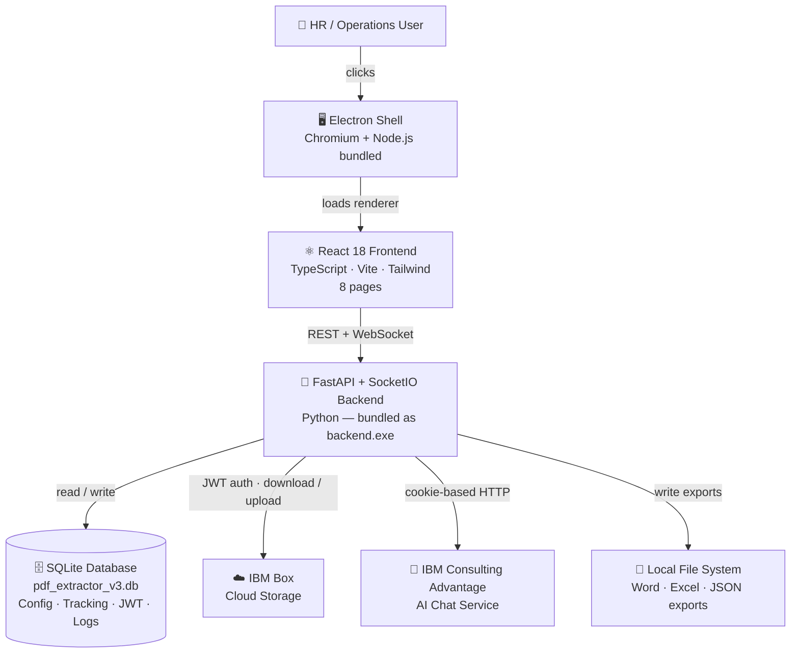

# PDF Extractor V3 — Overview

> **Think of V3 like a self-contained appliance.**
> Previous versions required Python installed on your machine. V3 ships everything bundled inside a single `.exe` — open it, configure it once through the GUI, and it runs. It is a background check processing station you can carry on a USB drive.

---

## What Is PDF Extractor V3?

PDF Extractor V3 is a **fully portable Electron desktop application** that automates the complete lifecycle of background check PDF reports. It is the third and most capable generation of the extractor series, replacing the Tkinter-based GUI of V2 with a modern **React + TypeScript** interface backed by a standalone **FastAPI + SocketIO** Python server — all packaged so that the target machine needs no Python, no Node.js, and no external browser.

All application data — configuration, file tracking state, JWT credentials, and extraction logs — is stored in a single **SQLite database** (`pdf_extractor_v3.db`) inside the user data directory. There are no loose JSON files to manage.

---

## Core Value Proposition

| Without V3 | With V3 |
|---|---|
| Manually open each PDF, re-type data | One click processes all pending reports |
| Hunt for output files across folders | Centralised view grouped by reference |
| No live progress visibility | Real-time streaming events during sync/extract |
| Reports locked in PDFs | Searchable Word, Excel, and JSON outputs |
| Separate Python install per machine | Single portable `.exe` — zero dependencies |
| Hand-edit `config.json` files | Full GUI Settings page with live connection tests |

---

## High-Level System Diagram



---

## Who Uses V3?

| Role | Primary Actions |
|---|---|
| **HR / Operations staff** | Sync from Box, scan folder, run extraction, view results |
| **Managers / Stakeholders** | Check Insights dashboard for completion stats |
| **Compliance reviewers** | Open Word or Excel exports directly from the View page |
| **Power users** | Chat with Detective Conan to look up report details conversationally |

---

## What Changed from V2 to V3

| Capability | V2 | V3 |
|---|---|---|
| UI framework | Tkinter (Windows native) | React + Tailwind (Chromium-rendered) |
| Distribution | Requires Python installed | Single portable `.exe` — zero dependencies |
| Persistence | `config.json` + `tracking_db.json` files | SQLite database (`pdf_extractor_v3.db`) |
| Extraction logs | Filesystem `.log` files in `Log History/` | Rows in `extraction_logs` SQLite table |
| JWT config | `box_jwt_config.json` file | Stored in `jwt_config` SQLite table |
| Live progress | Log text box updated synchronously | SocketIO events streamed in real time |
| AI assistant | Embedded Tkinter chat frame | Dedicated Chat page with bubble UI |
| Settings management | Hand-edit `config.json` | GUI Settings page with masked secrets + live tests |
| ICA login | Manual cookie copy-paste | Electron browser window auto-captures credentials |
| Theme | System default only | Dark / light toggle, persisted to localStorage |
| API | None (in-process function calls) | Full REST API at `/docs` — testable with any HTTP client |

---

## Distributable Files

After running `build_all.bat` two ready-to-ship files are produced:

| File | Description |
|---|---|
| `electron/dist/PDF-Extractor-V3-Setup-3.0.0.exe` | NSIS installer — installs to Program Files, adds Start Menu + Desktop shortcuts |
| `electron/dist/PDF-Extractor-V3-Portable-3.0.0.exe` | Single-file portable — run from anywhere (USB drive, shared folder, no install) |

Both are fully self-contained: Python interpreter, all packages, and Chromium are bundled inside — nothing needs to be installed on the target machine.

---

## User Data Location

All data lives at `%APPDATA%\PDF Extractor V3\` (created automatically on first launch):

```
%APPDATA%\PDF Extractor V3\
├── pdf_extractor_v3.db      ← single SQLite database (config, tracking, JWT, logs)
├── ica.log                  ← ICA HTTP request/response debug log (plain text)
└── Local Folder\
    ├── *.pdf                ← synced PDFs waiting for extraction
    ├── Extracted\
    │   ├── Word Extracts\   ← .docx exports (dated hierarchy)
    │   ├── CSV Extracts\    ← .xlsx exports (dated hierarchy)
    │   └── JSON File Extracts\  ← .json exports (dated hierarchy)
    └── Archive\             ← source PDFs after successful extraction
```

> **No loose config files to manage.** Configuration, tracking state, Box JWT credentials, and extraction logs are all stored in `pdf_extractor_v3.db`. The database is created automatically and managed entirely by the application.

---

## Quick Start

See the **[User Guide](user-guide.md)** for full step-by-step instructions. Summary:

1. **Launch** the `.exe` → wait for the splash screen to clear (~5–10 s on first launch)
2. **Settings** → fill in PDF password, Box folder IDs, upload JWT config, sign in to ICA
3. **Sync** → download new PDFs from Box
4. **Scan** → register PDFs in the tracking database
5. **Extract** → run the extraction pipeline; outputs saved as Word, Excel, JSON
6. **View** → browse and open extracted files
7. **Insights** → check completion stats and charts
8. **Chat** → ask Detective Conan about any report

---

## Development Mode

Run from source without building the `.exe` (requires Python 3.12 and Node.js):

```bat
cd "PDF Extractor V3"
python start_v3.py
```

---

## Documentation Index

| Document | Contents |
|---|---|
| **[User Guide](user-guide.md)** | Step-by-step instructions for every page |
| [Features](features.md) | Per-feature breakdown with flow diagrams |
| [System Design](system-design.md) | Architecture, all modules, API reference, design decisions |
| [Data Flow](data-flow.md) | How PDFs become structured JSON — DFD Levels 0–2 |
| [Process Flows](process-flows.md) | Startup, setup, full pipeline, and streaming event sequences |
| [Specifications](specifications.md) | Functional requirements, non-functional requirements, glossary |
| [Improvements](improvements.md) | Observations, gaps, and enhancement opportunities |
