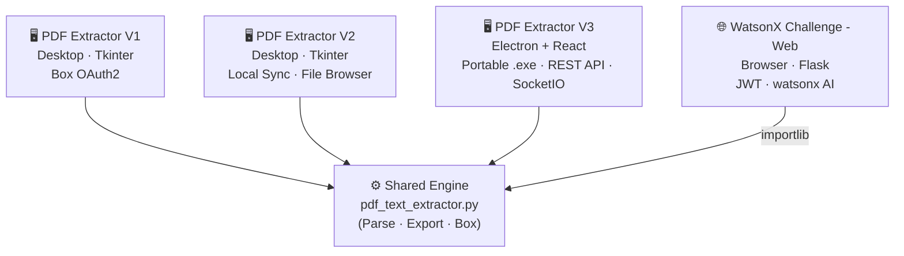

# Background Check Report Automation — Documentation

> **Think of this system like a smart postal clerk for background checks.**
> Reports arrive sealed (encrypted PDFs) in a digital mailbox (IBM Box). The system opens each envelope, reads the contents, neatly fills out structured forms (Word, Excel, JSON), files them in dated folders, and sends copies back to the right place — all while an AI assistant stands by to answer questions about any report.

---

## What Is It?

The **Background Check Report Automation** system automates the entire lifecycle of background check PDF reports issued by Corpnet Global Corp. Instead of manually opening, reading, and re-typing data from each PDF, this system:

1. Connects to **IBM Box** and finds new PDF reports
2. **Decrypts** password-protected files
3. **Parses** all structured data (employment checks, reference checks, database checks)
4. **Exports** clean Word, Excel, and JSON versions of each report
5. **Archives** the source PDF and uploads outputs back to Box
6. Makes every report searchable through an **AI chat assistant**

---

## Who Uses It?

| Role | How They Use It |
|------|----------------|
| **HR / Operations staff** | Scan for new reports, run extractions, track status |
| **Managers / Stakeholders** | View Insights charts, check file status at a glance |
| **Compliance / Auditors** | Access structured Word / Excel exports for review |
| **AI power users** | Chat with the assistant to look up specific reports instantly |

---

## Three Applications, One Shared Engine



| Application | Type | Key Differentiator |
|---|---|---|
| **PDF Extractor V1** | Desktop (Tkinter) | Lightweight; scan directly from Box via Developer Token |
| **PDF Extractor V2** | Desktop (Tkinter) | Adds local sync, auto-scan, file browser, Box upload |
| **PDF Extractor V3** | Desktop (Electron + React) | Portable `.exe`; REST API; real-time SocketIO; GUI settings; ICA chat |
| **WatsonX Challenge - Web** | Web App (Flask) | Browser UI; JWT auth; watsonx Orchestrate + multi-AI fallback |

All three produce **identical structured output** because they share the same parsing engine.

---

## Documentation Structure

```
docs/
├── README.md                  ← You are here — system overview and navigation
│
├── shared/                    ← Common engine used by all apps
│   ├── README.md              ← Shared engine overview
│   ├── data-flow.md           ← PDF → JSON data transformation (DFD)
│   └── specifications.md      ← Shared requirements, constraints, glossary
│
├── pdf-extractor-v1/          ← PDF Extractor V1 (Desktop)
│   ├── README.md
│   ├── features.md
│   ├── system-design.md
│   ├── process-flows.md
│   └── improvements.md
│
├── pdf-extractor-v2/          ← PDF Extractor V2 (Desktop)
│   ├── README.md
│   ├── features.md
│   ├── system-design.md
│   ├── process-flows.md
│   └── improvements.md
│
├── pdf-extractor-v3/          ← PDF Extractor V3 (Electron + React, portable .exe)
│   ├── README.md
│   ├── features.md
│   ├── system-design.md
│   ├── process-flows.md
│   └── improvements.md
│
└── watsonx-web/               ← WatsonX Challenge - Web App
    ├── README.md
    ├── features.md
    ├── system-design.md
    ├── process-flows.md
    └── improvements.md
```

---

## Quick Links

### Shared Engine
- [Shared Engine Overview](shared/README.md)
- [Data Flow & JSON Schema](shared/data-flow.md)
- [Shared Specifications & Glossary](shared/specifications.md)

### PDF Extractor V1
- [V1 Overview & Quick Start](pdf-extractor-v1/README.md)
- [V1 Features](pdf-extractor-v1/features.md)
- [V1 System Design](pdf-extractor-v1/system-design.md)
- [V1 Process Flows](pdf-extractor-v1/process-flows.md)
- [V1 Improvements](pdf-extractor-v1/improvements.md)

### PDF Extractor V2
- [V2 Overview & Quick Start](pdf-extractor-v2/README.md)
- [V2 Features](pdf-extractor-v2/features.md)
- [V2 System Design](pdf-extractor-v2/system-design.md)
- [V2 Process Flows](pdf-extractor-v2/process-flows.md)
- [V2 Improvements](pdf-extractor-v2/improvements.md)

### PDF Extractor V3
- [V3 Overview](pdf-extractor-v3/README.md)
- [V3 User Guide](pdf-extractor-v3/user-guide.md) ← **Start here for end-user instructions**
- [V3 Features](pdf-extractor-v3/features.md)
- [V3 System Design](pdf-extractor-v3/system-design.md)
- [V3 Data Flow](pdf-extractor-v3/data-flow.md)
- [V3 Process Flows](pdf-extractor-v3/process-flows.md)
- [V3 Specifications](pdf-extractor-v3/specifications.md)
- [V3 Improvements](pdf-extractor-v3/improvements.md)

### WatsonX Challenge - Web
- [Web App Overview & Quick Start](watsonx-web/README.md)
- [Web App Features](watsonx-web/features.md)
- [Web App System Design](watsonx-web/system-design.md)
- [Web App Process Flows](watsonx-web/process-flows.md)
- [Web App Improvements](watsonx-web/improvements.md)
