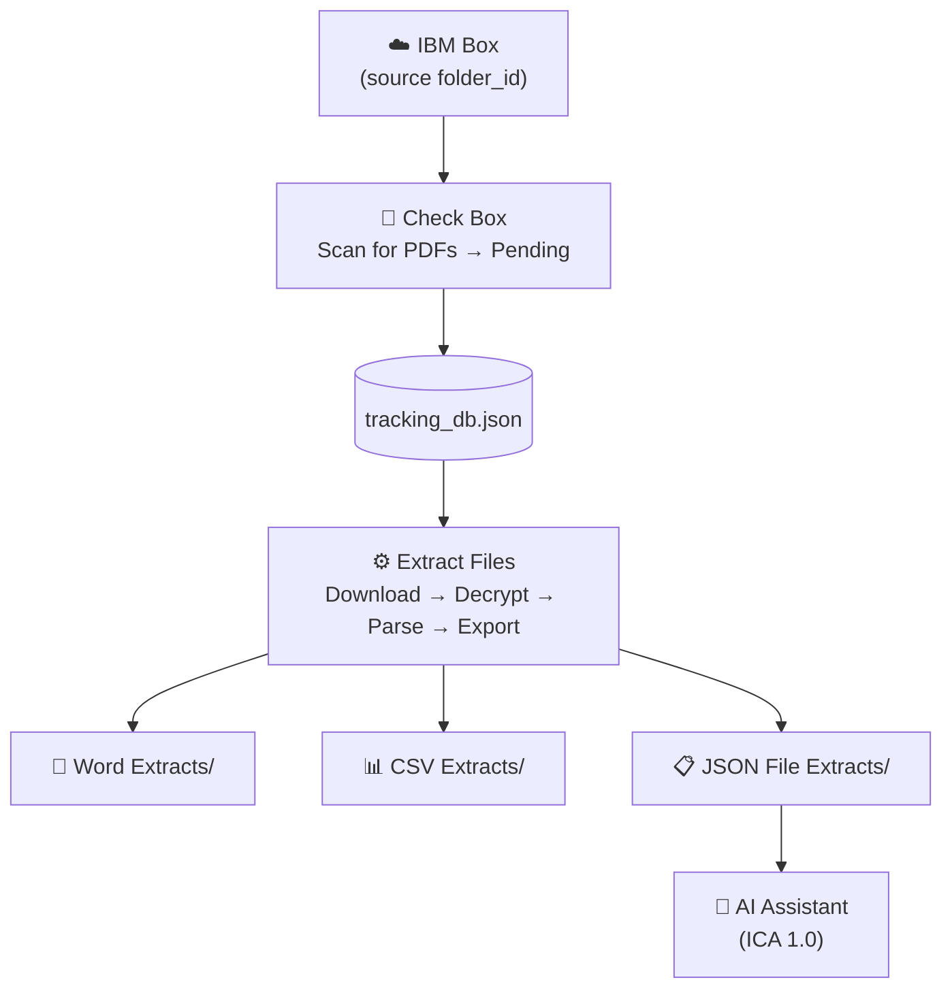

# PDF Extractor V1 — Overview

**Desktop application** for processing background check PDF reports from IBM Box.
Version 1 is the original standalone tool — lightweight, no sync, no file browser.

> **Think of it as a single operator at a desk:** the user scans the Box mailbox, then presses a button to process everything in the queue. Simple, direct, no frills.

---

## When to Use V1

| Use V1 when… | Use V2 instead when… |
|---|---|
| You want a quick, no-setup tool | You want automatic syncing and auto-scan |
| You're working solo on a machine with Box access | You need a local copy of PDFs for reliability |
| Your report volumes are small and infrequent | You want to browse extracted files in-app |
| You don't need to upload outputs back to Box | You need outputs uploaded to Box automatically |

---

## Screens

| Screen | Purpose |
|---|---|
| 🏠 **Home** | Landing page — shortcut cards for each feature |
| 📂 **Check Box** | Scan Box folder for PDFs; view Pending file table |
| 📊 **Insights** | Bar chart of Completed vs Pending by time period |
| ⚙️ **Extract Files** | Run extraction pipeline; view per-file result cards |
| 💬 **AI Assistant** | Chat with IBM Consulting Advantage (ICA 1.0) |

---

## Process Flow



**Step-by-step:**
1. **Check Box** — click "Scan Box Folder" to find PDFs and register them as Pending
2. **Extract Files** — click "Start Extraction" to download, decrypt, parse, and export
3. **AI Assistant** — ask questions or run commands via chat

---

## Quick Start

### 1. Install dependencies
```bash
cd "PDF Extractor"
pip install -r requirements.txt
```

### 2. Configure `config.json`

```json
{
  "pdf_password": "your_pdf_password",
  "box": {
    "client_id":     "your_box_client_id",
    "client_secret": "your_box_client_secret",
    "access_token":  "your_developer_token",
    "folder_id":     "your_box_folder_id"
  },
  "ica": {
    "full_cookie":  "paste_full_cookie_from_devtools",
    "team_id":      "your_ica_team_id",
    "team_name":    "Your%20Team",
    "assistant_id": "your_ica_assistant_id",
    "chat_id":      "your_ica_chat_id",
    "base_url":     "https://servicesessentials.ibm.com/curatorai/services/chat/new-chat"
  }
}
```

| Field | Description |
|---|---|
| `pdf_password` | Password to decrypt the PDF reports |
| `box.folder_id` | Box folder to scan for PDFs |
| `box.access_token` | Box Developer Token — **expires every 60 minutes**, must be refreshed manually |
| `ica.*` | IBM Consulting Advantage credentials (use the ICA Cookie Parser tool to generate) |

### 3. Launch

Double-click [`Launch.vbs`](../../PDF%20Extractor/Launch.vbs), or run:
```bash
python pdf_extractor_ui.py
```

---

## Folder Structure

```
PDF Extractor/
├── pdf_extractor_ui.py        Main UI — run this
├── pdf_text_extractor.py      Core extraction engine (shared with web app)
├── config.json                Credentials and settings
├── tracking_db.json           Auto-created — per-file Pending/Completed state
├── Launch.vbs                 Double-click to launch without a console window
├── requirements.txt           Python dependencies
├── Word Extracts/             .docx exports (dated hierarchy)
├── CSV Extracts/              .xlsx exports (dated hierarchy)
├── JSON File Extracts/        .json exports (dated hierarchy)
└── Log History/               Per-file extraction logs (dated hierarchy)
```

---

## ICA Credentials Setup

The AI Assistant uses **IBM Consulting Advantage (ICA) 1.0**:

1. Open the ICA Cookie Parser tool: `ICA Cookie Parser/ica_cookie_parser.html`
2. In your browser, open ICA and send any message
3. Open DevTools → Network → click the `entries` POST → Headers tab → copy all headers
4. Paste into the parser → click **Parse & Generate Config**
5. Copy the generated `"ica": { ... }` block into `config.json`

> ICA cookies expire periodically. Refresh when the AI stops responding.

---

## Further Reading

- [Features](features.md)
- [System Design](system-design.md)
- [Process Flows](process-flows.md)
- [Improvements](improvements.md)
- [Shared Engine](../shared/README.md)
- [Data Flow & JSON Schema](../shared/data-flow.md)
