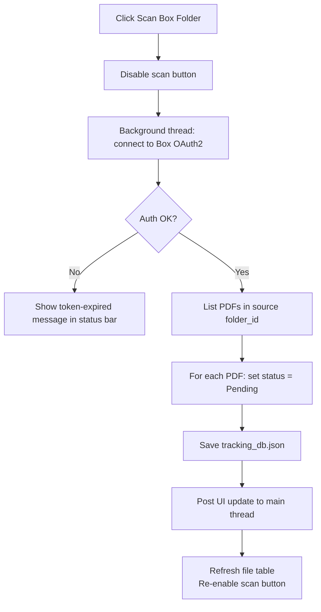
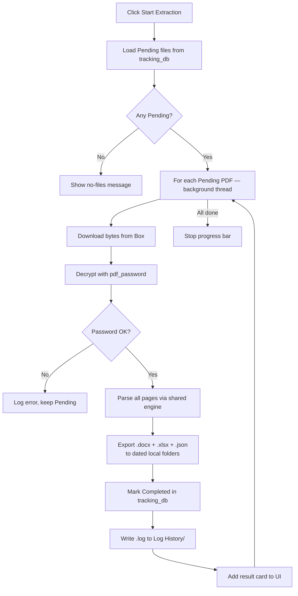
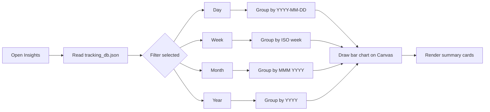
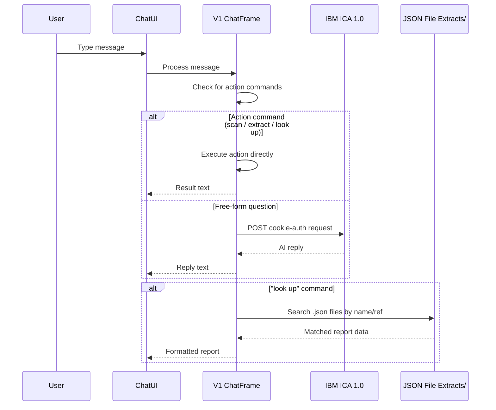

# PDF Extractor V1 — Features

All features use the shared extraction engine. See [Shared Engine](../shared/README.md) for parsing details.

---

## Feature 1 — Check Box Folder (Scan)

**What it does:** Connects to IBM Box and discovers all PDF files in the configured source folder, registering each as `Pending`.

**Simple explanation:** Like checking your mailbox before opening any letters — you take inventory first.

**Technical detail:**
- Uses Box SDK `folder.get_items(limit=1000)` with optional subfolder recursion
- Any file still in the source folder is always reset to `Pending` (if it's still there, it wasn't successfully archived)
- State persisted in `tracking_db.json` keyed by Box file ID
- Scan button is disabled while scanning to prevent double-clicks
- Token expiry (401/400) shows a clear inline message to refresh `box.access_token`

---

## Feature 2 — Extract Files

**What it does:** Downloads each Pending PDF from Box, decrypts it, parses all structured fields, and exports Word/Excel/JSON files locally.

**Simple explanation:** Like a bilingual assistant who reads an encrypted document and hands you a clean typed summary in three formats.

**V1 specifics:**
- Exports are written to dated sub-folders inside the app's own `Word Extracts/`, `CSV Extracts/`, `JSON File Extracts/` directories
- Source PDF is **not** moved to an archive folder (no `archive_folder_id` in V1 config) — the file remains in Box
- Outputs are **not** uploaded back to Box in V1

---

## Feature 3 — Insights

**What it does:** Shows a bar chart of Completed vs Pending extractions, filterable by Day / Week / Month / Year.

**Technical detail:**
- Chart drawn directly on `tk.Canvas` — no external charting library
- Redraws on canvas resize
- Filter radio buttons re-bucket and redraw instantly (no server calls)
- Summary cards (Total / Completed / Pending) shown above the chart

---

## Feature 4 — AI Assistant (ICA 1.0)

**What it does:** Chat interface powered by IBM Consulting Advantage (ICA) 1.0 session-cookie API.

**V1 specifics:**
- Uses ICA 1.0 only (no watsonx.ai / Orchestrate fallback chain — that is a V2/Web feature)
- Reads JSON exports from the app's own `JSON File Extracts/` folder for report lookups
- Supports chat commands: `scan`, `extract`, `look up [name/ref]`, `file status`, `logs this week`

**Chat commands:**

| Command | Action |
|---|---|
| `scan` | Scan Box folder for PDFs |
| `extract` | Run extraction pipeline |
| `look up [name or ref]` | Display report data in chat |
| `file status` | Show Pending / Completed counts |
| `logs this week` | View extraction log history |
