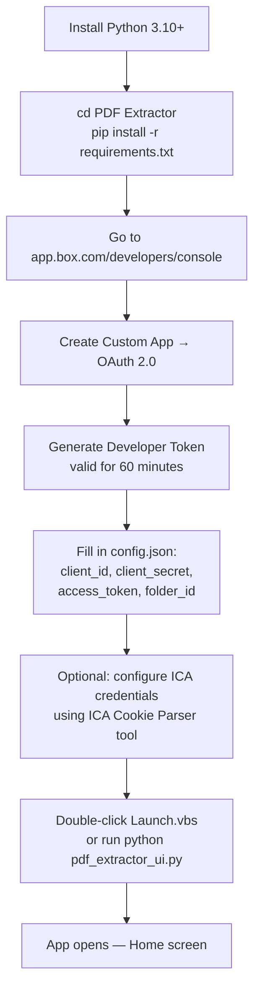
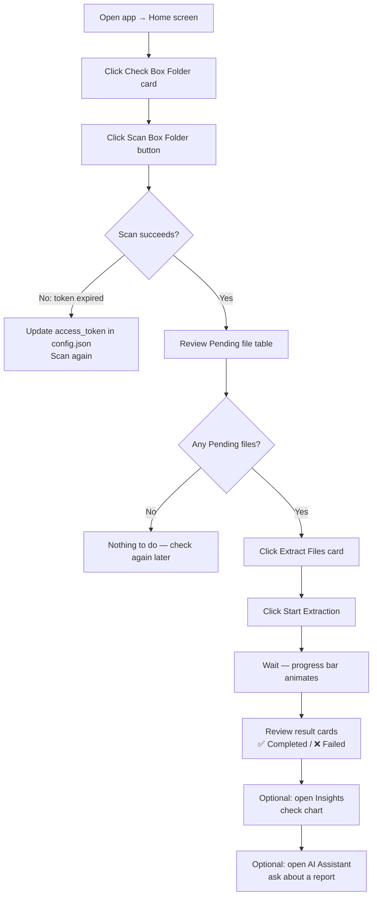
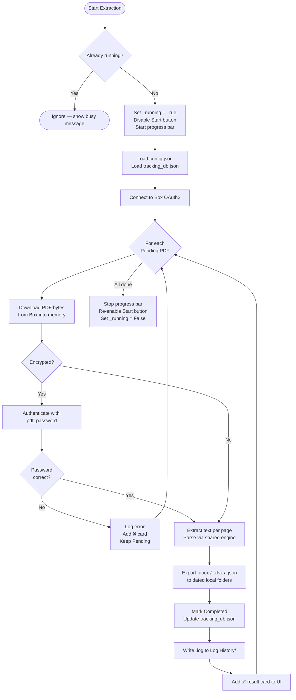
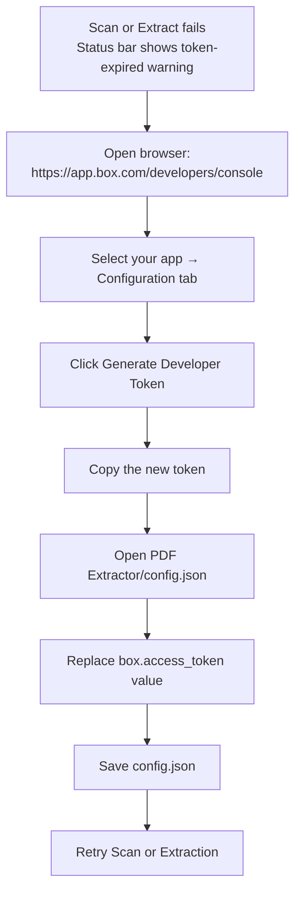
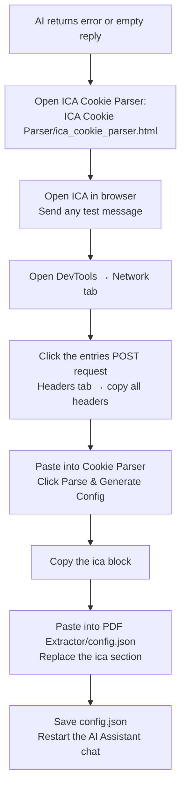
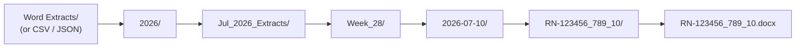

# PDF Extractor V1 — Process Flows

## User Journey: First-Time Setup

---

## User Journey: Daily Extraction Workflow

---

## Backend Process: Extraction Pipeline

---

## Process: Box Token Refresh

The OAuth2 Developer Token expires every **60 minutes**. Here is the refresh flow:

---

## Process: ICA Credential Refresh

ICA session cookies expire periodically. When the AI stops responding:

---

## Process: Dated Output Folder Creation

Every export is written into a consistent dated path:

Folders are created automatically with `Path.mkdir(parents=True, exist_ok=True)`.
