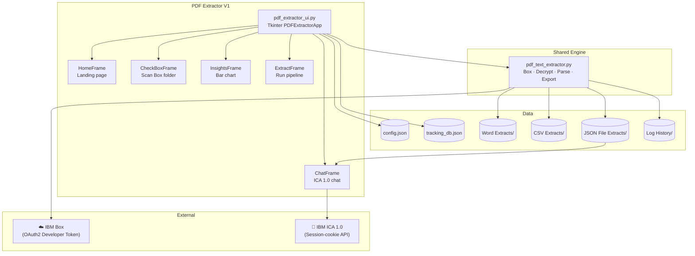
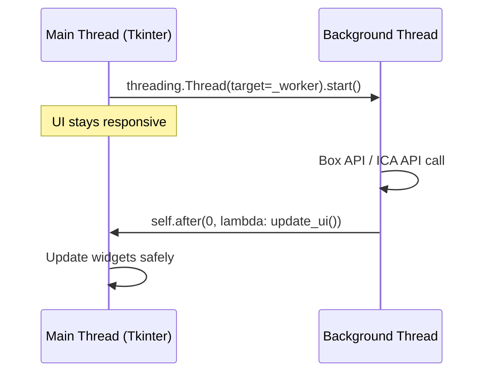

# PDF Extractor V1 — System Design

## Architecture



---

## UI Frame Classes

| Class | File | Screen |
|---|---|---|
| `PDFExtractorApp` | `pdf_extractor_ui.py` | Root window — builds sidebar + stacks frames |
| `HomeFrame` | `pdf_extractor_ui.py` | Landing page with 4 feature cards |
| `CheckBoxFrame` | `pdf_extractor_ui.py` | Scan Box folder; Pending file table |
| `InsightsFrame` | `pdf_extractor_ui.py` | Bar chart (Canvas-drawn) + summary cards |
| `ExtractFrame` | `pdf_extractor_ui.py` | Extraction runner; scrollable result cards |
| `ChatFrame` | `pdf_extractor_ui.py` | ICA 1.0 chat interface |

All frames are created at startup and stacked via `.place()` — only the active frame is `.lift()`-ed to the top. Navigation is handled by `PDFExtractorApp._show_frame(key)`.

---

## Threading Model

All Box API calls and ICA requests run on **background threads** to keep the UI responsive:



Rule: **never update Tkinter widgets from a background thread** — always use `self.after(0, callback)`.

---

## Box Authentication (V1)

V1 uses OAuth2 with a short-lived Developer Token:

```python
auth = OAuth2(
    client_id=box["client_id"],
    client_secret=box["client_secret"],
    access_token=box["access_token"],   # expires every 60 minutes
)
client = Client(auth)
```

When the token expires, Box returns HTTP 401. V1 detects `"401"` or `"invalid_token"` in the error string and shows:
> `⚠ Box token expired — update access_token in config.json and scan again.`

---

## Configuration (V1-specific fields)

```json
{
  "pdf_password": "...",
  "box": {
    "client_id":        "OAuth2 App Client ID",
    "client_secret":    "OAuth2 App Client Secret",
    "access_token":     "Developer Token — refresh every 60 min",
    "folder_id":        "Source Box folder ID",
    "archive_folder_id":"(optional) where to move processed PDFs"
  },
  "ica": {
    "full_cookie":  "Full browser cookie string from DevTools",
    "team_id":      "ICA team UUID",
    "team_name":    "URL-encoded team name",
    "assistant_id": "ICA Assistant ID",
    "chat_id":      "ICA Chat thread UUID",
    "base_url":     "ICA API base URL"
  },
  "settings": {
    "search_subfolders":          true,
    "overwrite_existing_exports": false,
    "log_activity":               true
  }
}
```

---

## Design Decisions (V1-specific)

### No Box Upload in V1
V1 was designed as a local-only tool. Exports are written to the app folder only; there is no `output_folder_id`. If you need Box uploads, use V2 or the Web App.

### Canvas-Drawn Chart
The Insights bar chart uses raw `tk.Canvas` primitives rather than a charting library. This keeps the dependency footprint minimal and avoids version conflicts. The trade-off is more verbose drawing code but zero extra dependencies.

### ICA-Only AI
V1's AI assistant is ICA 1.0 only — no watsonx.ai or Orchestrate. This was appropriate for the original scope. V2 and the Web App support the full AI fallback chain.
