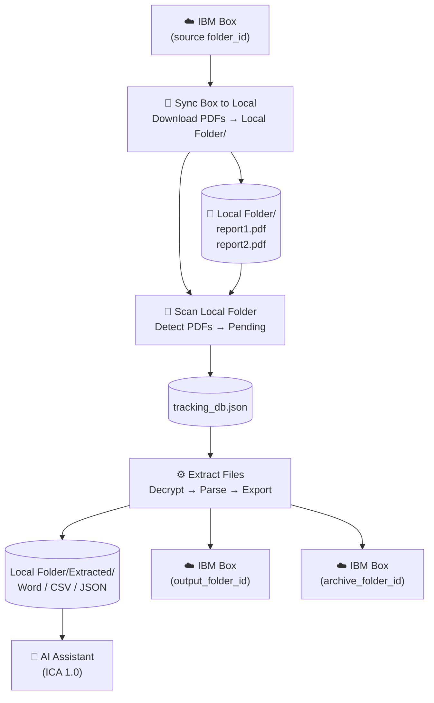

# PDF Extractor V2 — Overview

**Desktop application** for processing background check PDF reports from IBM Box.
Version 2 is the recommended desktop deployment — adds local sync, auto-scan, file browser, and Box upload.

> **Think of it as a fully automated mail room:** PDFs are automatically downloaded to a local tray on a schedule. The team processes them locally, and finished reports are automatically returned to the central filing cabinet (Box).

---

## What's New in V2 vs V1

| Feature | V1 | V2 |
|---|---|---|
| PDF source for extraction | Downloaded from Box during extraction | **Synced to Local Folder first** |
| Scan target | Box folder (via API) | **Local Folder** (no API needed for scan) |
| Output location | App root (`Word Extracts/` etc.) | **`Local Folder/Extracted/`** (dated hierarchy) |
| Post-extraction Box upload | None | **Uploads Word / Excel / JSON to `output_folder_id`** |
| Post-extraction archive | None | **Moves source PDF to archive folder** |
| AI source | App-root JSON files | **`Local Folder/Extracted/JSON File Extracts/`** |
| Sync | None | **Sync Box → Local** — manual + optional auto-schedule |
| Auto-scan after sync | No | **Yes — runs automatically** |
| View extracted files | No | **Yes — in-app file browser** |

---

## Screens

| Screen | Purpose |
|---|---|
| 🏠 **Home** | Landing page — shortcut cards for each feature |
| 📂 **Scan Local Folder** | Detect PDFs in Local Folder; register as Pending |
| 🔄 **Sync Box to Local** | Download PDFs from Box into Local Folder (manual or auto) |
| ⚙️ **Extract Files** | Run extraction pipeline; export, upload, archive |
| 📁 **View Extracted Files** | Browse all outputs grouped by reference number |
| 💬 **AI Assistant** | Chat with IBM Consulting Advantage (ICA 1.0) |

---

## Process Flow



**Step-by-step:**
1. **Sync Box to Local** — click "Sync Now" to download all PDFs; scan runs automatically after sync
2. **Extract Files** — click "Start Extraction" to process all Pending PDFs; outputs go to `Local Folder/Extracted/` and are uploaded to Box
3. **View Extracted Files** — browse all output files; click to open
4. **AI Assistant** — ask questions about reports or run commands

---

## Quick Start

### 1. Install dependencies
```bash
cd "PDF Extractor V2"
pip install -r requirements.txt
```

### 2. Configure `config.json`

```json
{
  "pdf_password": "your_pdf_password",
  "box": {
    "client_id":        "your_box_client_id",
    "client_secret":    "your_box_client_secret",
    "access_token":     "your_developer_token",
    "folder_id":        "your_source_box_folder_id",
    "output_folder_id": "your_output_box_folder_id"
  },
  "sync": {
    "auto_sync_enabled": false,
    "auto_sync_interval_minutes": 30
  },
  "ica": {
    "full_cookie":  "paste_full_cookie_from_devtools",
    "team_id":      "your_ica_team_id",
    "team_name":    "Your%20Team",
    "assistant_id": "your_ica_assistant_id",
    "chat_id":      "your_ica_chat_id",
    "base_url":     "https://servicesessentials.ibm.com/curatorai/services/chat/new-chat"
  }
}
```

| Field | Description |
|---|---|
| `box.folder_id` | Box folder to sync PDFs **from** |
| `box.output_folder_id` | Box folder to upload extracted files **to** |
| `box.access_token` | Developer Token — **expires every 60 minutes** |
| `sync.auto_sync_enabled` | `true` to auto-sync on startup and on a schedule |
| `sync.auto_sync_interval_minutes` | How often to auto-sync (default 30) |

### 3. Launch

Double-click [`Launch.vbs`](../../PDF%20Extractor%20V2/Launch.vbs), or run:
```bash
python pdf_extractor_ui_v2.py
```

---

## Folder Structure

```
PDF Extractor V2/
├── pdf_extractor_ui_v2.py     Main UI — run this
├── pdf_text_extractor.py      Core extraction engine
├── config.json                Credentials and settings
├── tracking_db.json           Auto-created — per-file state
├── Launch.vbs                 Double-click launcher
├── requirements.txt
├── Local Folder/              PDFs synced from Box (git-ignored)
│   └── Extracted/
│       ├── Word Extracts/
│       ├── CSV Extracts/
│       └── JSON File Extracts/
└── Log History/               Per-file extraction logs
```

---

## Further Reading

- [Features](features.md)
- [System Design](system-design.md)
- [Process Flows](process-flows.md)
- [Improvements](improvements.md)
- [Shared Engine](../shared/README.md)
- [Data Flow & JSON Schema](../shared/data-flow.md)
