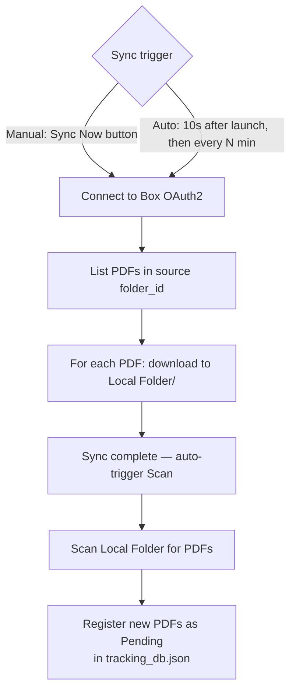
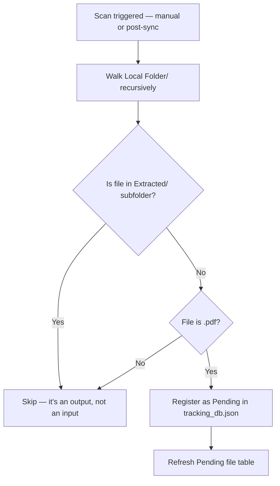
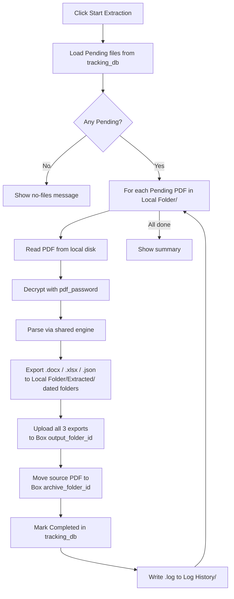
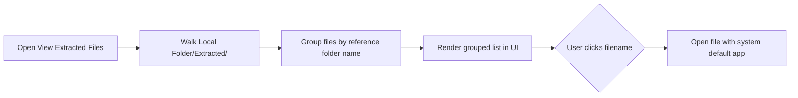

# PDF Extractor V2 — Features

All parsing and export features use the shared extraction engine. See [Shared Engine](../shared/README.md) for parsing details.

---

## Feature 1 — Sync Box to Local

**What it does:** Downloads all PDFs from the configured Box source folder into a local `Local Folder/` directory, then automatically runs a scan.

**Why it exists:** V2 moves the scan target from Box (network API) to local disk. This makes scanning instant and extraction more reliable — no network dependency during the extraction step.

**Technical detail:**
- Manual trigger ("Sync Now" button) or automatic (configurable interval)
- Auto-sync fires **10 seconds** after app launch when `sync.auto_sync_enabled = true`
- Re-schedules itself every `sync.auto_sync_interval_minutes` (default 30)
- Scan runs automatically after every sync — no extra click needed
- Uses the same Box OAuth2 Developer Token as other Box operations

---

## Feature 2 — Scan Local Folder

**What it does:** Scans the local `Local Folder/` directory (not Box) for PDF files and registers them as Pending.

**Why V2 scans locally:** No Box API call is needed. Scanning is instant and works offline after a prior sync.

**Technical detail:**
- Walks `Local Folder/` recursively
- Ignores anything in `Local Folder/Extracted/` (those are outputs, not inputs)
- Registers each `.pdf` file as Pending in `tracking_db.json`

---

## Feature 3 — Extract Files (V2)

**What it does:** Processes all Pending PDFs from the local folder, exports outputs to `Local Folder/Extracted/`, uploads all three formats to Box, and archives the source PDF.

**V2 differences from V1:**
- Source PDFs come from **Local Folder/** (already synced) — no Box download during extraction
- Outputs are written to `Local Folder/Extracted/` instead of the app root
- After extraction, all three exports are **uploaded to Box `output_folder_id`**
- After extraction, the source PDF is **moved to Box `archive_folder_id`**

---

## Feature 4 — View Extracted Files

**What it does:** Browses all extracted output files (Word, Excel, JSON) grouped by reference number, with clickable filenames that open the file.

**Why it exists:** After extraction, navigating a deep dated folder hierarchy manually is tedious. This screen provides an in-app file browser.

**Technical detail:**
- Walks `Local Folder/Extracted/` and groups files by their parent reference folder name
- Click on any filename → open with the system default app (`os.startfile()` on Windows)
- Filter tabs: All / Word / Excel / JSON

---

## Feature 5 — Insights

Identical to V1. See [V1 Features — Insights](../pdf-extractor-v1/features.md#feature-3--insights).

---

## Feature 6 — AI Assistant (ICA 1.0)

Same as V1 with additional V2-specific commands:

| Command | Action |
|---|---|
| `sync` | Sync Box → Local Folder + auto-scan |
| `scan` | Scan Local Folder for PDFs |
| `extract` | Run extraction pipeline |
| `generate report` | List all available extracted reports |
| `generate report for [name]` | Find a specific report, ask for file type, open it |
| `look up [name or ref]` | Display full report data in chat |
| `file status` | Show Pending / Completed counts |
| `logs this week` | View extraction log history |
