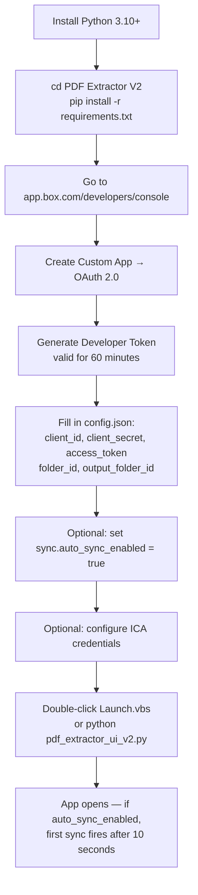
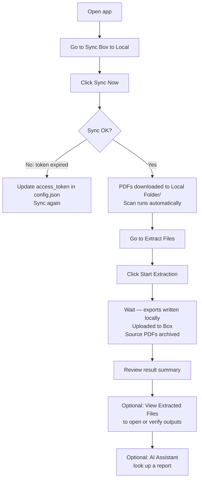
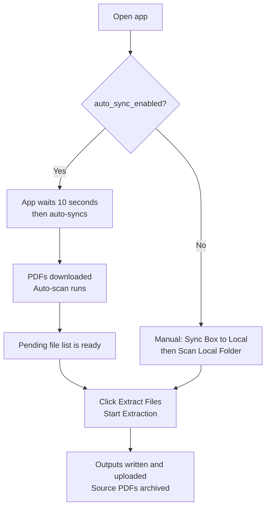
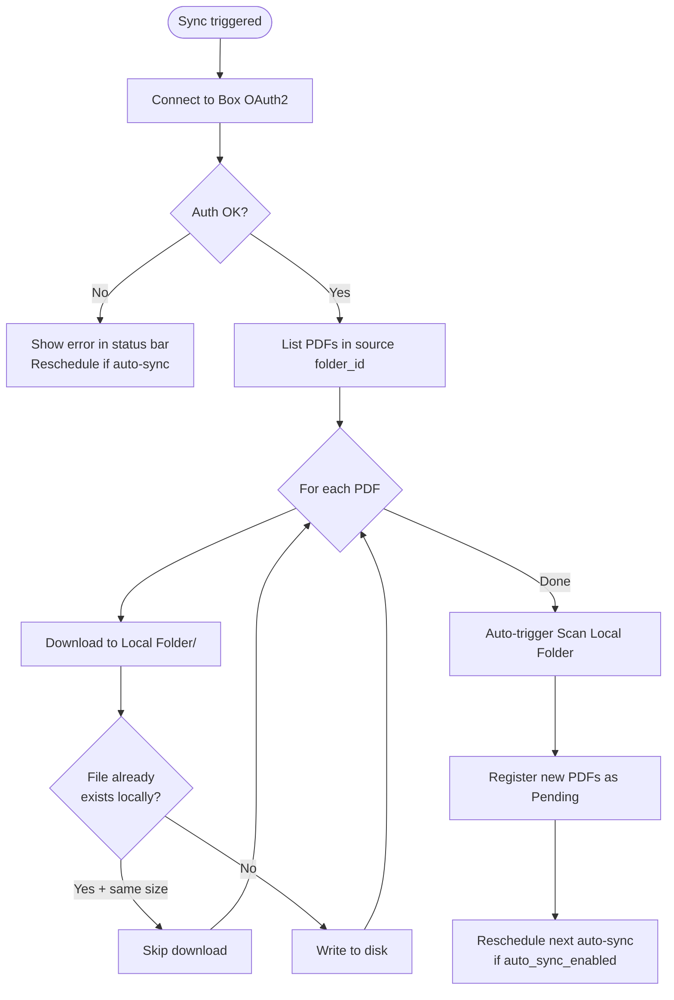
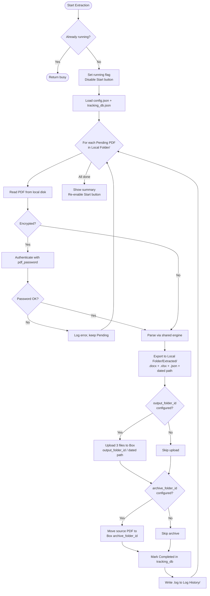
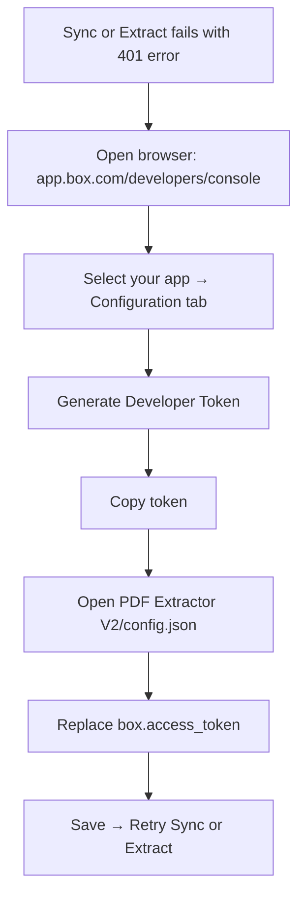

# PDF Extractor V2 — Process Flows

## User Journey: First-Time Setup

---

## User Journey: Daily Workflow (Manual Sync)

---

## User Journey: Auto-Sync Daily Workflow

---

## Backend Process: Sync Box to Local

---

## Backend Process: Extraction Pipeline (V2)

---

## Process: Box Token Refresh (V2)

Same as V1. Applies before Sync and before Extract (if extracting from Box directly):

