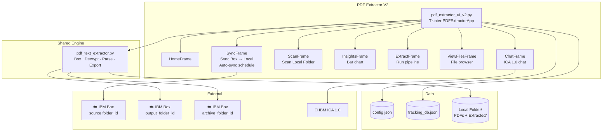
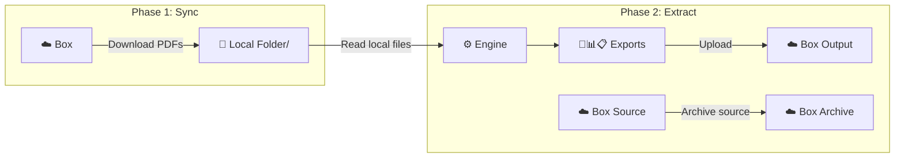
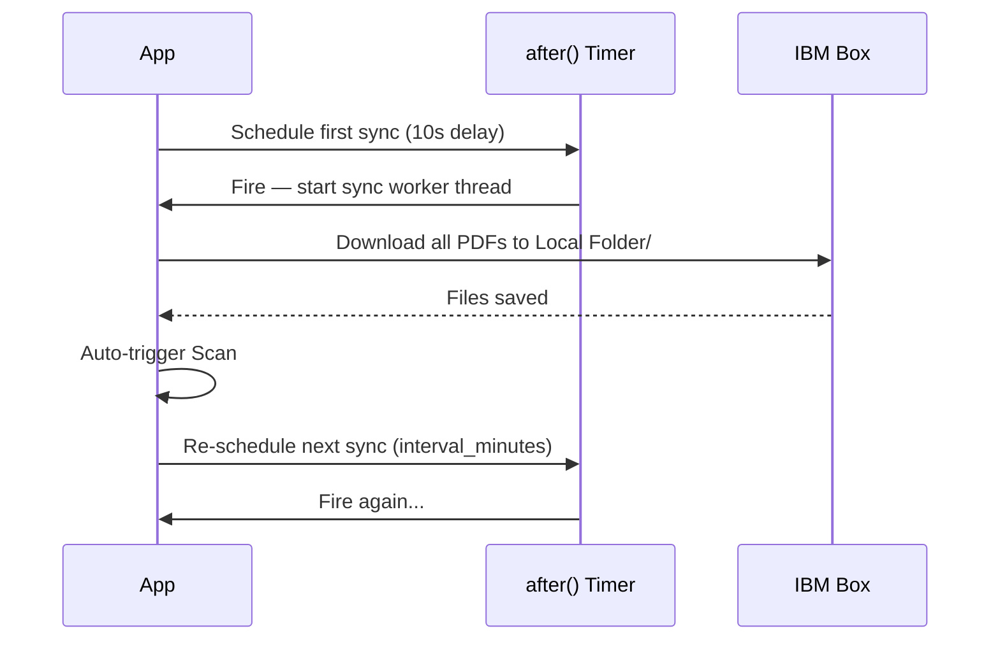

# PDF Extractor V2 — System Design

## Architecture



---

## Key Difference from V1: Two-Phase Architecture

V1 combines Box download + extraction into one step. V2 separates them:



**Why this matters:**
- Phase 1 can run on a schedule (auto-sync) without user interaction
- Phase 2 reads from fast local disk — not dependent on network speed during extraction
- A network disruption during Phase 2 only affects the Box upload, not the extraction itself

---

## Auto-Sync Design



The auto-sync loop runs entirely on a background thread. UI updates are posted via `self.after(0, callback)`.

---

## Configuration (V2-specific fields)

```json
{
  "pdf_password": "...",
  "box": {
    "client_id":        "OAuth2 App Client ID",
    "client_secret":    "OAuth2 App Client Secret",
    "access_token":     "Developer Token — refresh every 60 min",
    "folder_id":        "Source Box folder — sync FROM here",
    "output_folder_id": "Box folder — upload exports TO here",
    "archive_folder_id":"Box folder — move processed PDFs TO here (optional)"
  },
  "sync": {
    "auto_sync_enabled":          false,
    "auto_sync_interval_minutes": 30
  },
  "ica": {
    "full_cookie":  "...",
    "team_id":      "...",
    "team_name":    "...",
    "assistant_id": "...",
    "chat_id":      "...",
    "base_url":     "..."
  },
  "settings": {
    "search_subfolders":          true,
    "overwrite_existing_exports": false,
    "log_activity":               true
  }
}
```

---

## Design Decisions (V2-specific)

### Local-First Extraction
Extracting from local disk instead of streaming from Box eliminates the biggest reliability risk in V1: a network hiccup mid-extraction causing a partial or failed export. V2 fails fast at sync time (network dependent) but runs reliably at extraction time (disk only).

### Automatic Post-Extraction Upload
V1 left outputs local-only. V2 uploads all three export formats to Box after each successful extraction, making them available to anyone with access to the Box output folder — not just the person running the desktop app.

### Auto-Scan After Sync
Every sync triggers a scan automatically so the Pending file list is always up to date without a separate user action.
