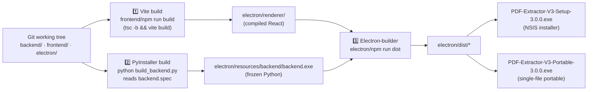

# CI / CD

Build pipeline for PDF Extractor V3. No cloud CI runners are configured today — the pipeline runs on a Windows build machine and is orchestrated by `build_all.bat`.

---

## Pipeline Diagram



Orchestrated by `build_all.bat`. Each step exits non-zero if it fails; the batch aborts.

---

## Step 1: Frontend Build

```bat
cd frontend
npm run build
```

Which under the hood is:

```
tsc -b && vite build
```

- `tsc -b` typechecks the whole project against `tsconfig.json` (fails on any TS error).
- `vite build` compiles + bundles to `electron/renderer/` (path set in `vite.config.ts:outDir`).

`base: './'` in `vite.config.ts` produces relative asset URLs so the built HTML can be loaded via `file://` in Electron.

Duration: ~10–20 seconds on a warm cache.

---

## Step 2: Backend Freeze

```bat
python build_backend.py
```

`build_backend.py` performs a preflight check that every backend runtime dependency is importable (including alternates like `multipart` vs `python_multipart` — PyInstaller can't autodetect this variance) and refuses to build if anything is missing. Then it invokes PyInstaller via `backend.spec`.

Key parts of `backend.spec`:

- **hiddenimports** — packages PyInstaller can't infer statically (`python_multipart`, `multipart`, `aiofiles.threadpool.*`, all backend modules including `activity`)
- **datas** — non-code files that must be shipped alongside code (`bee_prompt.md`, the default `config.json` template)
- **onefolder** target — the executable + `_internal/` sibling, faster startup than one-file mode

Output: `electron/resources/backend/backend.exe` and its `_internal/` directory.

Duration: ~30–60 seconds.

Verify the built binary knows about every endpoint:

```bat
electron\resources\backend\backend.exe --port 9999
```

You should see `Registered routes: /api/scan/upload …` in the stdout.

---

## Step 3: Electron Package

```bat
cd electron
npm run dist
```

Which runs:

```
electron-builder --win
```

Reads the `build` section of `electron/package.json`. Two Windows targets in one shot:

- `nsis` — creates `PDF-Extractor-V3-Setup-3.0.0.exe`. Installer default writes to `AppData\Local\Programs\PDF Extractor V3\`, adds shortcut, adds uninstaller.
- `portable` — creates `PDF-Extractor-V3-Portable-3.0.0.exe`. Single-file exe that self-extracts on first launch to `%TEMP%\<random>` and runs from there.

`extraResources` copies `electron/resources/backend/` verbatim into the package's `resources/backend/` at `process.resourcesPath`.

Duration: ~60–120 seconds (mostly dominated by NSIS + portable compression).

---

## Full Build

```bat
cd "PDF Extractor V3"
build_all.bat
```

Roughly:

```
[1/3] Building frontend...
[2/3] Building backend...
[3/3] Packaging Electron distributables...
Done. See electron/dist/
```

Total wall-clock: ~2–3 minutes.

Outputs:

- `electron/dist/PDF-Extractor-V3-Setup-3.0.0.exe`
- `electron/dist/PDF-Extractor-V3-Portable-3.0.0.exe`

---

## Signing

Not enabled in 3.0.0. `electron-builder` config sets `"signAndEditExecutable": false, "sign": null`. Windows SmartScreen may warn on first launch. Adding a certificate is on the [Roadmap](Roadmap.md).

---

## Automated CI (not currently wired)

If/when GitHub Actions is added, the workflow would look like:

```yaml
name: Build
on:
  push:
    branches: [main]
    tags: ['v*']

jobs:
  build:
    runs-on: windows-latest
    steps:
      - uses: actions/checkout@v4
      - uses: actions/setup-python@v5
        with: { python-version: '3.12' }
      - uses: actions/setup-node@v4
        with: { node-version: '20' }
      - name: Install deps
        run: |
          pip install -r "PDF Extractor V3/requirements-build.txt"
          npm ci --prefix "PDF Extractor V3/frontend"
          npm ci --prefix "PDF Extractor V3/electron"
      - name: Build
        run: |
          cd "PDF Extractor V3"
          ./build_all.bat
      - uses: actions/upload-artifact@v4
        with:
          name: installers
          path: PDF Extractor V3/electron/dist/*.exe
```

---

## Release Process

Manual today:

1. Bump versions in `electron/package.json`, `frontend/package.json`, and `backend/main.py` (`APP_VERSION`).
2. Commit: `chore(release): 3.x.y`.
3. Run `build_all.bat` on a clean checkout.
4. Smoke-test both installers on a clean Windows VM (see [Deployment-Guide.md](Deployment-Guide.md#smoke-test-checklist)).
5. Draft a [Release-Notes.md](Release-Notes.md) entry.
6. Tag `git tag -a v3.x.y -m "…"`, push tag, and attach both exes to the GitHub release.

---

## Troubleshooting the Build

| Symptom | Cause | Fix |
|---|---|---|
| `python_multipart` import error at runtime | Missing hidden import in `backend.spec` | Add `python_multipart` and `multipart` (both spellings) to `hiddenimports` |
| Backend binary starts then exits with `Could not import module 'main'` | You used `uvicorn.run("main:app", …)` instead of passing the `app` object | Pass the module-level `app` object directly (already done) |
| Renderer displays a white screen | Wrong `base` in `vite.config.ts` | Ensure `base: './'` |
| Portable exe won't launch | Antivirus quarantine | Rebuild; add exclusion; consider signing |

---

## Related

- [Environment-Setup.md](Environment-Setup.md) — prerequisites
- [Deployment-Guide.md](Deployment-Guide.md) — install/uninstall
- [Release-Notes.md](Release-Notes.md) — cumulative changelog
