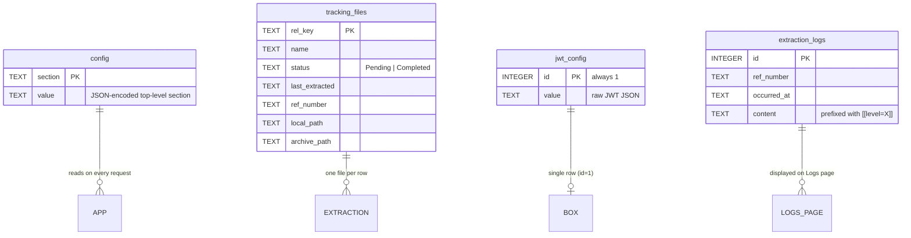

# Database Schema

Single SQLite file `pdf_extractor_v3.db` in the data directory (`%APPDATA%\PDF Extractor V3\` in packaged builds; `backend/` in dev). Managed exclusively through `backend/db.py`.

WAL journal mode is enabled so background worker threads (sync, scan, extract) can write while the main uvicorn thread reads.

---

## Schema Overview



---

## Table: `config`

Key/value store. One row per top-level config section (`box`, `ica`, `local`, `sync`, `settings`, `pdf_password`, etc.). Values are JSON-encoded strings.

```sql
CREATE TABLE IF NOT EXISTS config (
    section TEXT PRIMARY KEY,
    value   TEXT NOT NULL
);
```

**Typical rows**

| section | value (illustrative) |
|---|---|
| `pdf_password` | `"secret"` (JSON-encoded string) |
| `box` | `{"folder_id":"12345","archive_folder_id":"67890","output_folder_id":""}` |
| `ica` | `{"full_cookie":"…","team_id":"abc","chat_id":"xyz","system_prompt_chat_id":"xyz", …}` |
| `local` | `{"local_folder":"Local Folder","extracted_folder":"…","archive_folder":"…"}` |
| `sync` | `{"auto_sync_enabled":false,"auto_sync_interval_minutes":30}` |
| `settings` | `{"search_subfolders":true,"file_extension":".pdf","overwrite_existing_exports":false,"log_activity":true,"chat_enabled":false}` |

**Access API** (`db.py`):
- `config_get_all() -> dict` — returns the assembled config
- `config_replace_all(cfg: dict)` — atomically replaces every row
- `config_exists() -> bool`

Legacy JSON-file behaviour preserved: `config.read_config()` raises `FileNotFoundError` when the table is empty (missing config forces the user through Settings). `read_config_safe()` returns a default template merged with any stored rows.

---

## Table: `tracking_files`

One row per known PDF. Primary key is `rel_key`, the file's path relative to `Local Folder/`.

```sql
CREATE TABLE IF NOT EXISTS tracking_files (
    rel_key        TEXT PRIMARY KEY,
    name           TEXT,
    status         TEXT DEFAULT 'Pending',
    last_extracted TEXT,
    ref_number     TEXT,
    local_path     TEXT,
    archive_path   TEXT
);
```

| Column | Purpose |
|---|---|
| `rel_key` | Relative path used as the unique key |
| `name` | Basename (also stored for legacy compat) |
| `status` | `Pending` (registered, not yet extracted) or `Completed` |
| `last_extracted` | ISO-8601 timestamp when extraction succeeded |
| `ref_number` | Reference number derived from the PDF (or filename stem fallback) |
| `local_path` | Absolute path where the PDF currently lives |
| `archive_path` | Absolute path in `Local Folder/Archive/` after successful extraction (nullable) |

**Access API**:
- `tracking_get_all() -> dict` — returns `{"files": {rel_key: {...}}}` in the legacy shape
- `tracking_replace_all(db: dict)` — atomic full replace

The `save_tracking()` / `load_tracking()` wrappers in `backend/tracking.py` route to these calls.

---

## Table: `jwt_config`

Singleton row storing the Box JWT service-account JSON.

```sql
CREATE TABLE IF NOT EXISTS jwt_config (
    id    INTEGER PRIMARY KEY CHECK (id = 1),
    value TEXT NOT NULL
);
```

The `CHECK (id = 1)` guarantees only one row can exist. UPSERT semantics via `ON CONFLICT(id) DO UPDATE SET value = excluded.value`.

**Access API**:
- `jwt_config_set(parsed: dict)` — validate JSON already parsed, store
- `jwt_config_get() -> dict | None`
- `jwt_config_exists() -> bool`

---

## Table: `extraction_logs`

Append-only activity log. Written by every user-visible operation via `backend/activity.write()`.

```sql
CREATE TABLE IF NOT EXISTS extraction_logs (
    id         INTEGER PRIMARY KEY AUTOINCREMENT,
    ref_number TEXT,
    occurred_at TEXT NOT NULL,
    content    TEXT NOT NULL
);
CREATE INDEX IF NOT EXISTS idx_logs_occurred_at
    ON extraction_logs (occurred_at);
```

| Column | Purpose |
|---|---|
| `id` | Auto-increment primary key |
| `ref_number` | Either a report reference (extractor) or a category tag (`SYNC`, `SCAN`, `UPLOAD`, `SETTINGS`, `JWT-UPLOAD`, `BOX-TEST`, `ICA-TEST`, `ICA-INIT`) |
| `occurred_at` | ISO-8601 local timestamp |
| `content` | Prepended with `[[level=info|warning|error]]` machine-readable marker; message body follows |

**Content example**
```
[[level=info]] Sync complete — 3 downloaded, 2 skipped, 0 failed.
```

**Access API**:
- `log_add(ref_number, when, content) -> int` — returns the new row id
- `logs_since(cutoff_date) -> list[dict]` — newest first, filtered by date

Rows are never deleted by the app. Retention is manual (see [Data-Retention.md](Data-Retention.md)).

---

## Index Strategy

Only one non-primary-key index exists: `idx_logs_occurred_at`. The other tables are small enough that a full table scan is instant. Adding indexes on `tracking_files.status` would help only when the table exceeds ~10 k rows, which is not the current use case.

---

## Concurrency

Every access opens a fresh `sqlite3.Connection` with a 30 s busy timeout and `PRAGMA journal_mode=WAL`. SQLite's WAL mode allows one writer and many readers concurrently, which matches V3's pattern (worker threads write; the FastAPI request handlers read).

Schema creation is guarded by a module-level lock (`_init_lock`) and a `_initialized_for` sentinel so `_ensure_schema` runs at most once per data-dir per process.

---

## Migration Story

There is no versioning yet. The schema is:

- **Immutable** — `CREATE TABLE IF NOT EXISTS` on every connect. New columns require code that reads defensively.
- **Backwards-compatible only** — adding a column that older code doesn't know about is fine; renaming or dropping is not.

If a future release changes the shape, a migration function will need to run at startup guarded by a `schema_version` row in a new `meta` table. Tracked in [Roadmap.md](Roadmap.md).

---

## Backup

Copy the `.db`, `.db-wal`, and `.db-shm` files together (only the `.db` is required, but including the WAL captures any un-checkpointed writes). See [Backup-and-Restore.md](Backup-and-Restore.md).

---

## Related

- [Security-Model.md](Security-Model.md) — secrets stored in `config` and `jwt_config`
- [Audit-Logs.md](Audit-Logs.md) — semantics of the activity log
- [Business-Rules.md](Business-Rules.md) — the invariants the schema enforces
