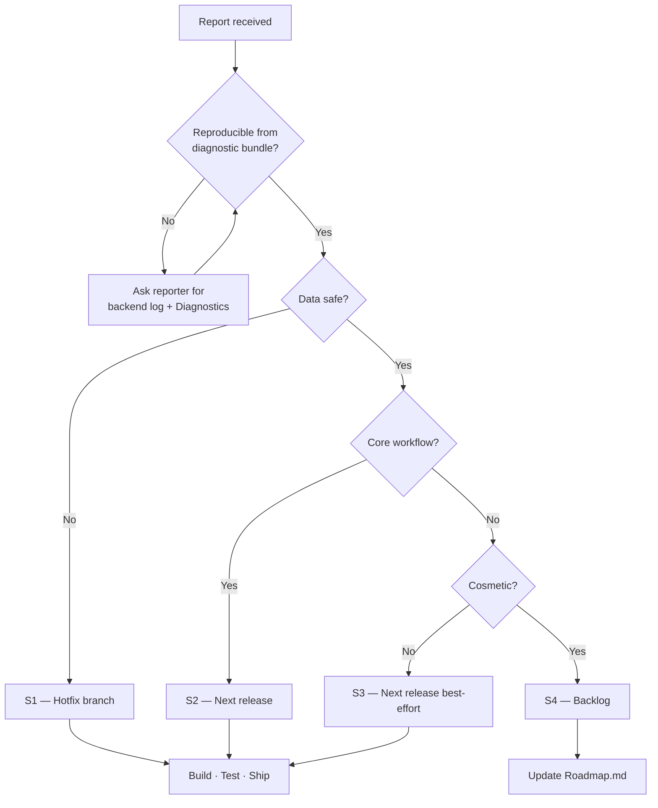

# Incident Response

Playbook for when V3 misbehaves in a user's hands. Scoped to the single-user desktop context — there is no on-call rotation because there is no shared service. "Incident" here means a bug the user cannot work around.

---

## Severity Matrix

| Sev | Definition | Response time | Example |
|---|---|---|---|
| **S1** | App crashes on launch for a class of users; data loss risk | Same business day hotfix | DB corruption on save; installer fails on Windows 11 |
| **S2** | Core workflow unavailable but data safe | Next release (within 2 weeks) | Sync always errors due to Box permission regression; Extract fails for all files |
| **S3** | Non-core feature broken; workaround exists | Next release (best effort) | Insights chart empty; Chat can't reach ICA (but local skills work) |
| **S4** | Cosmetic / minor | Backlog | Dark-mode contrast off; toast overlap |

---

## Reporting Channels

1. **Bug report** — file per [Bug-Report-Process.md](Bug-Report-Process.md). Must include the diagnostic bundle (backend log, startup log, screenshot of Diagnostics panel where relevant).
2. **Direct message to maintainer** — Slack. Include the exe version and one-sentence repro.
3. **In the source repo** — GitHub issue (for internal reporters).

Users who don't file a bug get their fix later — noise is the enemy of throughput.

---

## Triage Flow

---

## S1 Response

If the bug puts user data at risk:

1. **Acknowledge** the reporter within one business hour.
2. **Reproduce** on a matching Windows version.
3. **Snapshot** the affected `pdf_extractor_v3.db` if the reporter can share it (may contain secrets — sanitize first).
4. **Freeze** other work; branch from the tagged release.
5. **Fix + test** end-to-end.
6. **Rebuild** via `build_all.bat`.
7. **Ship** the new installer + portable. Notify the reporter with an install link.
8. **Post-mortem** — file an entry in [Release-Notes.md](Release-Notes.md) explaining what broke, what was fixed, and any data-migration note.

---

## S2 Response

1. Acknowledge within one business day.
2. Reproduce and confirm scope (which workflow, which config).
3. Add to the next release ticket in the roadmap.
4. Communicate ETA to the reporter.
5. On release, notify the reporter in the release note.

---

## S3 / S4 Response

Log a bug, add to backlog, notify reporter that it's tracked but not prioritised. Batch these into normal release cycles.

---

## Rollback

Because V3 is distributed as portable + installer:

- **Portable users** — keep the previous exe. If a new release regresses, they run the old one. `%APPDATA%\PDF Extractor V3\pdf_extractor_v3.db` is compatible across versions unless a schema migration was introduced.
- **Installer users** — uninstall the current version, install the previous version. Data survives.

Always mark a release with a **schema-breaking** note in [Release-Notes.md](Release-Notes.md) if applicable. Currently no releases have had a breaking DB change.

---

## Data-Loss Recovery

If a user reports lost tracking/config data:

1. Confirm they have a backup of `pdf_extractor_v3.db` (see [Backup-and-Restore.md](Backup-and-Restore.md)).
2. If yes → guide them through the restore.
3. If no → confirm from the backend log whether the DB was actually touched or the reader path was broken.
4. Worst case, the extracted `.docx/.xlsx/.json` outputs are all on disk under `Local Folder/Extracted/`. Re-scan repopulates the tracking table (as Pending); re-extract completes it.

---

## Communication Templates

**Acknowledgement (S1/S2):**
> Received. Reproducing now. Will follow up within <window>.

**Fix confirmation:**
> Fixed in v3.x.y. Install link: <url>. Please install and confirm.

**Won't-fix (S3/S4):**
> Tracked as <issue-id>. Not planned for the next release. If workaround insufficient, please add impact detail on the issue.

Every message names the actual version.

---

## Escalation

There is no escalation ladder — the maintainer is the single point of ownership. If the maintainer is unavailable and an S1 is open:

1. Users on the affected version stop using V3 and fall back to manual processing.
2. Data on disk is safe (only PDFs and exports; no schema changes propagate without a build).
3. The maintainer resumes on return.

Multi-maintainer capacity is on the [Roadmap](Roadmap.md).

---

## Related

- [Bug-Report-Process.md](Bug-Report-Process.md)
- [Troubleshooting.md](Troubleshooting.md)
- [Release-Notes.md](Release-Notes.md)
- [Roadmap.md](Roadmap.md)
