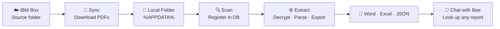

# PDF Extractor V3 — Documentation Suite

> The complete documentation set for **PDF Extractor V3**, IBM's portable Electron desktop application for automating the sync, scan, extraction, and lookup of encrypted background check PDF reports.

---

## What Is PDF Extractor V3?

PDF Extractor V3 is a **fully portable Electron + React + FastAPI desktop application** that automates the complete lifecycle of background check reports downloaded from **IBM Box**. It replaces the Tkinter-based V1 and V2 desktop apps with a modern web-tech UI, a standalone HTTP + WebSocket backend, and a single-file SQLite database — bundled together into one distributable `.exe` that requires no Python, no Node.js, and no browser on the target machine.

**Version:** `3.0.0`
**Distribution:** NSIS installer (`PDF-Extractor-V3-Setup-3.0.0.exe`) and portable (`PDF-Extractor-V3-Portable-3.0.0.exe`)
**Platform:** Windows 10 / 11 (x64)

---

## Workflow at a Glance

Each stage streams live progress over **Socket.IO** to the React UI and writes an entry to the SQLite `extraction_logs` table so every transaction is auditable on the Logs page.

---

## Documentation Index

### Product & Business
| File | Purpose |
|---|---|
| [Product-Overview.md](Product-Overview.md) | Executive summary — what V3 is, who it's for, what it replaces |
| [Use-Cases.md](Use-Cases.md) | Concrete workflow scenarios drawn from HR operations |
| [User-Personas.md](User-Personas.md) | Primary and secondary personas with goals + frustrations |
| [Feature-Scope.md](Feature-Scope.md) | Feature inventory — in-scope, planned, out-of-scope |
| [Business-Rules.md](Business-Rules.md) | Domain invariants (ref-number priority, archive-move semantics, etc.) |

### User-Facing
| File | Purpose |
|---|---|
| [Quickstart.md](Quickstart.md) | Get productive in ten minutes |
| [User-Guide.md](User-Guide.md) | Step-by-step tour of every page |
| [FAQ.md](FAQ.md) | Common questions with concrete answers |
| [Troubleshooting.md](Troubleshooting.md) | Diagnostic playbook for every observable failure |
| [Glossary.md](Glossary.md) | Terminology used across code and docs |

### Technical
| File | Purpose |
|---|---|
| [Technical-Architecture.md](Technical-Architecture.md) | Layered architecture, boundaries, module responsibilities |
| [System-Design.md](System-Design.md) | Runtime topology, threading model, event flow |
| [API-Documentation.md](API-Documentation.md) | Every REST endpoint + Socket.IO event with request/response shapes |
| [Database-Schema.md](Database-Schema.md) | SQLite tables, indexes, columns, sample rows |
| [Developer-Onboarding.md](Developer-Onboarding.md) | First-day setup, code-tour, PR flow |
| [Codebase-Structure.md](Codebase-Structure.md) | Directory layout with per-file responsibilities |
| [Environment-Setup.md](Environment-Setup.md) | Prerequisites, install commands, dev vs packaged runtime |
| [CI-CD.md](CI-CD.md) | Build pipeline (`build_all.bat`), artifacts, release process |
| [ADR/](ADR/) | Architecture Decision Records — the "why" behind key choices |

### Operational
| File | Purpose |
|---|---|
| [Runbooks/](Runbooks/) | Step-by-step runbooks for on-call operators |
| [Monitoring.md](Monitoring.md) | What to watch — logs, ports, health endpoint |
| [Logging.md](Logging.md) | Log file locations, formats, levels, retention |
| [Incident-Response.md](Incident-Response.md) | Severity levels, triage flow, escalation matrix |
| [Backup-and-Restore.md](Backup-and-Restore.md) | What to back up, how to restore, PITR bounds |
| [Deployment-Guide.md](Deployment-Guide.md) | Packaging, distribution, install, upgrade, uninstall |
| [Performance-Benchmarks.md](Performance-Benchmarks.md) | Measured throughput, memory, disk footprint |

### Security & Compliance
| File | Purpose |
|---|---|
| [Security-Model.md](Security-Model.md) | Trust boundaries, secret handling, network exposure |
| [Data-Flow.md](Data-Flow.md) | DFD levels 0–2 showing every data touchpoint |
| [Threat-Model.md](Threat-Model.md) | STRIDE-style enumeration with mitigations |
| [Compliance.md](Compliance.md) | GDPR-relevant handling, retention, subject rights |
| [Audit-Logs.md](Audit-Logs.md) | What's logged, what isn't, tamper resistance |
| [Data-Retention.md](Data-Retention.md) | Retention policies per data class |

### Lifecycle
| File | Purpose |
|---|---|
| [Release-Notes.md](Release-Notes.md) | Cumulative changelog per version |
| [Versioning-Policy.md](Versioning-Policy.md) | SemVer commitment + what constitutes a break |
| [Feature-Request-Process.md](Feature-Request-Process.md) | How proposals become roadmap items |
| [Bug-Report-Process.md](Bug-Report-Process.md) | Required diagnostic bundle + triage SLA |
| [Roadmap.md](Roadmap.md) | Prioritised near-term and future work |
| [Maintenance-Plan.md](Maintenance-Plan.md) | Cadence for dependency, cred, and doc refresh |
| [EOL-Policy.md](EOL-Policy.md) | Support windows and end-of-life criteria |

---

## Quick Start (for the impatient)

1. Double-click `PDF-Extractor-V3-Portable-3.0.0.exe`.
2. Open **Settings** → paste PDF password → upload Box JWT JSON → sign in to ICA.
3. Click **Sync** → **Scan** → **Extract**.
4. Open **View** to browse exports, or **Chat** and type `look up <name>`.

Full walkthrough: **[Quickstart.md](Quickstart.md)** · **[User-Guide.md](User-Guide.md)**

---

## Supporting Documents (legacy, retained for reference)

These files predate the current documentation structure but remain accurate and complementary:

- [features.md](features.md) — per-feature deep dive with flow diagrams
- [system-design.md](system-design.md) — legacy architecture write-up (superseded by [System-Design.md](System-Design.md))
- [data-flow.md](data-flow.md) — legacy DFD (superseded by [Data-Flow.md](Data-Flow.md))
- [process-flows.md](process-flows.md) — startup/setup/pipeline sequence diagrams
- [specifications.md](specifications.md) — functional + non-functional requirements catalogue
- [improvements.md](improvements.md) — observations and enhancement backlog
- [user-guide.md](user-guide.md) — earlier user guide (superseded by [User-Guide.md](User-Guide.md))
