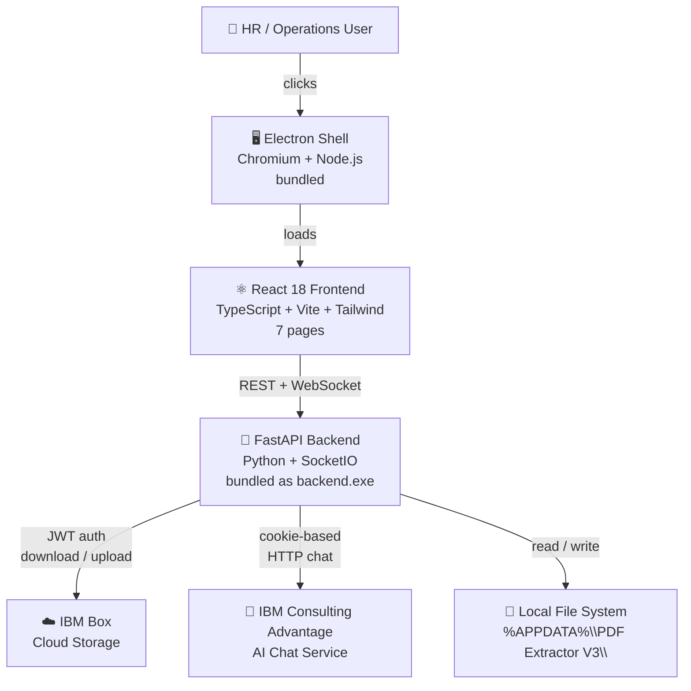

# PDF Extractor V3 — Overview & Quick Start

> **Think of V3 like a self-contained appliance.**
> Previous versions required Python installed on your machine. V3 ships everything bundled inside a single `.exe` — open it, fill in your credentials once, and it runs. It's a background check processing station you can carry on a USB drive.

---

## What Is PDF Extractor V3?

PDF Extractor V3 is a **fully portable Electron desktop application** for automating the full lifecycle of background check PDF reports. It is the third and most capable generation of the extractor series, replacing the Tkinter-based GUI of V2 with a modern **React + TypeScript** interface backed by a standalone **FastAPI + SocketIO** Python server — all packaged so that the target machine needs no Python, no Node.js, and no browser.

### Core Value Proposition

| Without V3 | With V3 |
|---|---|
| Manually open each PDF, re-type data | One click processes all pending reports |
| Hunt for files across folders | Centralized view with status tracking |
| No live progress visibility | Real-time SocketIO events during sync/extract |
| Reports locked in PDFs | Searchable Word, Excel, and JSON outputs |
| Separate install steps per machine | Single portable `.exe` — runs anywhere |

---

## High-Level System Diagram



---

## Who Uses V3?

| Role | Primary Actions |
|---|---|
| **HR / Operations staff** | Sync from Box, scan folder, run extraction, view results |
| **Managers / Stakeholders** | Check Insights dashboard for completion stats |
| **Compliance reviewers** | Open Word or Excel exports directly from the View page |
| **Power users** | Chat with Detective Conan to look up report details |

---

## What's New in V3 vs V2

| Capability | V2 | V3 |
|---|---|---|
| UI framework | Tkinter (Windows native) | React + Tailwind (Chromium-rendered) |
| Distribution | Requires Python installed | Single portable `.exe` — zero dependencies |
| Live progress | Log text box updated synchronously | Real-time SocketIO events streamed to UI |
| AI assistant | Embedded chat panel in Tkinter frame | Dedicated Chat page with bubble UI |
| Settings management | Hand-edit `config.json` | GUI Settings page with masked secrets, JWT upload, and live connection tests |
| ICA login | Manual cookie copy-paste | Built-in Electron browser window that auto-captures credentials |
| Theme | System default only | Dark/light toggle, persisted to localStorage |
| API | None (in-process function calls) | Full REST API at `/docs` — testable with any HTTP client |

---

## Distributable Files

After running `build_all.bat` you get two ready-to-ship files:

| File | Description |
|---|---|
| `electron/dist/PDF-Extractor-V3-Setup-3.0.0.exe` | NSIS installer — installs to Program Files, adds Start Menu + Desktop shortcuts |
| `electron/dist/PDF-Extractor-V3-Portable-3.0.0.exe` | Single-file portable — run from anywhere (USB drive, shared folder, no install) |

Both are fully self-contained: Python interpreter, all packages, and Chromium are bundled inside.

---

## Quick Start (End Users)

### 1. Launch
Double-click the `.exe`. A splash screen appears while the embedded Python backend warms up (~5–10 seconds on first launch).

### 2. Configure
Navigate to **Settings** → fill in:
- `pdf_password` — the decryption password for your PDF reports
- **Box** section — folder IDs and upload the `box_jwt_config.json` file
- **ICA** section — click **Sign in to IBM Consulting Advantage** for automatic credential capture

### 3. Sync
Navigate to **Sync** → click **Sync from Box**. Watch live log messages as files are downloaded and archived on Box.

### 4. Scan
Navigate to **Scan** → click **Scan Folder** to register all new PDFs in the tracking database.

### 5. Extract
Navigate to **Extract** → click **Run Extraction**. Watch per-file progress bars. Outputs are saved as Word, Excel, and JSON and uploaded back to Box.

### 6. View & Chat
Browse outputs on the **View** page, check stats on **Insights**, or query reports conversationally on the **Chat** page.

---

## User Data Location

All data lives at `%APPDATA%\PDF Extractor V3\` (created automatically on first launch):

```
%APPDATA%\PDF Extractor V3\
├── config.json            ← credentials and settings (auto-created as template)
├── box_jwt_config.json    ← replace with your Box app JWT file
├── tracking_db.json       ← auto-managed file status database
├── ica.log                ← ICA request/response debug log
├── Log History\           ← per-extraction .log files (dated hierarchy)
└── Local Folder\
    ├── *.pdf              ← synced PDFs waiting for extraction
    ├── Extracted\
    │   ├── Word Extracts\
    │   ├── CSV Extracts\
    │   └── JSON File Extracts\
    └── Archive\           ← source PDFs after successful extraction
```

---

## Development Mode

Run from source without building the `.exe` (requires Python 3.12 and Node.js):

```bat
cd "PDF Extractor V3"
python start_v3.py
```

This starts the FastAPI backend and Vite dev server and opens the browser automatically.

---

## Documentation Index

| Document | Contents |
|---|---|
| [System Design](system-design.md) | Architecture, modules, API reference, design decisions |
| [Features](features.md) | Per-feature breakdown with flow diagrams |
| [Process Flows](process-flows.md) | End-to-end user journeys and backend pipelines |
| [Improvements](improvements.md) | Observations, gaps, and enhancement opportunities |
| [Shared Data Flow](../shared/data-flow.md) | PDF→JSON parsing pipeline (shared with V1 and V2) |
| [Shared Specifications](../shared/specifications.md) | Glossary and functional requirements |
