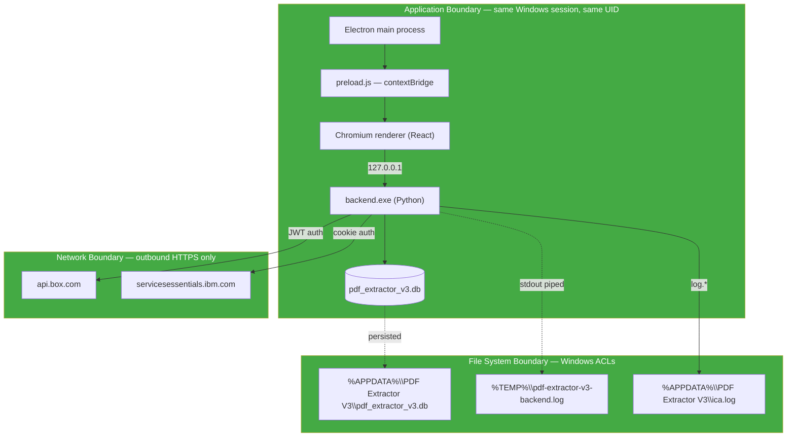

# Security Model

Threat surface, trust boundaries, and secret handling for PDF Extractor V3.

---

## Deployment Context

V3 is a **single-user desktop application** running on a Windows workstation. Its security posture is calibrated to that context — not a shared server, not a public-facing endpoint.

Key implications:

- The Windows account and its file permissions are the trust boundary.
- The backend HTTP server is bound to `127.0.0.1` and never exposed to the network.
- There is no user-level authentication *inside* V3 — anyone who can launch it acts as the Windows account.

---

## Trust Boundaries

Boundaries and what crosses them:

| Boundary | Direction | Contract | Enforcement |
|---|---|---|---|
| Preload ↔ Renderer | Node → Chromium | `electronAPI.{getApiPort, getBackendLogPath, icaLogin}` — three functions | `contextIsolation: true`, `nodeIntegration: false` |
| Renderer ↔ Backend | Chromium → Python | REST + WebSocket on 127.0.0.1 | uvicorn binds `127.0.0.1`; no `--host 0.0.0.0` |
| Backend ↔ SQLite | Python → file | `backend/db.py` API only | Convention + code review |
| Backend ↔ Box | Python → HTTPS | JWT service-account auth via `boxsdk` | Box-side folder ACLs |
| Backend ↔ ICA | Python → HTTPS | Cookie auth via `_ica_send_and_stream` | ICA gateway |

---

## Secrets Inventory

Four secrets live in the app:

| Secret | Location | Cleartext access | Masking |
|---|---|---|---|
| `pdf_password` | `config` table, section `pdf_password` | Backend Python reads it to decrypt PDFs | `••••••••` on the Settings API |
| `ica.full_cookie` | `config` table, section `ica`, key `full_cookie` | Backend Python sends it as the Cookie header to ICA | `••••••••` on Settings API; fingerprinted (length + names, no values) in `ica.log` |
| Box JWT JSON | `jwt_config` table, `id = 1` | Backend Python constructs the JWTAuth from it | Not returned via any API — the Settings page only shows "JWT uploaded ✓" |
| ICA `team_id`, `chat_id` | `config` table | Sent as headers / URL segments | Not masked (identifiers, not authenticators) |

Rules enforced in code:

- `backend/settings.py:_mask_config` — masks `pdf_password` and `ica.full_cookie` when returning config to the renderer.
- `backend/settings.py:_deep_merge` — treats a mask value in the incoming patch as "unchanged" so the on-disk secret is never overwritten by the mask.
- `backend/chat.py:_redact_cookie` — the only function that ever logs a cookie's fingerprint.
- `backend/activity.py` — settings-save log rows are computed from the **masked** config diff, so no real secret can leak into `extraction_logs`.

---

## Non-Secrets Included in Storage

- Sync/scan/extract history (tracking rows, activity log).
- Box folder IDs, ICA team IDs, chat IDs.
- Extracted report content (names, references, employer names, verification statuses).

These are **PII / sensitive-in-domain** but not authentication material. They deserve the same file-system protection as the DB — see [Compliance.md](Compliance.md) for retention obligations.

---

## Data-at-Rest Protection

- **`%APPDATA%\PDF Extractor V3\`** is created with the calling user's Windows ACL — only that user (and Administrators) can read it. No cross-user isolation on a shared machine unless the machine's user-profile hierarchy is respected.
- **No encryption** is applied by V3 to `pdf_extractor_v3.db` itself. On a machine with disk-level BitLocker, the data is protected at that layer.
- Extracted `.docx / .xlsx / .json` under `Local Folder/Extracted/` are similarly protected only by NTFS ACLs.

Encrypting the DB or the credential rows is on the [Roadmap.md](Roadmap.md).

---

## Data-in-Transit Protection

- **Box** — HTTPS with TLS 1.2+ (enforced by Box's endpoint).
- **ICA** — HTTPS with TLS 1.2+ (enforced by `servicesessentials.ibm.com`).
- **Renderer ↔ Backend** — plain HTTP on `127.0.0.1`. Not encrypted — traffic never leaves the host loopback interface. Threat model excludes an attacker with local packet capture privileges (they already own the account).

---

## Attack Surface

| Surface | Exposure | Mitigation |
|---|---|---|
| Local HTTP API | `127.0.0.1` bound | No mitigation needed — loopback is the trust boundary |
| Upload endpoint | Multipart POST accepting arbitrary files | Path traversal blocked via `Path(name).name`; extension whitelist (`.pdf` only); duplicates skipped without overwrite |
| Chat routing | Freeform text → keyword rules → ICA fallback | Hallucination guard filters model output; no code execution paths |
| ICA cookie in memory | Read from DB, sent to ICA per request | Redacted before logging |
| PyInstaller frozen binary | Can be reverse-engineered | Not a mitigated concern — no proprietary IP in the binary |
| Electron IPC channels | Three named channels via `contextBridge` | No other channels exposed; `nodeIntegration: false` |
| ICA login window | Renders `servicesessentials.ibm.com` | `partition: 'persist:ica-login'` isolates its session storage; cleared on window close |
| PDF password | Read from DB to `pdf_text_extractor.open_and_decrypt_pdf` | Never logged, never returned via API in cleartext |

See [Threat-Model.md](Threat-Model.md) for STRIDE-style enumeration.

---

## Authentication & Authorisation

- **Inside V3**: none. The Windows account authenticates by launching the exe.
- **Box**: JWT service account — a single credential shared by every operator machine. Auth is one-way (V3 identifies itself to Box).
- **ICA**: session cookies captured from an interactive IBMid sign-in. Each operator has their own IBMid; the cookie is per-user.

There is no RBAC. If an operator can launch V3, they can do everything V3 can do.

---

## Common Vulnerabilities Checklist

| Class | Status |
|---|---|
| SQL injection | N/A — all queries use parameter binding |
| Command injection | N/A — the backend does not shell out except via `os.startfile` on user-provided paths (bounded to files V3 wrote itself) |
| Path traversal on upload | Blocked (`Path(name).name`) |
| Path traversal on export | N/A — export paths are constructed from validated `ref_number` and dated folder names |
| XSS in chat / UI | Content is rendered in React, which auto-escapes. Bee's replies are rendered as text, not HTML. |
| CSRF on local API | Not applicable — API bound to loopback |
| Insecure deserialisation | JSON only; no `pickle`, no `eval` |
| Weak crypto | N/A — all crypto is delegated to `boxsdk` (Box JWT) and OS TLS |
| Sensitive data in logs | Actively defended — see [Logging.md](Logging.md) |
| Unsigned exe | Present — SmartScreen warnings expected. Signing on the [Roadmap.md](Roadmap.md). |

---

## Related

- [Threat-Model.md](Threat-Model.md) — STRIDE analysis
- [Data-Flow.md](Data-Flow.md) — data lineage
- [Compliance.md](Compliance.md) — legal / regulatory obligations
- [Audit-Logs.md](Audit-Logs.md) — what's captured for compliance
