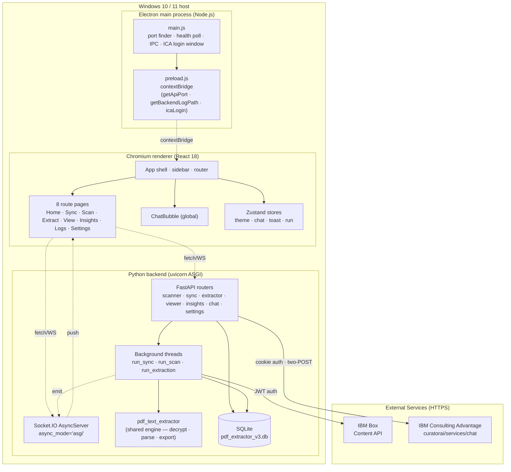
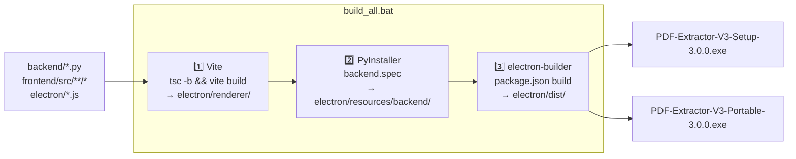

# Technical Architecture

Layered view of PDF Extractor V3. Names every boundary and its responsibility, then shows how the boundaries connect at runtime.

---

## Layer Diagram



---

## Layer Responsibilities

### Electron main process ( `electron/main.js` )

Owns the lifecycle of the whole app.

- Finds a free port (preferred 8765, skips 5000/8080/47321).
- Spawns `backend.exe` (packaged) or `python main.py --port <port>` (dev).
- Polls `GET /api/health` every 500 ms up to a 30 s deadline.
- Creates the main `BrowserWindow` with a splash loaded from a `data:` URL for instant feedback.
- Swaps the splash for the React renderer (`electron/renderer/index.html`) when the backend is healthy.
- Injects `window.__V3_API_PORT__` into the renderer.
- Redirects `backend.exe` stdout/stderr into `%TEMP%\pdf-extractor-v3-backend.log` with `[out]` / `[err]` prefixes.
- Handles two IPC channels: `get-api-port`, `get-backend-log-path`, `ica-login`.

### Preload script ( `electron/preload.js` )

Runs in the renderer with `contextIsolation: true`. Exposes exactly three functions via `contextBridge.exposeInMainWorld('electronAPI', …)`:

- `getApiPort()` — returns the chosen backend port.
- `getBackendLogPath()` — returns the log file path.
- `icaLogin()` — opens the browser-assisted ICA sign-in window.

No Node.js APIs leak to the renderer.

### Renderer (React)

`HashRouter` with 8 routes matching the sidebar. Global overlays: `<ChatBubble />` and `<ToastHost />`.

Communicates with the backend using `fetch` (REST) and `socket.io-client` (WebSocket). Both target `http://127.0.0.1:<port>` where `<port>` comes from `window.__V3_API_PORT__` (or defaults to 8765 in browser dev mode via Vite proxy).

State management: Zustand for cross-page state (theme, run status, toast queue, chat history).

### Backend (FastAPI + Socket.IO)

Single ASGI app assembled in `backend/main.py`:

```python
sio = socketio.AsyncServer(async_mode="asgi", …)
_fastapi = FastAPI(…)
# routers
_fastapi.include_router(scanner.router)   # /api/scan/*
_fastapi.include_router(sync.router)      # /api/sync/*
_fastapi.include_router(extractor.router) # /api/extract/*
_fastapi.include_router(viewer.router)    # /api/view/*
_fastapi.include_router(insights.router)  # /api/insights
_fastapi.include_router(chat.router)      # /api/chat/*
_fastapi.include_router(settings.router)  # /api/settings/*

app = socketio.ASGIApp(sio, other_asgi_app=_fastapi)
```

Long-running work (Sync, Scan, Extract) runs in Python `threading.Thread`s. Worker threads never call `sio.emit()` directly — they route through `events.emit()` which uses `asyncio.run_coroutine_threadsafe` to schedule the emit onto the captured uvicorn loop. This was a deliberate migration from `async_mode="threading"` after events silently dropped.

### Persistence (SQLite)

Single file `pdf_extractor_v3.db` in the data dir. Four tables:

| Table | Purpose |
|---|---|
| `config` | Key/value config; one row per top-level section |
| `tracking_files` | One row per known PDF; PK is `rel_key` |
| `jwt_config` | Single row (`id = 1`) holding the Box JWT JSON |
| `extraction_logs` | Activity-log rows, indexed on `occurred_at` |

WAL journal mode is enabled so the background worker threads can write while the main thread reads. See [Database-Schema.md](Database-Schema.md).

### External services

- **IBM Box** — JWT service-account authentication via `boxsdk`. Downloads for Sync, uploads for Extract output.
- **IBM Consulting Advantage (ICA)** — cookie-authenticated HTTP. Two-POST flow: (1) POST `type: PROMPT` and read back the `_id`; (2) POST `type: ANSWER` with `content.promptEntryId` referencing the prompt, and read the SSE response.

---

## Threading Model

```mermaid
sequenceDiagram
    participant UI as React (main thread)
    participant Uvicorn as Uvicorn asyncio loop
    participant Worker as Worker thread
    participant DB as SQLite
    participant Box as IBM Box

    UI ->> Uvicorn: POST /api/sync/run
    Uvicorn ->> Worker: Thread(_sync_thread).start()
    Uvicorn -->> UI: 200 {status: "started"}
    Worker ->> Box: list folder items
    Box -->> Worker: [items]
    loop per PDF
        Worker ->> Box: download file
        Worker ->> DB: (write nothing yet)
        Worker -->> Uvicorn: run_coroutine_threadsafe(emit "sync:log")
        Uvicorn -->> UI: WS event "sync:log"
    end
    Worker ->> DB: log_add via activity.write
    Worker -->> Uvicorn: emit "sync:done"
    Uvicorn -->> UI: WS event "sync:done"
```

Key invariant: **all writes to `sio.emit` happen on the asyncio loop.** Worker threads schedule via `events.emit()`.

---

## Build & Distribution Topology



- Renderer is bundled to `electron/renderer/` (Vite `base: './'` for `file://` compat).
- Backend is bundled to `electron/resources/backend/backend.exe` (PyInstaller one-folder mode, then referenced as `extraResources` in `electron-builder`).
- `electron-builder` produces both NSIS installer and portable single-exe outputs.

See [CI-CD.md](CI-CD.md) and [Deployment-Guide.md](Deployment-Guide.md).

---

## Key Boundaries and Contracts

| Boundary | Contract |
|---|---|
| Renderer ↔ Backend | REST at `/api/*` returning JSON; WebSocket namespace `/` for Socket.IO events named per `backend/events.py` |
| Preload ↔ Main | IPC channels `get-api-port`, `get-backend-log-path`, `ica-login` — no other channels are exposed |
| Backend ↔ SQLite | Only through `backend/db.py`. Modules never open a `sqlite3.connect` directly. |
| Backend ↔ Box | Only through `backend/box_client.get_box_client()` — no direct `JWTAuth` calls elsewhere |
| Backend ↔ ICA | Only through `chat._ica_send_and_stream` — no other module talks to ICA |
| Config ↔ Storage | `backend/config.py` proxies through `backend/db.py`; there are no `.json` files at runtime |

Violating any of these boundaries requires an ADR (see [ADR/](ADR/)).

---

## Design Decisions of Note

- **SQLite over JSON files** — atomic writes, WAL concurrency, indexed queries. See [ADR/](ADR/).
- **`async_mode="asgi"` over `"threading"`** — restored working Socket.IO event delivery from worker threads.
- **PyInstaller one-folder over one-file** — faster startup and more predictable path resolution than the one-file variant.
- **Electron browser-assisted ICA login over manual cookie paste** — captures HttpOnly cookies that JavaScript alone cannot see.
- **Diagnostics panel over DevTools** — packaged Windows Electron detaches from the console; DevTools is disabled; the on-screen panel is the primary diagnostic surface for end users.
- **Machine-readable `[[level=…]]` tag on activity-log rows** — deterministic classification beats fragile keyword heuristics.

See [ADR/](ADR/) for the full rationale.

---

## Related

- [System-Design.md](System-Design.md) — runtime topology and event flow
- [Codebase-Structure.md](Codebase-Structure.md) — where every file lives
- [API-Documentation.md](API-Documentation.md) — endpoint and event catalogue
- [Database-Schema.md](Database-Schema.md) — table definitions
