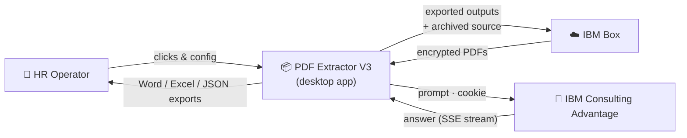
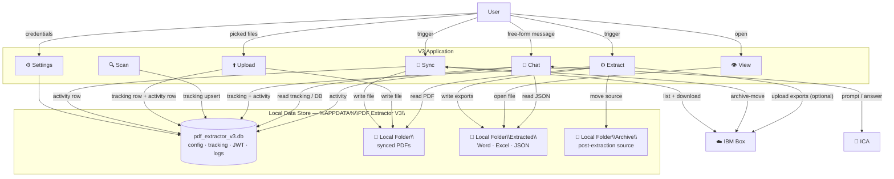
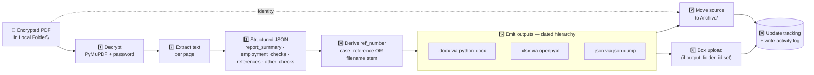
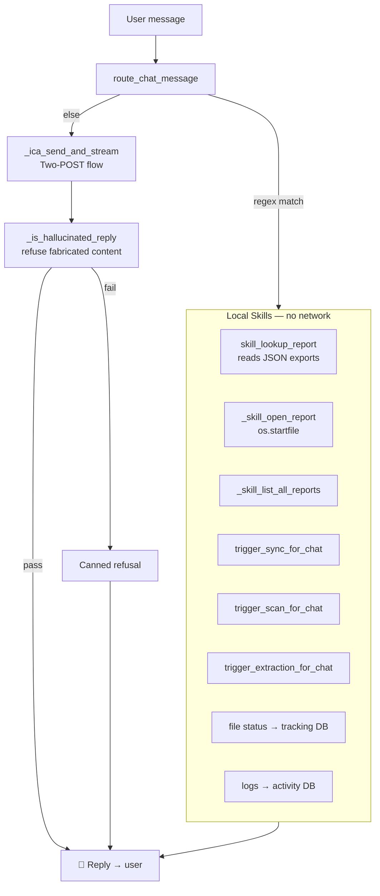

# Data Flow

DFD (Data Flow Diagram) levels 0–2 for PDF Extractor V3. Complements [Security-Model.md](Security-Model.md) and [Compliance.md](Compliance.md) — this doc shows *what* moves; those show *what's protected*.

---

## Level 0 — Context Diagram

Three external actors: the user, IBM Box, and IBM Consulting Advantage.

---

## Level 1 — Major Data Stores

Stores:

| Store | Contents | Persistence |
|---|---|---|
| `pdf_extractor_v3.db` | Config, tracking, JWT, activity log (see [Database-Schema.md](Database-Schema.md)) | SQLite, WAL journal, backed by disk |
| `Local Folder\` | Synced source PDFs before extraction | NTFS files |
| `Local Folder\Extracted\` | Word/Excel/JSON exports in a dated hierarchy | NTFS files |
| `Local Folder\Archive\` | Post-extraction source PDFs | NTFS files |

---

## Level 2 — Extraction Pipeline

Every step is idempotent given the same inputs: re-running Extract over a partial file re-produces the same outputs (subject to filename collision suffixing) and rewrites the same tracking row.

---

## Level 2 — Chat Data Flow

Local skills never call the network. The hallucination guard is applied only to ICA replies (local skills return structured content from our own JSON extracts).

---

## Data Categories

| Category | Examples | Where it lives |
|---|---|---|
| **Auth material** | Box JWT, ICA cookie, PDF password | `pdf_extractor_v3.db` (masked at API boundary) |
| **Domain identifiers** | Box folder IDs, ICA team_id, chat_id | `pdf_extractor_v3.db` (unmasked) |
| **PII (subject data)** | Names, references, employment history from parsed reports | `pdf_extractor_v3.db` (tracking, activity), `Local Folder\Extracted\` |
| **Source documents** | Vendor PDFs | `Local Folder\` before extraction; `Local Folder\Archive\` after |
| **Operational telemetry** | Sync/scan/extract counts, timestamps | `extraction_logs` table + backend log |
| **Chat transcripts** | Local skill responses; ICA prompt/answer pairs | Frontend Zustand store (localStorage-persisted); NOT persisted server-side |

---

## Cross-boundary Data Movement

| Movement | Direction | Contents | Transport |
|---|---|---|---|
| Box source → V3 | in | Encrypted PDFs | HTTPS, `boxsdk` |
| V3 → Box archive | out | The same PDFs (Box-side move) | HTTPS, `boxsdk` |
| V3 → Box output | out | Exports mirroring the dated hierarchy | HTTPS, `boxsdk` |
| V3 → ICA | out | User message (or `bee_prompt.md`), auth cookie | HTTPS |
| ICA → V3 | in | Streamed answer chunks | HTTPS SSE |
| User → V3 | in | Clicks, form data, chat messages | Local UI |
| V3 → User | out | Renders, downloads, opened files | Local UI |

---

## Retention

See [Data-Retention.md](Data-Retention.md) for per-category policy.

---

## Related

- [Database-Schema.md](Database-Schema.md) — table shape
- [Security-Model.md](Security-Model.md) — trust boundaries around this flow
- [Compliance.md](Compliance.md) — regulatory framing
- [Audit-Logs.md](Audit-Logs.md) — how log rows are structured
