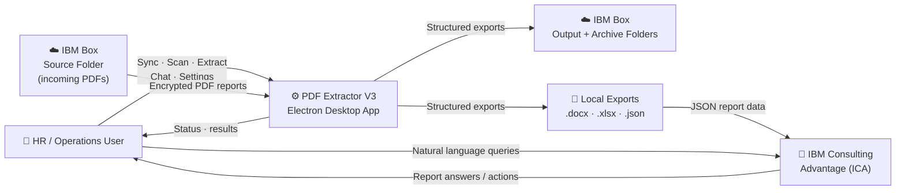
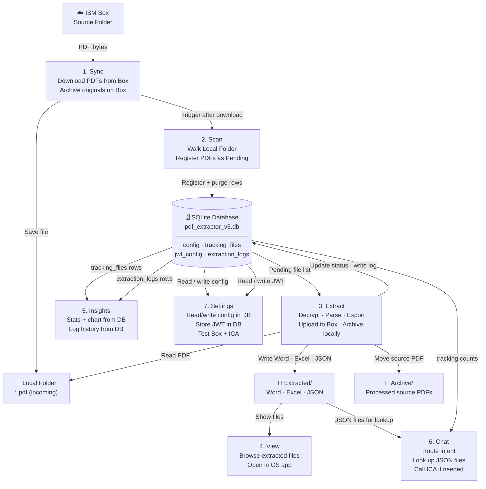
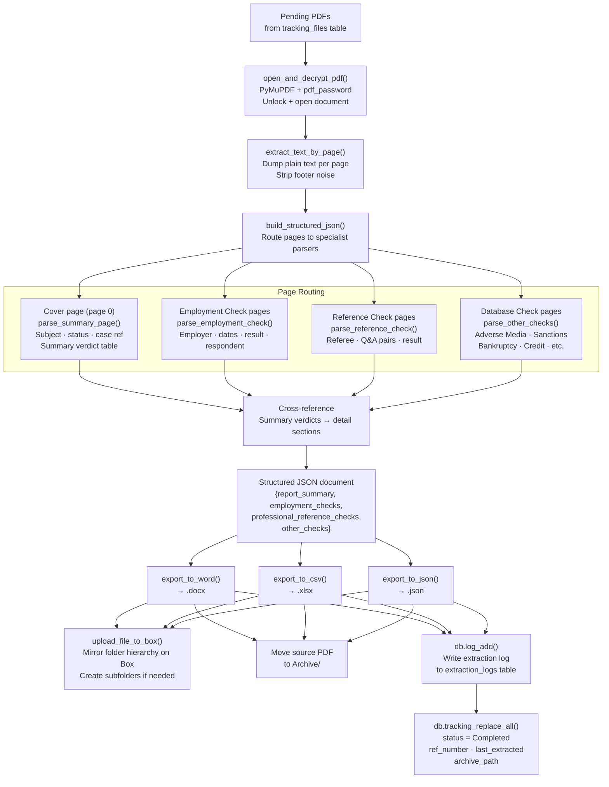
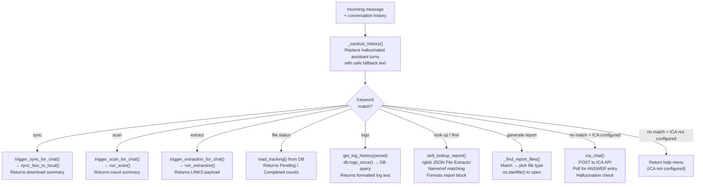

# PDF Extractor V3 — Data Flow

This document describes how data moves through PDF Extractor V3. All data stores, transformations, and external integrations are V3-specific and self-contained — V3 uses a single SQLite database as its source of truth.

---

## Level 0 — System Context

> **Analogy:** Think of V3 as a fully automated post room. Sealed letters (encrypted PDFs) arrive in your company inbox (IBM Box). V3 opens every letter, reads it, types up a clean copy in three formats, files it in a dated cabinet, sends the copies back to headquarters, and tells an AI assistant what was in each letter so you can ask questions later.



---

## Level 1 — Major Internal Processes & Data Stores



---

## Level 2 — Extract Process Detail

The Extract step is the most complex — a multi-stage pipeline per PDF file.



---

## Level 2 — Chat Intent Routing

How a user message becomes a response.



---

## Data Inputs and Outputs

### Inputs

| Source | Format | What It Contains |
|---|---|---|
| IBM Box source folder | Encrypted PDF | Background check report — cover page + section detail pages |
| `config` DB table | JSON (per section) | Box credentials, PDF password, ICA session, folder paths, settings |
| `jwt_config` DB table | JSON | Box JWT service-account key material |
| User interactions | Button click / chat message | Sync trigger, extract trigger, AI query |

### Data Stores

| Store | Type | Updated By | Read By |
|---|---|---|---|
| `config` table | SQLite | Settings page (`POST /api/settings`) | All modules via `config.read_config()` |
| `tracking_files` table | SQLite | Scanner, Extractor | Scanner, Extractor, Insights, Chat |
| `jwt_config` table | SQLite | Settings page (`POST /api/settings/jwt`) | `box_client.get_box_client()` |
| `extraction_logs` table | SQLite | Extractor (`db.log_add()`) | Insights (`db.logs_since()`), Chat |
| `Local Folder/Extracted/` | `.docx` `.xlsx` `.json` files | Extractor | View page, Chat (`skill_lookup_report`), users |
| `Local Folder/Archive/` | `.pdf` files | Extractor (move after success) | View page |
| IBM Box output folder | `.docx` `.xlsx` `.json` | Extractor (upload) | External consumers, auditors |

### Outputs

| Output | Format | Destination | Consumer |
|---|---|---|---|
| Structured report | `.json` | Local Extracted/ + Box | AI assistant, integrations |
| Formatted report | `.docx` | Local Extracted/ + Box | HR reviewers, auditors |
| Tabular report | `.xlsx` | Local Extracted/ + Box | Data analysis, reporting |
| Extraction log | `extraction_logs` row | SQLite DB | Insights logs view, Chat `logs` command |
| Status update | `tracking_files` row | SQLite DB | Next scan / extract / insights / chat cycle |

---

## Structured JSON Output Schema

The core transformation takes an unstructured PDF text dump and produces this document stored as a `.json` file on disk (and searchable by the Chat assistant):

```json
{
  "source_file": "RN-123456_789_10.pdf",
  "extracted_at": "2026-07-10T14:23:03",
  "total_pages": 12,
  "report_summary": {
    "subject_name": "Smith, John",
    "overall_status": "Cleared",
    "case_reference": "RN-123456_789_10",
    "case_received": "2026-06-15",
    "package": "Standard",
    "delivery_date": "2026-07-08",
    "employment_check_summary": [
      { "employer": "Acme Corp", "result": "Verified – Clear", "status": "Cleared" }
    ],
    "professional_reference_summary": [],
    "database_check_summary": [
      { "check": "Adverse Media Check", "result": "No Adverse", "status": "Cleared" }
    ]
  },
  "employment_checks": [
    {
      "check_number": 1,
      "employer_name": "Acme Corp",
      "position_title": "Software Engineer",
      "dates_of_employment": "Jan 2020 – Dec 2023",
      "verification_status": "Cleared",
      "result": "Verified – Clear",
      "notes": ""
    }
  ],
  "professional_reference_checks": [],
  "other_checks": [
    { "check_name": "Adverse Media Check", "status": "Cleared", "source": "...", "result": "No Adverse" },
    { "check_name": "Global Sanctions",    "status": "Cleared" }
  ]
}
```

---

## Status Values

The extraction engine uses exactly three status values. Ambiguity always defaults to `--`.

| Value | Meaning | Example Match |
|---|---|---|
| `Cleared` | Positive verification | "Verified – Clear", "No Adverse", "No Civil Case" |
| `Not Cleared` | Negative result | "Not Verified", "Red Flag", "Unverified" |
| `--` | Unknown / inconclusive | No keyword found — safe default, never a guess |
