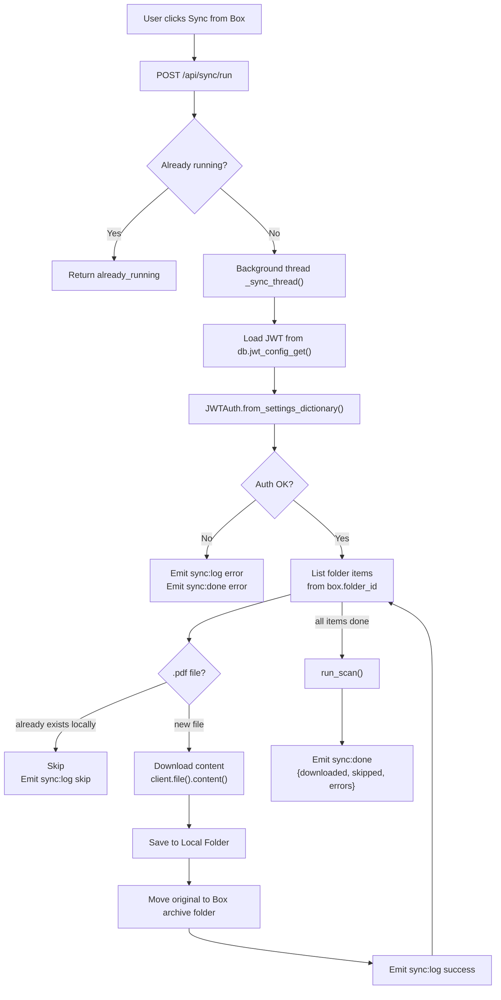
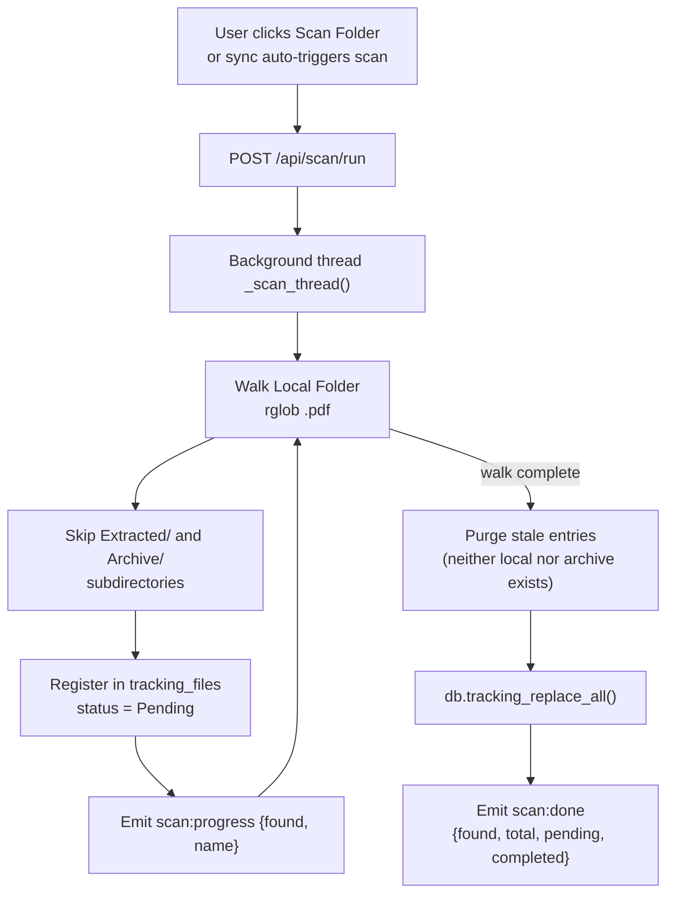
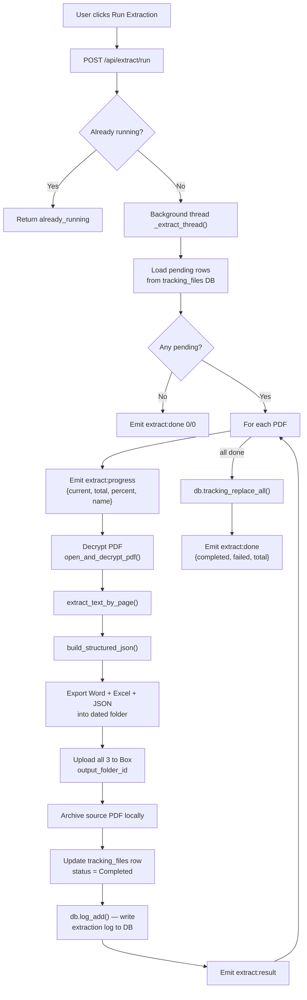
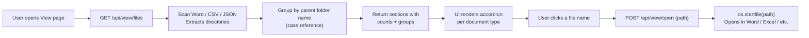
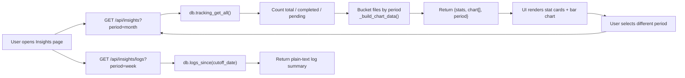
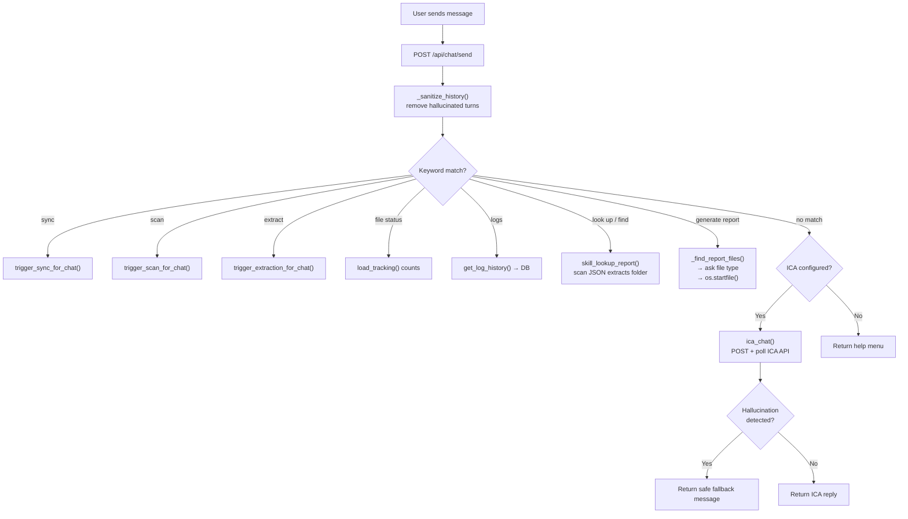
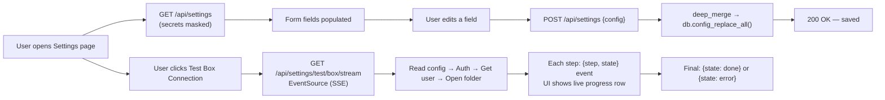
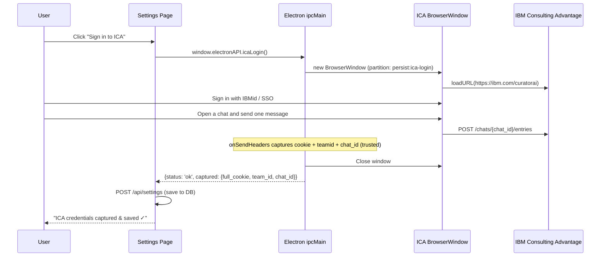

# PDF Extractor V3 — Feature Breakdown

## Feature Index

| # | Feature | Page | Backend Module(s) |
|---|---|---|---|
| 1 | [Box Sync](#1-box-sync) | Sync | `sync.py`, `box_client.py` |
| 2 | [Folder Scan](#2-folder-scan) | Scan | `scanner.py`, `db.py` |
| 3 | [PDF Extraction Pipeline](#3-pdf-extraction-pipeline) | Extract | `extractor.py`, `pdf_text_extractor.py`, `db.py` |
| 4 | [File Viewer](#4-file-viewer) | View | `viewer.py` |
| 5 | [Insights & Analytics](#5-insights--analytics) | Insights | `insights.py`, `db.py` |
| 6 | [AI Chat Assistant](#6-ai-chat-assistant) | Chat | `chat.py` |
| 7 | [Settings & Configuration](#7-settings--configuration) | Settings | `settings.py`, `config.py`, `db.py` |
| 8 | [ICA Browser Login](#8-ica-browser-login) | Settings | `electron/main.js` |

---

## 1. Box Sync

**What it does:** Downloads all PDF files from a configured IBM Box source folder to the local machine, then moves each downloaded original to a Box archive folder.

**Why it exists:** Background check reports arrive in a shared Box folder. This feature bridges the cloud and the local extraction pipeline — pulling new reports down and archiving originals atomically so files are never double-processed.

### Simple Explanation
Think of it as an automated inbox collector. It reaches into your IBM Box mailbox, takes every PDF it finds, saves a copy locally, then stamps each original "processed" by moving it to a filing-cabinet folder on Box.

### Technical Detail
- Reads `box.folder_id` from the `config` database table
- Uses `boxsdk==3.9.2` with JWT service-account authentication (`JWTAuth.from_settings_dictionary()` using JWT JSON stored in the `jwt_config` table)
- Recursively walks subfolders when `settings.search_subfolders` is `true`
- Skips files that already exist locally (by filename)
- Moves each downloaded file to `box.archive_folder_id` on Box after a successful save
- Automatically triggers a folder scan after completion
- Runs in a background thread; every log line is streamed via `sync:log` SocketIO events

### Flow

---

## 2. Folder Scan

**What it does:** Walks the local `Local Folder` directory, registers every `.pdf` file in the SQLite `tracking_files` table with status `Pending`, and purges entries for files that no longer exist anywhere on disk.

**Why it exists:** The extraction pipeline needs a manifest of what to process. Scanning is decoupled from syncing so that PDFs dropped manually into the folder are also picked up.

### Simple Explanation
Like a warehouse stocktake: the scanner walks the warehouse (Local Folder), writes every box (PDF) onto the manifest (`tracking_files` table), and crosses off anything that's been shipped or lost.

### Technical Detail
- Recursively searches `Local Folder/**/*.pdf`
- Skips files under `Extracted/` and `Archive/` subdirectories
- Preserves existing `last_extracted` and `ref_number` for files already tracked
- Purges rows where neither `local_path` nor `archive_path` exists on disk
- Saves changes via `db.tracking_replace_all()` through `tracking.save_tracking()`
- Emits `scan:progress` per file and `scan:done` with total/pending/completed counts

### Flow

---

## 3. PDF Extraction Pipeline

**What it does:** For every `Pending` PDF in the tracking database, decrypts and parses the report, exports three output formats (Word `.docx`, Excel `.xlsx`, JSON `.json`), uploads all three to Box, archives the source PDF locally, and writes a detailed log entry to the `extraction_logs` database table.

**Why it exists:** This is the core value of the entire system — transforming locked, binary PDF reports into structured, searchable, shareable documents automatically.

### Simple Explanation
Imagine a highly efficient data-entry clerk who can process 100 sealed envelopes: open each one, read the report, fill out a Word form, an Excel sheet, and a JSON data file for each — file everything in the right dated drawer, send copies to headquarters, and write a completion note. All in minutes.

### Technical Detail
- Filters `tracking_files` table for `status = "Pending"` entries
- Calls `pdf_text_extractor.open_and_decrypt_pdf()` with the password from `config`
- Calls `extract_text_by_page()` then `build_structured_json()` to produce the structured report model
- Exports `.docx`, `.xlsx`, `.json` into a dated folder hierarchy (`YYYY/Mon_YYYY_Extracts/Week_NN/YYYY-MM-DD/`)
- Uploads all three files to `box.output_folder_id` via `upload_file_to_box()` (mirrors folder hierarchy on Box)
- Moves the source PDF to `archive_folder` with a timestamp suffix if name collision
- Updates `tracking_files` row: `status = "Completed"`, sets `ref_number`, `last_extracted`, `archive_path`
- Writes a plain-text extraction log to the `extraction_logs` table via `db.log_add()`
- Emits `extract:progress` (per-file percent), `extract:result` (per-file outcome), and `extract:done` (final summary)
- Only one extraction runs at a time (`_status["running"]` guard)

### Flow

---

## 4. File Viewer

**What it does:** Displays all extracted output files (Word, Excel, JSON) grouped by document type and case reference, with the ability to open any file in the OS default application.

**Why it exists:** HR staff need a convenient way to find and open extraction outputs without manually navigating the dated folder hierarchy.

### Simple Explanation
A digital filing cabinet with labelled drawers. Open the "Word Documents" drawer, find the folder for a specific case reference, and click the document to open it.

### Technical Detail
- Scans three directories: `Word Extracts/`, `CSV Extracts/`, `JSON File Extracts/`
- Files sorted by modification time (newest first) within each type
- Grouped by parent folder name (the case reference slug)
- Returns `sections[] → groups[] → files[]` hierarchy
- `POST /api/view/open` calls `os.startfile(path)` — Windows shell integration

### Flow

---

## 5. Insights & Analytics

**What it does:** Provides a dashboard of extraction statistics (total, completed, pending) and a bar chart showing volume by a selectable period (day, week, month, year). Also surfaces extraction log history.

**Why it exists:** Managers need a quick visual summary of throughput without opening individual files.

### Simple Explanation
A weekly report card for the processing pipeline. "This month: 47 reports completed, 3 still pending."

### Technical Detail
- Stats queried directly from the `tracking_files` SQLite table (fast, no file I/O)
- Chart data built by bucketing `last_extracted` timestamps into the selected period
- Log history from `db.logs_since(cutoff_date)` — SQL query on indexed `occurred_at` column
- Returns first 10 lines per log entry with a continuation hint for longer entries
- Period options: `day`, `week`, `month` (default), `year`

### Flow

---

## 6. AI Chat Assistant

**What it does:** Provides a conversational interface ("Detective Conan") that can look up report data from extracted JSON files, trigger operations (sync, scan, extract), return file status and log history, and forward general questions to IBM Consulting Advantage (ICA).

**Why it exists:** Rather than navigating between pages, users can ask in plain language — "What's John Smith's status?" or "Extract now" — and get immediate structured answers.

### Simple Explanation
Detective Conan is a knowledgeable colleague who has read every extracted JSON report. Ask him anything. He looks things up directly, runs operations for you, or escalates to IBM's AI for open-ended questions.

### Intent Routing (priority order)

| Intent Keyword | Handler |
|---|---|
| `sync / sync folder / sync now` | `trigger_sync_for_chat()` → calls `sync_box_to_local()` synchronously |
| `scan / scan folder` | `trigger_scan_for_chat()` → calls `run_scan()` |
| `extract / run extract` | `trigger_extraction_for_chat()` → calls `run_extraction()` |
| `file status / how many files` | Reads tracking DB, returns counts |
| `show logs / logs this week` | Calls `get_log_history(period)` → DB query |
| `look up [name]` / `find [name]` | `skill_lookup_report()` — searches JSON files |
| `generate report for [name]` | `_find_report_files()` → pick person → pick type → `os.startfile()` |
| `generate reports` (bare) | `_skill_list_all_reports()` — lists all extracted reports |
| fallback | `ica_chat()` → HTTP POST to ICA API with polling |

### Hallucination Protection
A regex pattern list scans every ICA reply before it reaches the user. Replies that appear to fabricate report structures (employment history, report headers, etc.) are replaced with a safe message.

### Flow

---

## 7. Settings & Configuration

**What it does:** A GUI page for reading and writing all configuration: PDF password, Box credentials and folder IDs, ICA session credentials, local folder paths, sync schedule, and extraction options. Supports JWT file upload and live streaming connection tests.

**Why it exists:** V1 and V2 required hand-editing a JSON file. V3 provides a form with masked secrets, field validation, per-section Clear buttons, and step-by-step connection diagnostics — removing a significant barrier for non-technical users.

### Key Behaviours
- `GET /api/settings` masks `pdf_password` and `full_cookie` as `••••••••` — secrets never leave the server in cleartext
- `POST /api/settings` deep-merges the submitted patch; mask values are silently skipped to avoid overwriting real secrets
- ICA cookie values are automatically `.strip()`-ed on save to remove whitespace that would cause HTTP 400 errors
- `POST /api/settings/jwt` validates the pasted JSON and stores it in the `jwt_config` table (not as a file)
- Streaming tests (`GET /api/settings/test/box/stream` and `/test/ica/stream`) use **Server-Sent Events** — each backend step emits a `{step, state: "run"|"ok"|"error"|"done"}` event the UI renders live
- The ICA stream polls for up to 5 minutes (150 polls × 2 s) with a visible heartbeat update on every poll

### Flow

---

## 8. ICA Browser Login

**What it does:** Opens an embedded Electron browser window pointed at IBM Consulting Advantage. The user signs in normally; Electron automatically captures the session cookie, team ID, and chat ID from outgoing API request headers, then saves them to the database.

**Why it exists:** ICA requires a full browser-session cookie that is impractical to copy manually. This feature makes ICA setup a one-click flow.

### Technical Detail
- Opens a `BrowserWindow` with a persistent session partition (`persist:ica-login`) so previous sessions survive between attempts
- Hooks `session.webRequest.onSendHeaders` to intercept requests to `servicesessentials.ibm.com`
- Captures `cookie`, `teamid`, `teamname` headers from `/curatorai/services/chat/` API calls
- Parses `chat_id` from the `/chats/{id}/entries` URL using regex `ICA_ENTRIES_RE`
- **Trust guard:** Only a `chat_id` captured from a real `/entries` POST (where the user actually sent a message) is accepted as authoritative — placeholder IDs from the new-chat landing page are ignored
- Auto-resolves and closes the window once `full_cookie + team_id + trusted chat_id` are all captured
- Returns partial credentials if the user closes early, with a UI message explaining what is missing

### Flow

