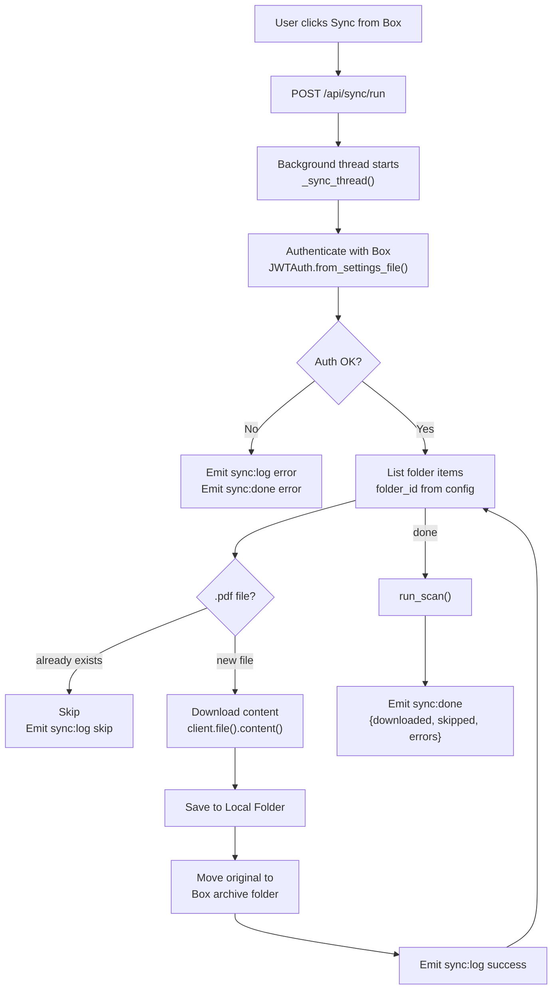
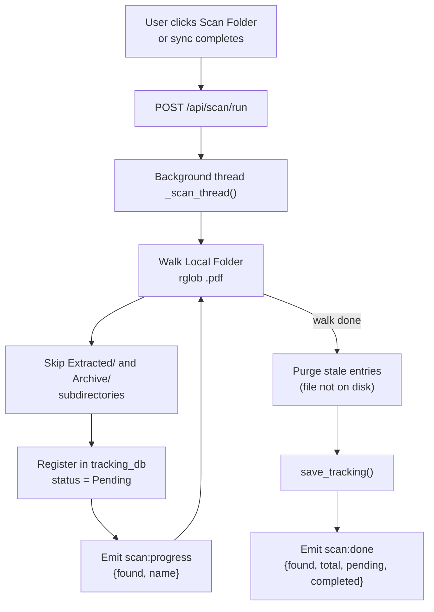
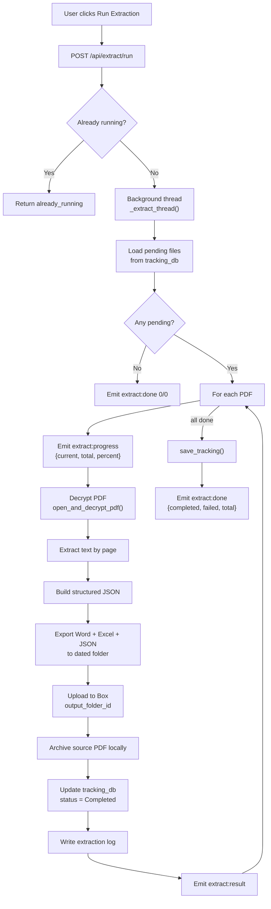
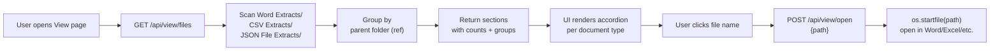
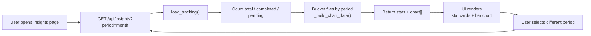
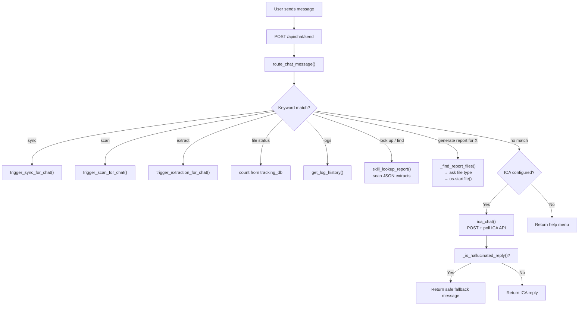
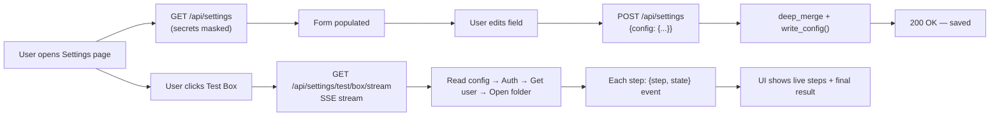
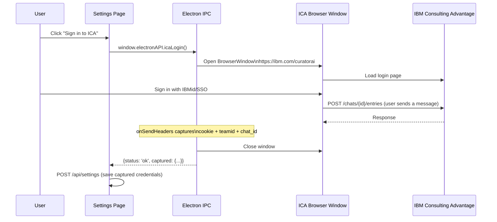

# PDF Extractor V3 — Feature Breakdown

## Feature Index

| # | Feature | Page | Backend Module |
|---|---|---|---|
| 1 | [Box Sync](#1-box-sync) | Sync | `sync.py`, `box_client.py` |
| 2 | [Folder Scan](#2-folder-scan) | Scan | `scanner.py` |
| 3 | [PDF Extraction Pipeline](#3-pdf-extraction-pipeline) | Extract | `extractor.py`, `pdf_text_extractor.py` |
| 4 | [File Viewer](#4-file-viewer) | View | `viewer.py` |
| 5 | [Insights & Analytics](#5-insights--analytics) | Insights | `insights.py` |
| 6 | [AI Chat Assistant](#6-ai-chat-assistant) | Chat | `chat.py` |
| 7 | [Settings & Configuration](#7-settings--configuration) | Settings | `settings.py`, `config.py` |
| 8 | [ICA Browser Login](#8-ica-browser-login) | Settings | `electron/main.js` |

---

## 1. Box Sync

**What it does:** Downloads all PDF files from a configured IBM Box folder to the local machine, then moves each downloaded file to a Box archive folder.

**Why it exists:** Background check reports arrive in a shared Box folder. This feature bridges the cloud storage and the local extraction pipeline — pulling new reports down and archiving originals atomically so files are never double-processed.

### How It Works (Simple)
Think of this as an automated inbox collector. It reaches into your IBM Box mailbox, takes every PDF it finds, saves a copy locally, then stamps each original "processed" by moving it to a filing cabinet folder on Box.

### Technical Detail
- Reads `box.folder_id` from `config.json`
- Uses `boxsdk==3.9.2` with JWT service-account authentication
- Recursively walks subfolders if `settings.search_subfolders` is `true`
- Skips files that already exist locally (by filename)
- Moves each downloaded file to `box.archive_folder_id` on Box after a successful save
- Immediately triggers a folder scan after completion
- Runs in a background thread; every log line is streamed to the UI via `sync:log` SocketIO events

### Flow

---

## 2. Folder Scan

**What it does:** Walks the local `Local Folder` directory, registers every `.pdf` file found in the tracking database with status `Pending`, and purges entries for files that no longer exist.

**Why it exists:** The extraction pipeline needs a manifest of what to process. Scanning is decoupled from syncing so that locally-placed PDFs (dropped manually into the folder) are also picked up.

### How It Works (Simple)
Like an inventory stocktake: the scanner walks the warehouse (Local Folder), writes every box (PDF) onto the manifest (tracking_db.json), and crosses off anything that's been shipped or lost.

### Technical Detail
- Recursively searches `Local Folder/**/*.pdf`
- Skips files under `Extracted/` and `Archive/` subdirectories
- Preserves existing `last_extracted` and `ref_number` for files already in the DB
- Purges entries where neither `local_path` nor `archive_path` exists on disk
- Emits `scan:progress` per file and `scan:done` summary via SocketIO
- Called automatically after every sync

### Flow

---

## 3. PDF Extraction Pipeline

**What it does:** For every `Pending` PDF in the tracking database, decrypts and parses the report, exports three output formats (Word, Excel, JSON), uploads all three to Box, archives the source PDF locally, and writes a detailed extraction log.

**Why it exists:** This is the core value of the entire system — transforming locked, binary PDF reports into structured, searchable, shareable documents automatically.

### How It Works (Simple)
Imagine a highly efficient data-entry clerk who can open 100 sealed envelopes simultaneously, read each report, fill in a Word form, an Excel spreadsheet, and a JSON data file for each one, file everything in the right cabinet drawer, and send copies to headquarters — all in minutes.

### Technical Detail
- Filters tracking DB for `status == "Pending"` entries
- Calls `pdf_text_extractor.open_and_decrypt_pdf()` with the configured password
- Calls `extract_text_by_page()` then `build_structured_json()` to get the report data model
- Exports to `.docx`, `.xlsx`, `.json` in a dated hierarchy (`YYYY/Mon_YYYY_Extracts/Week_NN/YYYY-MM-DD/`)
- Uploads all three files to `box.output_folder_id` via `upload_file_to_box()` (mirrors folder hierarchy)
- Moves source PDF to `archive_folder` with deduplication suffix if needed
- Updates tracking DB: `status = "Completed"`, records `ref_number`, `last_extracted`, `archive_path`
- Writes a plain-text extraction log under `Log History/`
- Emits `extract:progress` (per-file percent), `extract:result` (per-file outcome), and `extract:done` (summary)
- Runs in a background thread; only one extraction at a time (`_status["running"]` guard)

### Flow

---

## 4. File Viewer

**What it does:** Displays all extracted output files (Word, Excel, JSON) grouped by document type and case reference, with the ability to open any file in the OS default application.

**Why it exists:** HR staff need a convenient way to find and open extraction outputs without navigating the dated folder hierarchy manually.

### How It Works (Simple)
Like a digital filing cabinet with labelled drawers. Open the "Word Documents" drawer, find the folder for a specific case reference, and click the document to open it.

### Technical Detail
- `GET /api/view/files` scans three directories: `Word Extracts/`, `CSV Extracts/`, `JSON File Extracts/`
- Files are sorted by modification time (newest first) within each type
- Grouped by parent folder name (case reference slug)
- Returns `sections[]` → `groups[]` → `files[]` hierarchy
- `POST /api/view/open` calls `os.startfile(path)` — Windows-only shell integration

### Flow

---

## 5. Insights & Analytics

**What it does:** Provides a dashboard of extraction statistics (total, completed, pending) and a bar chart showing volume over a selectable time period (day, week, month, year).

**Why it exists:** Managers need a quick visual summary of throughput without reading individual log files.

### How It Works (Simple)
Like a weekly summary report for the filing clerk's work. "This week: 47 reports processed, 3 still pending."

### Technical Detail
- Stats sourced from `tracking_db.json` (fast, no file I/O)
- Chart data built by bucketing `last_extracted` timestamps by the selected period
- `GET /api/insights/logs` reads actual `.log` files from `Log History/` and returns truncated content (first 10 lines per log)
- Period options: `day`, `week`, `month` (default), `year`

### Flow

---

## 6. AI Chat Assistant

**What it does:** Provides a conversational interface ("Detective Conan") that can look up report data, trigger operations (sync, scan, extract), display file status and log history, and forward general questions to IBM Consulting Advantage (ICA).

**Why it exists:** Rather than navigating between pages, users can ask in plain language: "What's the status for John Smith?" or "Extract now" — and get immediate, structured answers.

### How It Works (Simple)
Think of Detective Conan as a knowledgeable colleague sitting next to you. Ask him anything about the reports. He'll look up the structured JSON files, run operations for you, or escalate to IBM's AI if the question is outside his direct knowledge.

### Technical Detail
**Intent routing** (in order of priority):

| Intent Pattern | Handler |
|---|---|
| `sync / sync folder / sync now` | `trigger_sync_for_chat()` → calls `sync_box_to_local()` synchronously |
| `scan / scan folder` | `trigger_scan_for_chat()` → calls `run_scan()` |
| `extract / run extract` | `trigger_extraction_for_chat()` → calls `run_extraction()`, returns `§LINKS§` payload |
| `file status / how many files` | Reads `tracking_db.json`, returns counts |
| `show logs / logs this week` | Calls `get_log_history(period)` |
| `look up [name]` / `find [name]` | `skill_lookup_report()` — scans JSON extracts, formats full report block |
| `generate report for [name]` | `_find_report_files()` → multi-step: pick person → pick file type → open file |
| fallback | `ica_chat()` → HTTP POST to ICA API with polling |

**Hallucination protection:** A regex pattern list scans every ICA reply before it reaches the user. Fabricated report structures are replaced with a safe message.

**ICA chat loop:**
1. POST `message` to ICA `/chats/{chat_id}/entries`
2. Poll `GET /chats/{chat_id}/entries` every 2s for up to 60s (30 polls)
3. Return first `ANSWER`-type entry found

### Flow

---

## 7. Settings & Configuration

**What it does:** A GUI page for reading and writing all `config.json` fields: PDF password, Box credentials and folder IDs, ICA session credentials, local folder paths, sync schedule, and extraction options. Also supports uploading the Box JWT file and running live connection tests.

**Why it exists:** V1 and V2 required hand-editing `config.json` with a text editor. V3 provides a form with masked secret fields, field validation, and step-by-step connection diagnostics — removing a significant barrier for non-technical users.

### Technical Detail
- `GET /api/settings` returns config with `pdf_password` and `full_cookie` replaced by `••••••••`
- `POST /api/settings` deep-merges the submitted patch, skipping mask values to avoid overwriting real secrets
- `POST /api/settings/jwt` validates the uploaded JSON and writes it to `box_jwt_config.json`
- `GET /api/settings/status` returns boolean flags: `box.configured`, `ica.configured`, `pdf_password`, `ready`
- `GET /api/settings/test/box/stream` and `/test/ica/stream` are Server-Sent Event (SSE) streams — each step emits a JSON event with `{ step, state: "run"|"ok"|"error"|"done" }` so the UI shows live progress

### Flow

---

## 8. ICA Browser Login

**What it does:** Opens an embedded Electron browser window pointing at the IBM Consulting Advantage login page. The user signs in normally; Electron automatically captures the session cookie, team ID, and chat ID from outgoing API requests and saves them to `config.json`.

**Why it exists:** ICA requires a full browser-session cookie that is impractical to copy manually. This feature makes ICA setup as simple as "click a button, sign in, done."

### Technical Detail
- Opens a `BrowserWindow` with a persistent session partition (`persist:ica-login`)
- Hooks `session.webRequest.onSendHeaders` to intercept outgoing requests to `servicesessentials.ibm.com`
- Captures `cookie`, `teamid`, `teamname` headers from `/curatorai/services/chat/` API calls
- Parses `chat_id` from the `/chats/{id}/entries` URL pattern using `ICA_ENTRIES_RE`
- **Trust guard:** Only a chat ID from a real `/entries` POST (user actually sent a message) is treated as authoritative — placeholder IDs from the new-chat landing page are ignored to prevent the "(ICA did not respond in time)" failure
- Auto-resolves once `full_cookie + team_id + trusted chat_id` are captured
- On window close without a trusted ID: returns captured cookie + team (partial) with blank `chat_id` to prompt the user to complete setup

### Flow

