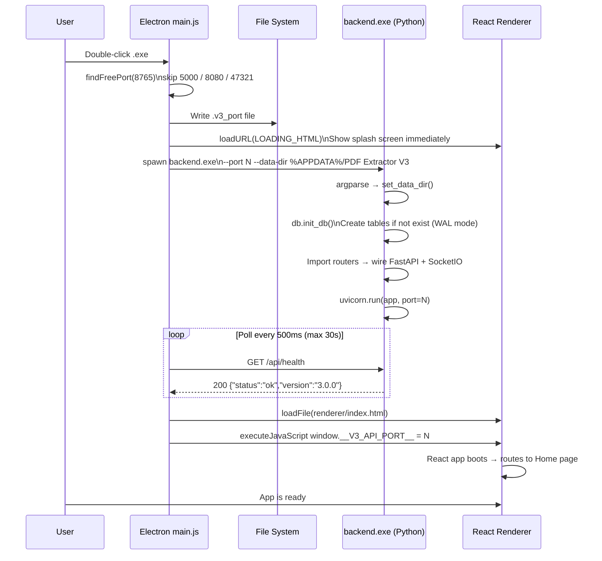
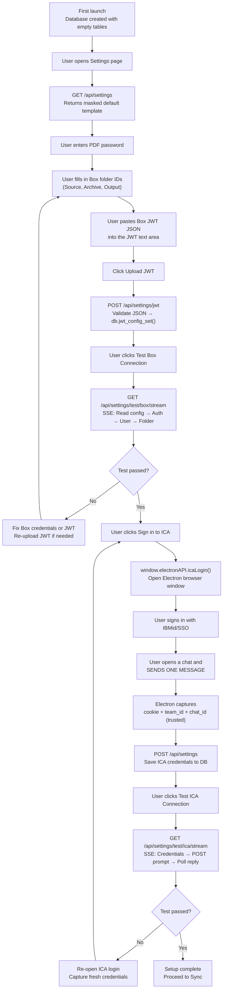
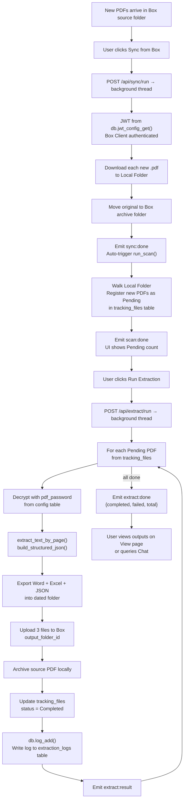
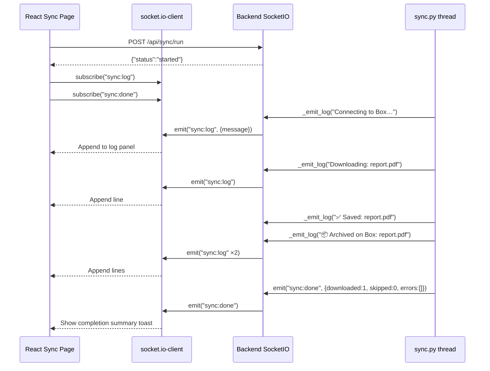
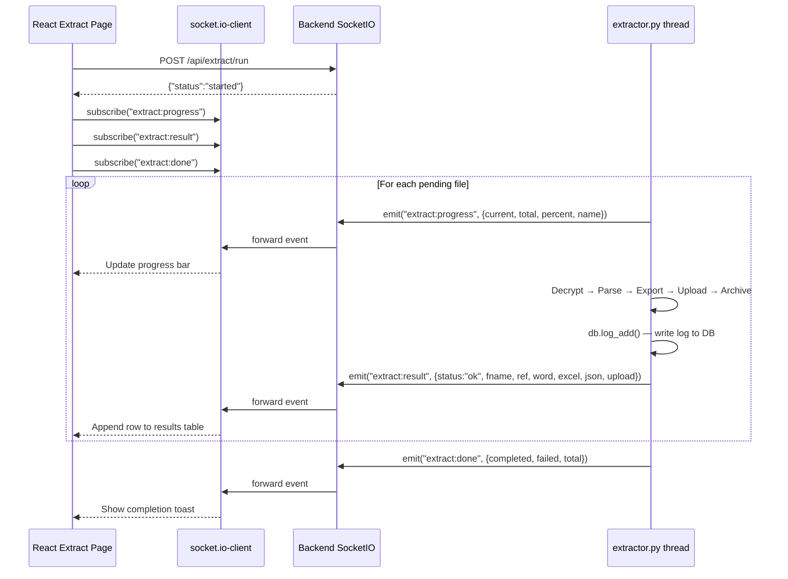
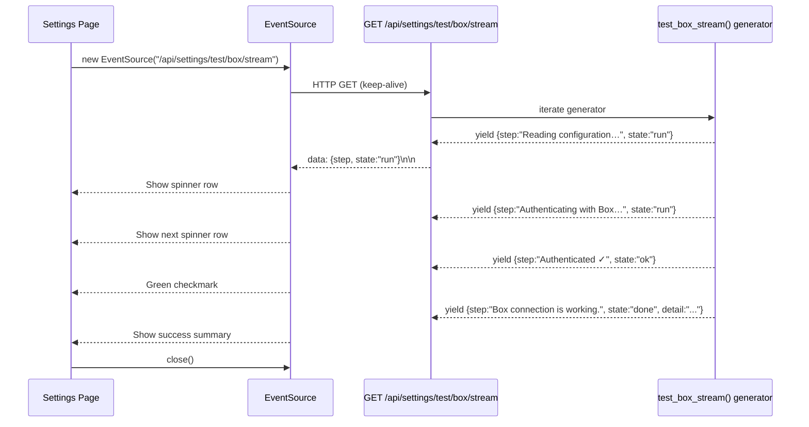
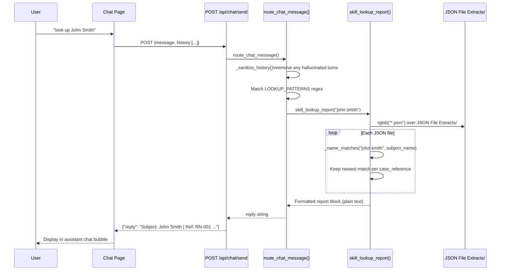
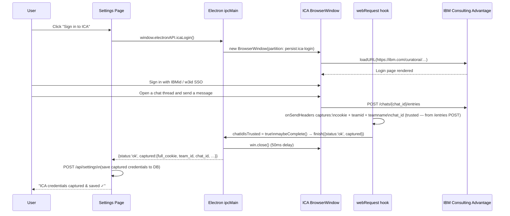
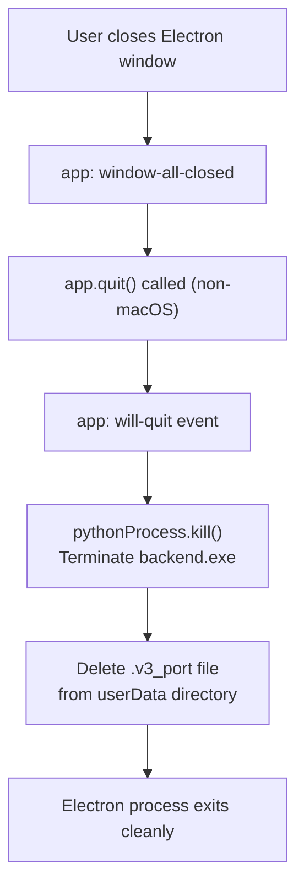

# PDF Extractor V3 — Process & User Flows

This document traces the major journeys through V3 — from first launch to a completed extraction run — along with the critical backend event sequences.

---

## 1. Application Startup

From double-clicking the `.exe` to a fully interactive window.

---

## 2. First-Time Setup

How a new user configures the application after first launch.

---

## 3. Full Processing Workflow

End-to-end from new PDFs on Box to extracted outputs ready to view.

---

## 4. Live Sync Log Stream

How real-time sync log messages flow from Box SDK through the backend to the UI.

---

## 5. Extraction Progress Stream

Per-file progress events during extraction.

---

## 6. Settings SSE Connection Test

How the streaming "Test Box" or "Test ICA" button shows live step-by-step progress.

---

## 7. Chat Report Lookup

How a "look up John Smith" message is processed.

---

## 8. ICA Browser Login

Credential capture via the embedded Electron browser window.

---

## 9. Application Shutdown

Clean teardown when the user closes the window.

