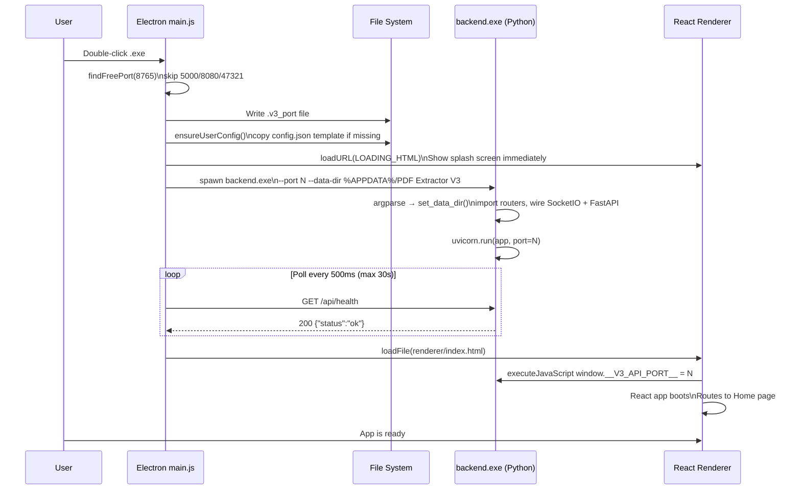
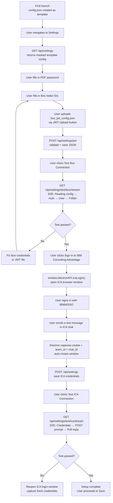
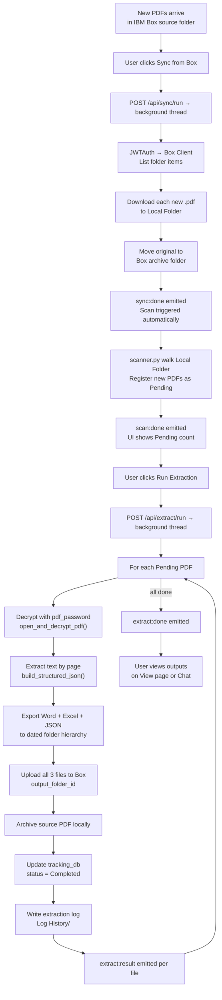
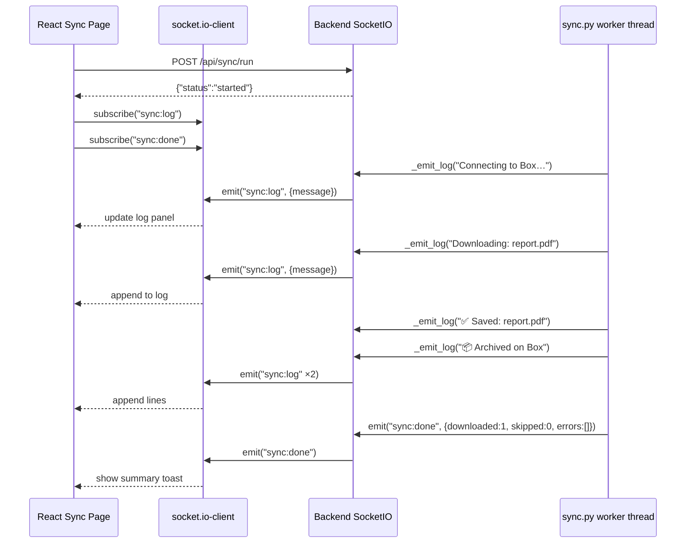
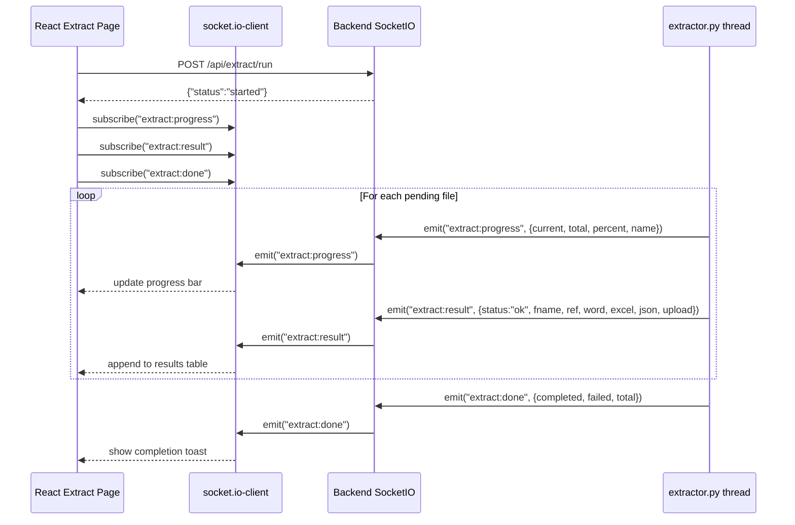
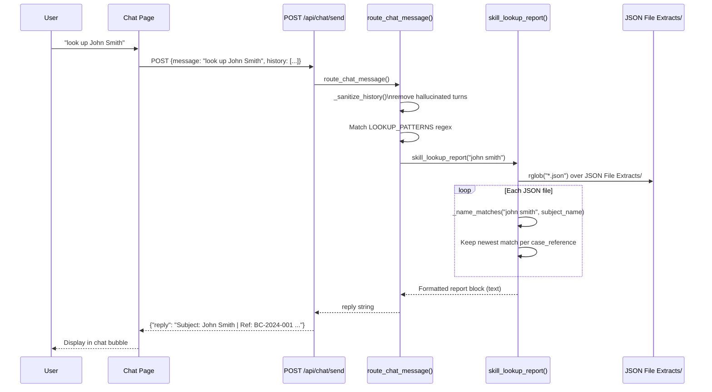
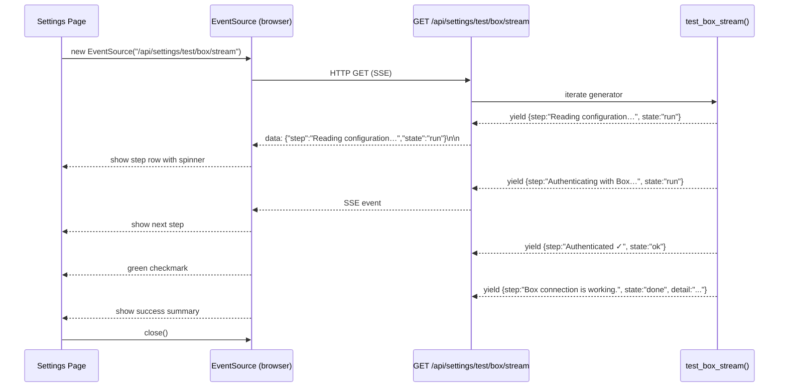
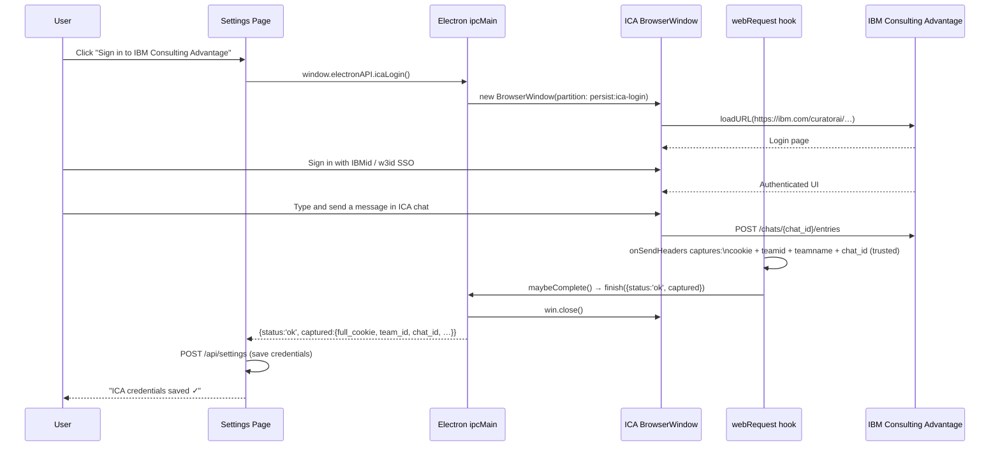
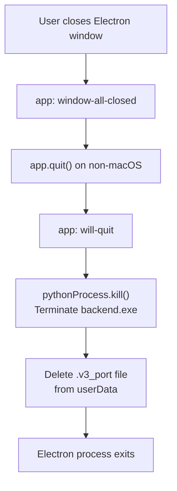

# PDF Extractor V3 — Process & User Flows

## Overview

This document traces the major journeys through V3 — from first launch to a completed extraction — and the critical backend paths that power them.

---

## 1. Application Startup Flow

The sequence from double-clicking the `.exe` to a fully interactive window.

---

## 2. First-Time Setup Flow

How a new user configures the application after first launch.

---

## 3. Full Processing Workflow

The end-to-end journey from new PDFs arriving in Box to extracted outputs ready to view.

---

## 4. Live Sync Log Stream

How real-time sync log messages flow from Box SDK through the backend to the UI.

---

## 5. Extraction Progress Stream

Per-file progress events during extraction.

---

## 6. Chat: Report Lookup Flow

How a "look up John Smith" message is processed end-to-end.

---

## 7. Settings SSE Connection Test Flow

How the "Test Box" button shows live step-by-step progress.

---

## 8. ICA Browser Login Flow

Credential capture via the embedded Electron browser window.

---

## 9. Application Shutdown Flow

Clean teardown when the user closes the window.

