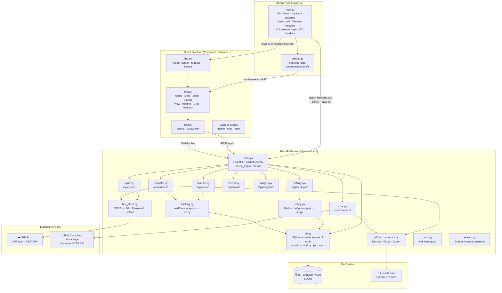

# PDF Extractor V3 — System Design

## Architecture Overview

V3 is a three-layer desktop application packaged into a single distributable executable. The three layers communicate exclusively through well-defined interfaces: REST + WebSocket between frontend and backend; IPC between Electron and the renderer; and a single SQLite database as the backend's sole persistence layer.



---

## Technology Stack

| Layer | Technology | Version | Role |
|---|---|---|---|
| Desktop shell | Electron | 32 | Window management, backend process lifecycle, IPC |
| Packaging | electron-builder | latest | NSIS installer + portable `.exe` |
| Frontend framework | React | 18 | Component-based UI |
| Frontend language | TypeScript | 5 | Type-safe components and API contracts |
| Frontend build | Vite | 5 | Fast dev server + optimised production build |
| Frontend styling | Tailwind CSS | 3 | Utility-first CSS with custom design tokens |
| State management | Zustand | 4 | Lightweight stores (theme, chat, toast) |
| WebSocket client | socket.io-client | 4 | Real-time event subscriptions |
| Backend language | Python | 3.12 | All backend logic |
| Backend framework | FastAPI | 0.110+ | REST API with automatic `/docs` OpenAPI UI |
| ASGI server | Uvicorn | 0.29+ | HTTP server for FastAPI |
| WebSocket server | python-socketio | 5 | SocketIO in threading mode |
| Database | SQLite (stdlib `sqlite3`) | — | Single source of truth; WAL mode |
| PDF parsing | PyMuPDF (fitz) | 1.24+ | Page text extraction from PDFs |
| Word export | python-docx | 1.1+ | `.docx` generation |
| Excel export | openpyxl | 3.1+ | `.xlsx` generation |
| Box SDK | boxsdk (v3) | 3.9.2 | JWT-authenticated Box API client |
| Data validation | Pydantic | 2 | Request/response models |
| Python bundler | PyInstaller | latest | Python → `backend.exe` |

---

## Module Reference

### Electron Layer

| File | Responsibility |
|---|---|
| `electron/main.js` | App lifecycle: finds free port, spawns `backend.exe --port N --data-dir ...`, polls `/api/health`, creates `BrowserWindow` with splash, loads React renderer, injects `window.__V3_API_PORT__`, hosts ICA browser login credential capture, kills backend on quit |
| `electron/preload.js` | Exposes `window.electronAPI.getApiPort()` and `window.electronAPI.icaLogin()` to the renderer via `contextBridge` (no Node integration) |
| `electron/package.json` | electron-builder config: NSIS installer + portable target, `extraResources` to bundle `backend.exe` folder |

### Frontend Layer

| File | Responsibility |
|---|---|
| `frontend/src/App.tsx` | React Router setup, always-dark sidebar layout, theme class toggle |
| `frontend/src/pages/Home.tsx` | Dashboard with quick-access cards to all pages |
| `frontend/src/pages/Sync.tsx` | Box→Local sync trigger + live SocketIO log stream panel |
| `frontend/src/pages/Scan.tsx` | Folder scan trigger + pending/completed file table |
| `frontend/src/pages/Extract.tsx` | Extraction trigger + per-file progress bar + results table |
| `frontend/src/pages/View.tsx` | Browse extracted files (Word/Excel/JSON) grouped by reference; open in OS default app |
| `frontend/src/pages/Insights.tsx` | Stat cards (total/completed/pending) + bar chart; selectable period |
| `frontend/src/pages/Chat.tsx` | Conversational chat with Detective Conan; bubble UI; history preserved in Zustand |
| `frontend/src/pages/Settings.tsx` | GUI for all config fields; Box JWT upload; per-section Clear buttons; Box/ICA SSE streaming connection tests; ICA browser login button |
| `frontend/src/hooks/useApi.ts` | `fetch` wrapper pointing to `http://127.0.0.1:<port>` |
| `frontend/src/hooks/useSocket.ts` | `socket.io-client` connection + typed event subscriptions |
| `frontend/src/store/theme.ts` | Zustand dark/light toggle persisted to `localStorage` |
| `frontend/src/store/chat.ts` | Zustand chat message history + ICA configured flag |
| `frontend/src/store/toast.ts` | Zustand toast notification queue |
| `frontend/src/components/Sidebar.tsx` | Always-dark navy sidebar with route links and status indicators |
| `frontend/src/components/ChatBubble.tsx` | Individual chat message bubble (user / assistant) |
| `frontend/src/components/ui/` | Reusable primitives: Button, Card, Badge, Spinner, EmptyState, Toast |
| `frontend/src/types/index.ts` | All shared TypeScript interfaces (`AppConfig`, `TrackedFile`, `ExtractResult`, etc.) |

### Backend Layer

| Module | REST Routes | Responsibility |
|---|---|---|
| `main.py` | `GET /api/health` | Entry point; parses `--port` and `--data-dir` args; calls `db.init_db()`; wires FastAPI routers + SocketIO server |
| `db.py` | — | **SQLite persistence layer.** Four tables: `config`, `tracking_files`, `jwt_config`, `extraction_logs`. WAL mode, per-call connections. All other modules go through `config.py` or `tracking.py` wrappers |
| `config.py` | — | Path helpers (`set_data_dir`, `_data_dir`, `local_folder`, `extracted_folder`, `archive_folder`). Thin wrappers over `db.py` for `read_config`, `write_config`, `write_jwt_config`, `jwt_config_exists` |
| `tracking.py` | — | `load_tracking()` → `db.tracking_get_all()` ; `save_tracking()` → `db.tracking_replace_all()` — legacy shape `{"files": {...}}` preserved |
| `ports.py` | — | `find_free_port(8765)` — socket-probes ports starting at 8765, skips 5000 / 8080 / 47321 |
| `events.py` | — | String constants for all SocketIO event names |
| `scanner.py` | `POST /api/scan/run` `GET /api/scan/files` | Walks `Local Folder/**/*.pdf`, skips `Extracted/` + `Archive/`, upserts tracking DB, purges stale entries, emits `scan:progress` / `scan:done` |
| `sync.py` | `POST /api/sync/run` `GET /api/sync/status` | Downloads PDFs from Box source folder, archives originals on Box, triggers scan after completion, emits `sync:log` / `sync:done` |
| `extractor.py` | `POST /api/extract/run` `GET /api/extract/results` | Full extraction pipeline: decrypt → parse → export Word/Excel/JSON → upload to Box → archive locally → write log to DB; emits `extract:progress` / `extract:result` / `extract:done` |
| `viewer.py` | `GET /api/view/files` `POST /api/view/open` | Lists extracted files grouped by type and case reference; opens files via `os.startfile()` |
| `insights.py` | `GET /api/insights` `GET /api/insights/logs` | Returns stat cards + time-bucketed chart data from `tracking_files` table; reads log history from `extraction_logs` table via `db.logs_since()` |
| `chat.py` | `POST /api/chat/send` | Keyword intent router → local skill handlers → ICA HTTP fallback; hallucination detection; SSE streaming connection test generators |
| `settings.py` | `GET/POST /api/settings` `GET /api/settings/status` `POST /api/settings/jwt` `POST /api/settings/test/box` `GET /api/settings/test/box/stream` `POST /api/settings/test/ica` `GET /api/settings/test/ica/stream` | CRUD for config via `db.py`; deep-merge with secret masking; Box/ICA connection tests via SSE |
| `box_client.py` | — | `get_box_client()` → loads JWT from `db.jwt_config_get()` (falls back to on-disk file for legacy installs); `upload_file_to_box()` with folder hierarchy mirroring |
| `pdf_text_extractor.py` | — | Shared extraction engine: `open_and_decrypt_pdf`, `extract_text_by_page`, `build_structured_json`, `export_to_word`, `export_to_csv`, `export_to_json` |

---

## SQLite Database Schema

The database file is `pdf_extractor_v3.db`, located in `%APPDATA%\PDF Extractor V3\` in production (or `backend/` in development). All tables are created by `db.init_db()` on first startup.

```sql
-- Application configuration (one row per top-level config section)
CREATE TABLE IF NOT EXISTS config (
    section TEXT PRIMARY KEY,   -- e.g. "box", "ica", "local", "sync", "settings"
    value   TEXT NOT NULL       -- JSON-encoded value for that section
);

-- Tracked PDF files
CREATE TABLE IF NOT EXISTS tracking_files (
    rel_key        TEXT PRIMARY KEY,  -- relative path from Local Folder root
    name           TEXT,              -- filename e.g. "RN-123.pdf"
    status         TEXT DEFAULT 'Pending',  -- "Pending" | "Completed"
    last_extracted TEXT,              -- ISO-8601 timestamp
    ref_number     TEXT,              -- case reference e.g. "RN-123456_789_10"
    local_path     TEXT,              -- absolute path on disk
    archive_path   TEXT               -- path after archiving
);

-- Box JWT service-account config (single row, id always = 1)
CREATE TABLE IF NOT EXISTS jwt_config (
    id    INTEGER PRIMARY KEY CHECK (id = 1),
    value TEXT NOT NULL   -- full JWT config JSON
);

-- Per-extraction log entries (replaces Log History/ filesystem files)
CREATE TABLE IF NOT EXISTS extraction_logs (
    id          INTEGER PRIMARY KEY AUTOINCREMENT,
    ref_number  TEXT,
    occurred_at TEXT NOT NULL,   -- ISO-8601 timestamp
    content     TEXT NOT NULL    -- full log text for this extraction
);
CREATE INDEX IF NOT EXISTS idx_logs_occurred_at ON extraction_logs (occurred_at);
```

**WAL mode** is enabled so background worker threads (scanner, sync, extractor) can write concurrently while the FastAPI request threads read without blocking.

---

## REST API Reference

Base URL: `http://127.0.0.1:<port>` (port auto-detected at startup, injected as `window.__V3_API_PORT__`)

Interactive docs: `http://127.0.0.1:<port>/docs`

| Method | Path | Description |
|---|---|---|
| `GET` | `/api/health` | Liveness probe; returns `{"status":"ok","version":"3.0.0"}` |
| `POST` | `/api/scan/run` | Trigger folder scan in background; progress via SocketIO |
| `GET` | `/api/scan/files` | Return all tracked files with status |
| `POST` | `/api/sync/run` | Trigger Box→Local sync in background; logs via SocketIO |
| `GET` | `/api/sync/status` | `{"running": bool}` |
| `POST` | `/api/extract/run` | Trigger extraction pipeline in background |
| `GET` | `/api/extract/results` | Same as `/api/scan/files` |
| `GET` | `/api/view/files` | Extracted outputs grouped by type + reference |
| `POST` | `/api/view/open` | Open a file in the OS default app |
| `GET` | `/api/insights` | Stats + chart data (`?period=day\|week\|month\|year`) |
| `GET` | `/api/insights/logs` | Log history text (`?period=week`) |
| `POST` | `/api/chat/send` | Send message; returns `{"reply": "..."}` |
| `GET` | `/api/settings` | Read config (secrets masked as `••••••••`) |
| `POST` | `/api/settings` | Write config (deep-merge; mask values skipped) |
| `GET` | `/api/settings/status` | Box / ICA / PDF password configured flags |
| `POST` | `/api/settings/jwt` | Upload Box JWT JSON content (stored in DB) |
| `POST` | `/api/settings/test/box` | Test Box JWT connection (synchronous) |
| `GET` | `/api/settings/test/box/stream` | Box connection test as SSE stream |
| `POST` | `/api/settings/test/ica` | Test ICA connection (synchronous) |
| `GET` | `/api/settings/test/ica/stream` | ICA connection test as SSE stream (up to 5 min) |

---

## SocketIO Events

| Event | Direction | Payload | Emitter |
|---|---|---|---|
| `sync:log` | Server → Client | `{ message: string }` | `sync.py` per file |
| `sync:done` | Server → Client | `{ downloaded, skipped, errors[] }` | `sync.py` on completion |
| `scan:progress` | Server → Client | `{ found, name }` | `scanner.py` per file |
| `scan:done` | Server → Client | `{ found, total, pending, completed }` | `scanner.py` on completion |
| `extract:progress` | Server → Client | `{ current, total, percent, name }` | `extractor.py` per file |
| `extract:result` | Server → Client | `{ status, fname, ref, word, excel, json, upload }` | `extractor.py` per file |
| `extract:done` | Server → Client | `{ completed, failed, total }` | `extractor.py` on completion |

---

## Key Design Decisions

| Decision | Choice | Rationale |
|---|---|---|
| Desktop shell | Electron + electron-builder | Produces real `.exe`, bundles Chromium — no browser required on target |
| Python bundling | PyInstaller one-folder → `backend.exe` | Python interpreter + all packages bundled — no system Python needed |
| Persistence | SQLite (`db.py`) | Single atomic file replaces three loose JSON files; WAL mode supports concurrent threads; no external dependency |
| Config storage | `config` table (one row per section) | Sections updated independently; no full-file rewrites; mask-safe deep-merge |
| JWT config storage | `jwt_config` table | Keeps sensitive key material inside the database file, not a separate file on disk |
| Extraction logs | `extraction_logs` table | DB queries replace filesystem `rglob`; indexed on `occurred_at` for period filtering |
| Backend API | FastAPI REST + python-socketio threading mode | REST for synchronous queries; SocketIO for long-running live-streaming operations |
| Port resolution | `find_free_port(8765)` via `socket.bind()` | Zero-config; never conflicts with other workspace servers |
| User data path | `%APPDATA%\PDF Extractor V3\` via `--data-dir` | Writable location, separate from read-only app bundle |
| Box SDK version | `boxsdk==3.9.2` (v3, NOT v10 `box_sdk_gen`) | Same `JWTAuth`/`Client` API as V2; no migration required |
| Secret masking | Server-side `••••••••` on `GET /api/settings` | `pdf_password` and `full_cookie` never travel to the frontend in cleartext |
| ICA credential capture | Electron `webRequest.onSendHeaders` | Auto-captures cookie + team_id + chat_id from real ICA API traffic |
| Trusted chat_id guard | Only `/chats/{id}/entries` POST IDs accepted | Prevents uninitialized thread IDs from causing "(ICA did not respond in time)" |
| Hallucination guard | Regex pattern list on all ICA replies | Detects fabricated report data before it reaches the user |

---

## Output File Hierarchy

Extraction outputs use a date-based nested structure under `Local Folder/Extracted/`:

```
Extracted/
├── Word Extracts/
│   └── <YYYY>/
│       └── <Mon_YYYY>_Extracts/
│           └── Week_<NN>/
│               └── <YYYY-MM-DD>/
│                   └── <ref_number>.docx
├── CSV Extracts/       ← same structure, .xlsx files
└── JSON File Extracts/ ← same structure, .json files
```
