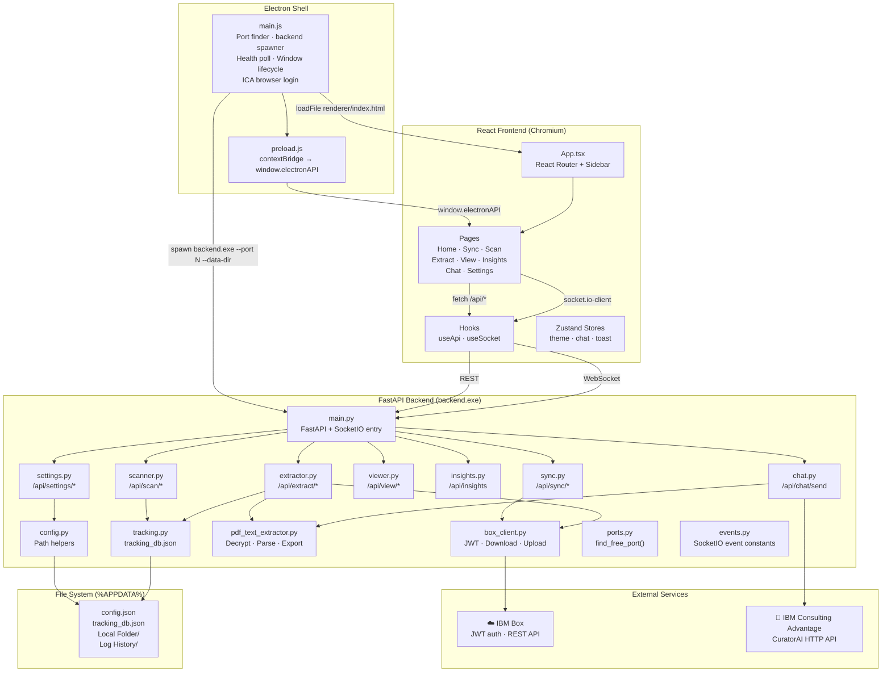

# PDF Extractor V3 — System Design

## Architecture Overview

V3 is a three-layer desktop application packaged into a single distributable executable:



---

## Technology Stack

| Layer | Technology | Version | Role |
|---|---|---|---|
| Desktop shell | Electron | 32 | Window management, backend lifecycle, IPC |
| Packaging | electron-builder | latest | NSIS installer + portable `.exe` |
| Frontend framework | React | 18 | Component-based UI |
| Frontend language | TypeScript | 5 | Type-safe components and API contracts |
| Frontend build | Vite | 5 | Fast dev server + optimised production build |
| Frontend styling | Tailwind CSS | 3 | Utility-first CSS with custom design tokens |
| State management | Zustand | 4 | Lightweight stores (theme, chat, toast) |
| WebSocket client | socket.io-client | 4 | Real-time event subscription |
| Backend language | Python | 3.12 | All backend logic |
| Backend framework | FastAPI | 0.110+ | REST API with automatic `/docs` OpenAPI UI |
| ASGI server | Uvicorn | 0.29+ | HTTP server for FastAPI |
| WebSocket server | python-socketio | 5 | SocketIO in threading mode |
| PDF parsing | PyMuPDF (fitz) | 1.24+ | Page text extraction from PDFs |
| Word export | python-docx | 1.1+ | `.docx` generation |
| Excel export | openpyxl | 3.1+ | `.xlsx` generation |
| Box SDK | boxsdk (v3) | 3.9.2 | JWT-authenticated Box API client |
| Data validation | Pydantic | 2 | Request/response models |
| Bundler | PyInstaller | latest | Python → `backend.exe` |

---

## Module Reference

### Electron Layer

| File | Responsibility |
|---|---|
| `electron/main.js` | App lifecycle: finds free port, spawns `backend.exe`, polls `/api/health`, creates `BrowserWindow`, injects `window.__V3_API_PORT__`, hosts ICA browser login, cleans up on quit |
| `electron/preload.js` | Exposes `window.electronAPI.getApiPort()` and `window.electronAPI.icaLogin()` to the renderer via `contextBridge` |
| `electron/package.json` | electron-builder config: NSIS installer + portable target, `extraResources` to bundle `backend.exe` |

### Frontend Layer

| File / Directory | Responsibility |
|---|---|
| `frontend/src/App.tsx` | React Router setup, sidebar layout, theme class application |
| `frontend/src/pages/Home.tsx` | Dashboard: quick-action cards linking to each page |
| `frontend/src/pages/Sync.tsx` | Box→Local sync trigger + live SocketIO log stream |
| `frontend/src/pages/Scan.tsx` | Folder scan trigger + pending/completed file table |
| `frontend/src/pages/Extract.tsx` | Extraction trigger + per-file progress + results table |
| `frontend/src/pages/View.tsx` | Browse extracted files (Word/Excel/JSON) grouped by reference |
| `frontend/src/pages/Insights.tsx` | Stats cards + chart (bar) over selectable period |
| `frontend/src/pages/Chat.tsx` | Conversational chat with Detective Conan AI assistant |
| `frontend/src/pages/Settings.tsx` | GUI for all config.json fields, JWT upload, Box/ICA live connection tests, ICA browser login |
| `frontend/src/hooks/useApi.ts` | Thin wrapper around `fetch` pointing to the dynamic backend port |
| `frontend/src/hooks/useSocket.ts` | `socket.io-client` connection + typed event subscriptions |
| `frontend/src/store/theme.ts` | Zustand dark/light toggle, persisted to `localStorage` |
| `frontend/src/store/chat.ts` | Zustand chat message history |
| `frontend/src/store/toast.ts` | Zustand toast notification queue |
| `frontend/src/components/Sidebar.tsx` | Always-dark navy sidebar with navigation links |
| `frontend/src/components/ChatBubble.tsx` | Individual chat message bubble (user / assistant) |
| `frontend/src/components/ui/` | Reusable primitives: Button, Card, Badge, Spinner, EmptyState, Toast |
| `frontend/src/types/index.ts` | All shared TypeScript interfaces |

### Backend Layer

| Module | REST Routes | Responsibility |
|---|---|---|
| `main.py` | `GET /api/health` | Entry point; wires FastAPI router + SocketIO; reads `--port` and `--data-dir` CLI args |
| `config.py` | — | Config file location (`set_data_dir`), `read_config()`, `write_config()`, path helpers for local folder, extracted folder, archive folder |
| `tracking.py` | — | `load_tracking()` / `save_tracking()` — reads and writes `tracking_db.json` |
| `ports.py` | — | `find_free_port(8765)` — socket-probes ports, skips 5000 / 8080 / 47321 |
| `events.py` | — | String constants for SocketIO event names (e.g. `sync:log`, `extract:progress`) |
| `scanner.py` | `POST /api/scan/run` `GET /api/scan/files` | Walks `Local Folder`, registers PDFs in tracking DB, purges stale entries, emits `scan:progress` / `scan:done` |
| `sync.py` | `POST /api/sync/run` `GET /api/sync/status` | Downloads PDFs from Box folder, moves originals to Box archive folder, emits `sync:log` / `sync:done` |
| `extractor.py` | `POST /api/extract/run` `GET /api/extract/results` | Full extraction pipeline: decrypt → parse → export Word/Excel/JSON → upload to Box → archive locally → write log; emits `extract:progress` / `extract:result` / `extract:done` |
| `viewer.py` | `GET /api/view/files` `POST /api/view/open` | Lists extracted files grouped by type and reference; opens files in OS default application |
| `insights.py` | `GET /api/insights` `GET /api/insights/logs` | Returns stat cards + time-bucketed chart data from tracking DB; reads log history files |
| `chat.py` | `POST /api/chat/send` | Intent router: dispatches to local skill handlers or ICA HTTP API; hallucination detection; streaming connection tests |
| `settings.py` | `GET /api/settings` `POST /api/settings` `GET /api/settings/status` `POST /api/settings/jwt` `POST /api/settings/test/box` `GET /api/settings/test/box/stream` `POST /api/settings/test/ica` `GET /api/settings/test/ica/stream` | CRUD for `config.json`; deep-merge with secret masking; Box/ICA connection tests via SSE stream |
| `box_client.py` | — | `get_box_client()` → Box `JWTAuth` + `Client`; `upload_file_to_box()` with folder mirroring |
| `pdf_text_extractor.py` | — | Shared extraction engine (ported from V2): `open_and_decrypt_pdf`, `extract_text_by_page`, `build_structured_json`, `export_to_word`, `export_to_csv`, `export_to_json` |

---

## REST API Summary

Base URL: `http://127.0.0.1:<port>` (port auto-detected at startup)

Interactive docs: `http://127.0.0.1:<port>/docs`

| Method | Path | Description |
|---|---|---|
| `GET` | `/api/health` | Version check / liveness probe |
| `POST` | `/api/scan/run` | Trigger background folder scan |
| `GET` | `/api/scan/files` | List all tracked files with status |
| `POST` | `/api/sync/run` | Trigger Box→Local sync in background |
| `GET` | `/api/sync/status` | Check if sync is running |
| `POST` | `/api/extract/run` | Trigger extraction pipeline in background |
| `GET` | `/api/extract/results` | Same as `/api/scan/files` (full tracking DB) |
| `GET` | `/api/view/files` | List extracted outputs grouped by type + reference |
| `POST` | `/api/view/open` | Open a file in the OS default application |
| `GET` | `/api/insights` | Stats + chart data (`?period=day\|week\|month\|year`) |
| `GET` | `/api/insights/logs` | Plain-text log history for a period |
| `POST` | `/api/chat/send` | Send a chat message; returns reply |
| `GET` | `/api/settings` | Read config.json (secrets masked) |
| `POST` | `/api/settings` | Write config.json (deep-merge, mask-aware) |
| `GET` | `/api/settings/status` | Whether Box / ICA / PDF password are configured |
| `POST` | `/api/settings/jwt` | Upload Box JWT config JSON content |
| `POST` | `/api/settings/test/box` | Test Box JWT connection (returns user + folder) |
| `GET` | `/api/settings/test/box/stream` | Box test as SSE stream (live steps) |
| `POST` | `/api/settings/test/ica` | Test ICA cookie connection (returns reply preview) |
| `GET` | `/api/settings/test/ica/stream` | ICA test as SSE stream (live steps) |

---

## SocketIO Events

All events are emitted by the backend to all connected clients (no rooms).

| Event | Direction | Payload | Emitter |
|---|---|---|---|
| `sync:log` | Server → Client | `{ message: string }` | `sync.py` |
| `sync:done` | Server → Client | `{ downloaded, skipped, errors[] }` | `sync.py` |
| `scan:progress` | Server → Client | `{ found, name }` | `scanner.py` |
| `scan:done` | Server → Client | `{ found, total, pending, completed }` | `scanner.py` |
| `extract:progress` | Server → Client | `{ current, total, percent, name }` | `extractor.py` |
| `extract:result` | Server → Client | `{ status, fname, ref, word, excel, json, upload }` | `extractor.py` |
| `extract:done` | Server → Client | `{ completed, failed, total }` | `extractor.py` |

---

## Key Design Decisions

| Decision | Choice | Why |
|---|---|---|
| Desktop shell | Electron + electron-builder | Produces real `.exe`, bundles Chromium — no browser required on target machine |
| Python bundling | PyInstaller one-folder build → `backend.exe` | All Python packages and interpreter bundled — no system Python needed |
| Portable distribution | electron-builder portable target | Single `.exe` deployable from USB / shared folder — no install needed |
| Backend API style | FastAPI REST + python-socketio | REST for synchronous queries; SocketIO for long-running live-streaming operations |
| Real-time events | SocketIO threading mode | Async updates don't block FastAPI request threads; `threading.Thread` workers emit freely |
| Port resolution | `find_free_port(8765)` via `socket.bind()` | Zero-config: always finds a free port, never conflicts with other workspace servers |
| User data path | `%APPDATA%\PDF Extractor V3\` via `--data-dir` | Config/DB/logs in writable location, not inside read-only app bundle |
| Box SDK version | `boxsdk==3.9.2` (v3, NOT v10 `box_sdk_gen`) | V3 reuses the same `JWTAuth`/`Client` API as V2, avoiding a migration |
| Secret masking | Server-side mask on `GET /api/settings` | `pdf_password` and `full_cookie` never travel to the frontend in cleartext |
| ICA credential capture | Electron `webRequest.onSendHeaders` | Auto-captures cookie + team_id + chat_id from real ICA traffic — no manual copy-paste |
| Chat intent routing | Keyword dispatch → local skills → ICA fallback | Predictable for known commands; ICA handles open-ended questions |
| Hallucination guard | Regex pattern list on ICA replies | Detects fabricated report data before it reaches the user |
| Theme persistence | Zustand + localStorage | Dark/light choice survives app restarts without any backend involvement |

---

## File Hierarchy (Extracted Outputs)

Extraction outputs are organised in a date-based hierarchy under `Local Folder/Extracted/`:

```
Extracted/
├── Word Extracts/
│   └── <YYYY>/
│       └── <Mon_YYYY>_Extracts/
│           └── Week_<NN>/
│               └── <YYYY-MM-DD>/
│                   └── <RefNumber>.docx
├── CSV Extracts/          ← same structure, .xlsx files
└── JSON File Extracts/    ← same structure, .json files
```

Extraction logs follow a parallel structure under `Log History/`.
