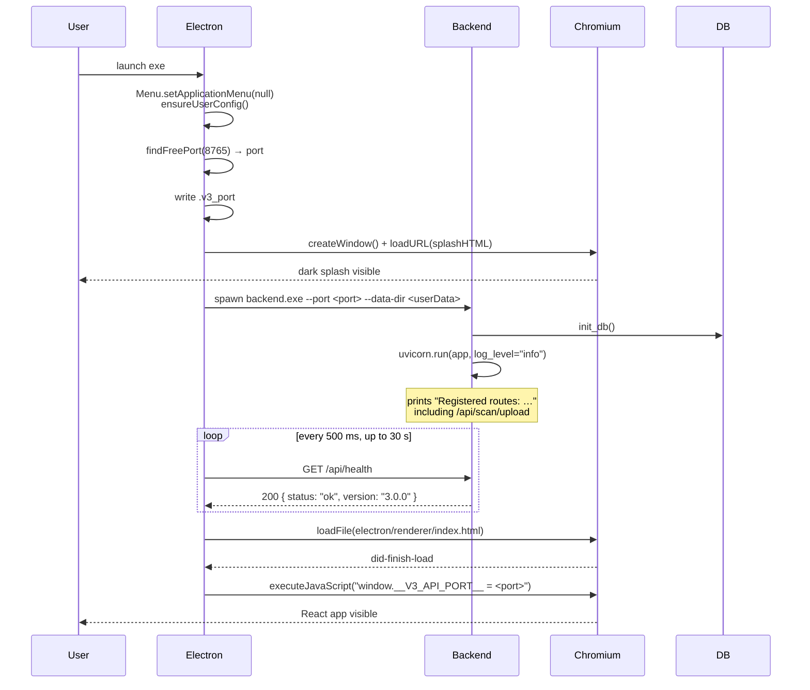
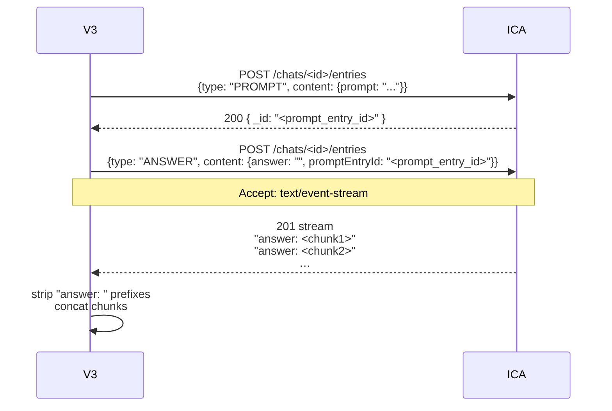

# System Design

Runtime view of PDF Extractor V3. Complements [Technical-Architecture.md](Technical-Architecture.md), which covers the static structure — this file covers what happens **at runtime**.

---

## Process Model

Three OS processes live during a normal run:

| Process | Binary | Role |
|---|---|---|
| Electron main | `PDF-Extractor-V3-Portable-3.0.0.exe` (Node.js core) | Lifecycle owner: spawns the backend, hosts the renderer, manages IPC |
| Renderer | Chromium child of Electron | Hosts the React UI, runs the preload script |
| Backend | `electron/resources/backend/backend.exe` (PyInstaller-frozen Python) | Owns SQLite; talks to Box and ICA |

The renderer never talks to Box or ICA directly. All external HTTP goes through the backend.

---

## Startup Sequence



Failure modes:
- **Port scan exhausts 20 attempts** → dialog "PDF Extractor V3 — Startup Failed"; app quits.
- **Backend `exit` fires before health** → dialog with captured stderr; app quits.
- **Health poll times out (30 s)** → dialog; app quits.

Every step is logged to `%TEMP%\pdf-extractor-v3-startup.log`.

---

## Pipeline: Sync

```mermaid
sequenceDiagram
    participant UI
    participant Backend
    participant Worker
    participant Box
    participant DB
    participant Scanner

    UI ->> Backend: POST /api/sync/run
    Backend ->> Worker: Thread(_sync_thread)
    Backend -->> UI: {status:"started"}
    Worker ->> Box: get_box_client() (JWTAuth)
    Worker ->> Box: folder(<source_id>).get_items(limit=1000)
    Box -->> Worker: items
    loop per PDF item
        alt local file already exists
            Worker -->> UI: emit sync:log "Skip (exists)"
        else
            Worker ->> Box: file(id).content()
            Worker ->> Worker: write to Local Folder/
            Worker -->> UI: emit sync:log "✅ Saved"
            opt archive_folder_id set
                Worker ->> Box: file(id).move(archive)
                Worker -->> UI: emit sync:log "📦 Archived on Box"
            end
        end
    end
    Worker ->> Scanner: run_scan() (re-uses same thread)
    Scanner ->> DB: tracking_files upserts
    Worker -->> UI: emit sync:done {downloaded, skipped, errors}
    Worker ->> DB: log_add (activity.write, level=info|warning|error)
```

Cancellation: `POST /api/sync/cancel` sets `_cancel` (a `threading.Event`); the worker checks it between items.

---

## Pipeline: Extract

```mermaid
sequenceDiagram
    participant UI
    participant Backend
    participant Worker
    participant PDF as pdf_text_extractor
    participant FS as Filesystem
    participant Box
    participant DB

    UI ->> Backend: POST /api/extract/run
    Backend ->> Worker: Thread(_extract_thread)
    Backend -->> UI: {status:"started"}
    Worker ->> DB: load_tracking() → pending rows

    loop per Pending row
        Worker -->> UI: emit extract:progress {current, total, name}
        Worker ->> FS: read PDF bytes
        Worker ->> PDF: open_and_decrypt_pdf(bytes, name, password)
        PDF -->> Worker: doc
        Worker ->> PDF: extract_text_by_page(doc)
        Worker ->> PDF: build_structured_json(name, pages)
        PDF -->> Worker: {report_summary, employment_checks, …}
        Worker ->> Worker: derive ref_number
        Worker ->> Worker: build dated Word/CSV/JSON folders
        Worker ->> PDF: export_to_word / _csv / _json
        opt output_folder_id set
            Worker ->> Box: upload_file_to_box(word/xlsx/json)
        end
        Worker ->> FS: move PDF → Local Folder/Archive
        Worker ->> DB: tracking_files.update(status="Completed", ref, ts, archive_path)
        Worker ->> DB: extraction_logs.insert (activity.write)
        Worker -->> UI: emit extract:result
    end

    Worker -->> UI: emit extract:done {completed, failed, total}
```

Failure per file: caught, logged, row stays Pending.

---

## Event Delivery (Socket.IO)

The AsyncServer runs on the uvicorn asyncio event loop. Worker threads must NOT call `sio.emit()` directly — that requires the loop.

```python
# backend/events.py
def emit(event: str, data) -> None:
    if _sio is None or _loop is None: return
    asyncio.run_coroutine_threadsafe(_sio.emit(event, data), _loop)
```

`_sio` and `_loop` are populated on `startup`:

```python
# backend/main.py
@_fastapi.on_event("startup")
async def _capture_loop():
    events.configure(sio, asyncio.get_running_loop())
```

Prior architecture used `async_mode="threading"` — that mode was incompatible with the ASGI stack and silently dropped events. See [ADR/0002-socketio-asgi-mode.md](ADR/0002-socketio-asgi-mode.md).

---

## ICA Two-POST Flow



Reasoning documented at length in `backend/chat.py:_ica_send_and_stream`. Prior "post prompt then poll GET /entries" logic never triggered inference and always timed out. See [ADR/0003-ica-two-post.md](ADR/0003-ica-two-post.md).

---

## State Rehydration

Users can navigate away from Sync / Scan / Extract mid-run without losing the visible progress. Each pipeline module maintains:

```python
_status = {"running": bool, "last": <summary dict>}
```

GET `/api/{sync,scan,extract}/status` returns the current shape. The frontend's `useRunStore.hydrate()` calls all three on app mount so navigating back to a running page shows correct state.

---

## Cancellation

Every pipeline module owns a module-level `threading.Event()` named `_cancel`. `POST /api/{…}/cancel` calls `_cancel.set()`. The worker checks `_cancel.is_set()` between items and exits cleanly, emitting a `{cancelled: true}` payload.

Cancellation never partially corrupts data:
- Sync: an in-flight download is not interrupted (checked between items).
- Scan: purge of stale rows still runs on cancel.
- Extract: a partially-exported PDF has whatever outputs completed remain on disk; the tracking row stays Pending.

---

## Splash and Handoff

To eliminate the ~5–10 s dark screen at startup, `main.js` immediately loads a `data:text/html` splash (`LOADING_HTML`) with a spinner. Once the backend health check succeeds, `loadRenderer(port)` swaps the URL to `electron/renderer/index.html`.

Because both pages live in the same `BrowserWindow`, the swap is a URL change — the window itself never blinks.

---

## Related

- [Technical-Architecture.md](Technical-Architecture.md) — static structure
- [Data-Flow.md](Data-Flow.md) — data lineage
- [API-Documentation.md](API-Documentation.md) — endpoints and events
- [ADR/](ADR/) — decision records
