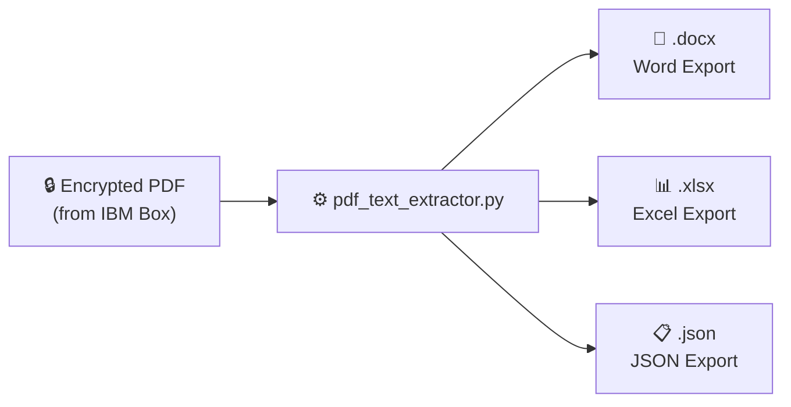

# Shared Engine — `pdf_text_extractor.py`

## What Is the Shared Engine?

[`pdf_text_extractor.py`](../../PDF%20Extractor/pdf_text_extractor.py) is the **core processing module** used by all three applications. It handles everything related to connecting to Box, downloading PDFs, parsing report contents, and writing structured outputs.

> **Analogy:** Think of it as a universal translator. All three apps speak different "languages" (desktop UI, web UI) but they all hand their work to the same translator, who always produces the same structured output regardless of who asked.

No parsing or export logic is duplicated across apps — any bug fix or parser improvement applies everywhere automatically.

---

## What It Does



---

## Module Function Reference

| Function | What It Does |
|---|---|
| `load_config()` | Read credentials and settings from `config.json` |
| `get_box_client(box_cfg)` | Build an authenticated Box SDK Client (JWT or OAuth2) |
| `find_pdf_files_on_box(client, folder_id)` | Recursively list PDF files in a Box folder |
| `download_pdf_bytes(client, file_id, file_name)` | Stream a Box file into memory as bytes |
| `open_and_decrypt_pdf(pdf_bytes, file_name, password)` | Open and decrypt a PDF using PyMuPDF |
| `extract_text_by_page(doc)` | Extract plain text per page from a PyMuPDF document |
| `strip_footer(text)` | Remove repeating address/phone/email header lines |
| `parse_kv_block(text)` | Parse `Label: Value` pairs from a text block |
| `parse_summary_page(text)` | Extract cover page: name, status, case ref, verdict tables |
| `parse_employment_check(text, number, summary_entry)` | Parse one Employment Check detail page |
| `parse_reference_check(text, number, summary_entry)` | Parse one Professional Reference Check detail page |
| `parse_other_checks(pages)` | Parse all Database/Other Check pages |
| `build_structured_json(file_name, pages)` | Orchestrate all parsers into one complete output document |
| `export_to_word(file_name, structured, ref_number, overwrite)` | Write a formatted `.docx` report |
| `export_to_csv(file_name, structured, ref_number, overwrite)` | Write a formatted `.xlsx` report |
| `export_to_json(file_name, structured, ref_number, overwrite)` | Write a `.json` report |
| `resolve_status(text)` | Return `Cleared`, `Not Cleared`, or `--` from a text snippet |

---

## PDF Layout Assumptions

The engine is tuned to the **Corpnet Global Corp** background check PDF format:

- **Two-column layout:** label on one line, value on the next — or `Label: Value` on the same line
- **Section headings:** ALL-CAPS text rendered as white text on coloured backgrounds — identified by regex, not by colour or font
- **Cover page verdicts:** Cleared / Not Cleared appear **only** on page 1 (and page 2 for Social Media Screening) — never on detail pages
- **Footer noise:** Each page repeats the office address, phone, and email — stripped before parsing

If the report template changes, update the regex patterns in `_FOOTER_PATTERNS`, `_SECTION_HEADINGS`, `_CLEARED_KEYWORDS`, and `_NOT_CLEARED_KEYWORDS`.

---

## Output Folder Structure

All three apps write exports into the same dated hierarchy:

```
<base_dir>/
└── YYYY/
    └── MMM_YYYY_Extracts/
        └── Week_NN/
            └── YYYY-MM-DD/
                └── <ref_number>/
                    └── <ref_number>.docx   (or .xlsx / .json)
```

Example:
```
Word Extracts/2026/Jul_2026_Extracts/Week_28/2026-07-10/RN-123456_789_10/RN-123456_789_10.docx
```

---

## Dependencies

| Package | Version | Purpose |
|---|---|---|
| `PyMuPDF` (fitz) | 1.24.5 | Open, decrypt, extract text from PDFs |
| `python-docx` | 1.1.2 | Generate Word `.docx` output files |
| `openpyxl` | 3.1.5 | Generate Excel `.xlsx` output files |
| `boxsdk` | 3.9.2 | Connect to IBM Box, download/upload files |

---

## Further Reading

- [Data Flow & JSON Schema](data-flow.md) — How raw PDF pages become structured JSON
- [Shared Specifications & Glossary](specifications.md) — Requirements and domain terminology
