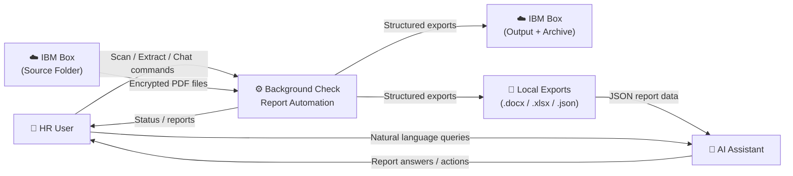
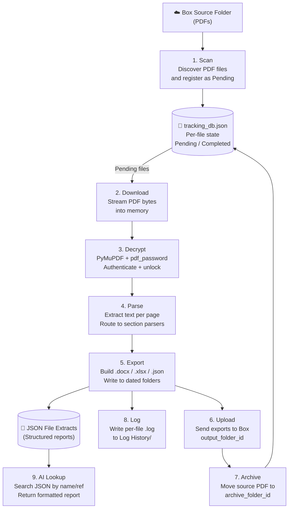
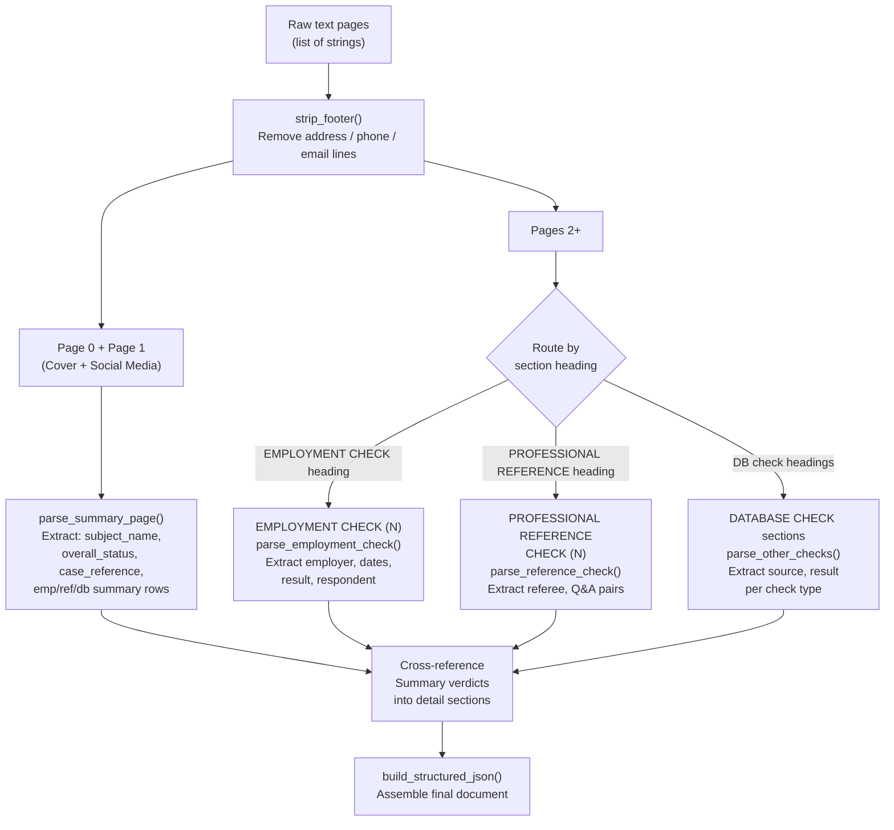

# Shared Data Flow

This document describes how data moves through the shared extraction engine used by all three applications. The flow is identical regardless of which app triggers it.

---

## Level 0 — System Context

> **Analogy:** The whole system is a black box labeled "Report Processor." Reports go in from Box; structured data comes out — to Box, to local files, and to the AI.



---

## Level 1 — Major Internal Processes



---

## Level 2 — Parse Process Detail

The Parse step is the most complex. Each page is routed to a specialist parser based on its section heading.



---

## Data Inputs and Outputs

### Inputs

| Source | Format | What It Contains |
|---|---|---|
| IBM Box source folder | Encrypted PDF | Background check report — cover page + section detail pages |
| `config.json` | JSON | Box credentials, PDF password, AI credentials, settings |
| User interaction | Button click / chat message | Scan trigger, extract trigger, AI query |

### Data Stores

| Store | Format | Updated By | Read By |
|---|---|---|---|
| `tracking_db.json` | JSON | Scan, Extraction pipeline | All app screens, Insights chart |
| `JSON File Extracts/` | JSON (one per report) | Extraction pipeline | AI assistant lookup skill |
| `Word Extracts/` | `.docx` | Extraction pipeline | Users (manual open / download) |
| `CSV Extracts/` | `.xlsx` | Extraction pipeline | Users (manual open / download) |
| `Log History/` | `.log` | Extraction pipeline | Log history view, AI `logs` command |
| IBM Box output folder | `.docx`, `.xlsx`, `.json` | Extraction pipeline (upload) | External consumers / auditors |

### Outputs

| Output | Format | Destination | Consumer |
|---|---|---|---|
| Structured report | `.json` | Local + Box | AI assistant, integration systems |
| Formatted report | `.docx` | Local + Box | HR reviewers, auditors |
| Tabular report | `.xlsx` | Local + Box | Data analysis, reporting |
| Extraction log | `.log` | Local `Log History/` | Audit trail, debugging |
| Status update | `tracking_db.json` | Local | Next scan / extract / insights cycle |

---

## Structured JSON Output Schema

The core transformation takes an unstructured PDF text dump and produces this document:

```json
{
  "source_file": "RN-123456_789_10.pdf",
  "extracted_at": "2026-07-10T14:23:03",
  "total_pages": 12,
  "report_summary": {
    "subject_name": "Manalo, Jeffrey",
    "overall_status": "Cleared",
    "case_reference": "RN-123456_789_10",
    "case_received": "2026-06-15",
    "package": "Standard",
    "delivery_date": "2026-07-08",
    "employment_check_summary": [
      { "employer": "Acme Corp", "result": "Verified – Clear", "status": "Cleared" }
    ],
    "professional_reference_summary": [...],
    "database_check_summary": [
      { "check": "Adverse Media Check", "result": "No Adverse", "status": "Cleared" }
    ]
  },
  "employment_checks": [
    {
      "check_number": 1,
      "employer_name": "Acme Corp",
      "position_title": "Software Engineer",
      "dates_of_employment": "Jan 2020 – Dec 2023",
      "verification_status": "Cleared"
    }
  ],
  "professional_reference_checks": [...],
  "other_checks": [...]
}
```

---

## Status Values

The engine uses exactly three status values. Ambiguity always defaults to `--` — the system never guesses.

| Value | Meaning | Matched By |
|---|---|---|
| `Cleared` | Positive verification result | "Verified – Clear", "Cleared", "No Adverse", "No Civil Case", etc. |
| `Not Cleared` | Negative verification result | "Not Verified", "Red Flag", "Unverified", "Verified –" (followed by anything except "clear") |
| `--` | Unknown / inconclusive | No matching keyword found — safe default |
