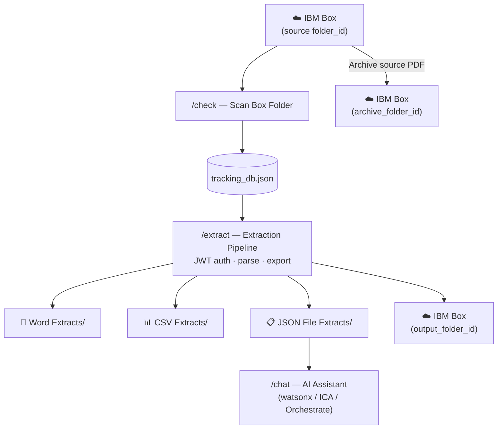

# WatsonX Challenge - Web App — Overview

**Flask web application** for processing background check PDF reports from IBM Box, accessible from any browser on the network.

> **Think of it as the upgrade from a single operator's desk to a shared office:** anyone on the team can open a browser tab, check the status of reports, trigger extraction, and chat with the AI — no desktop app install required.

---

## When to Use the Web App

| Use the Web App when… | Use a Desktop App instead when… |
|---|---|
| Multiple people need access | You are working solo on one machine |
| You want permanent JWT Box auth (no 60-min token refresh) | Quick ad-hoc extractions are sufficient |
| You need the full AI fallback chain (watsonx → ICA → Watson) | You need a local file browser for outputs |
| You want to deploy on a shared/server machine | No server to host the Flask app |
| You need the OpenAPI skill definitions for ICA registration | |

---

## Screens

| URL | Screen | Purpose |
|---|---|---|
| `/` | **Home** | Dashboard with stat cards and navigation |
| `/check` | **Check Box Folder** | Scan Box folder; view Pending file table |
| `/extract` | **Extract Files** | Start pipeline; live progress; result cards |
| `/insights` | **Insights** | Stats chart (Completed vs Pending by period) |
| `/chat` | **AI Assistant** | Chat UI — watsonx Orchestrate + multi-AI fallback |

---

## Process Flow



---

## API Endpoints

| Method | Path | Description |
|---|---|---|
| `GET` | `/` | Home dashboard |
| `GET` | `/check` | Check Box Folder screen |
| `GET` | `/extract` | Extract Files screen |
| `GET` | `/insights` | Insights screen |
| `GET` | `/chat` | AI Assistant chat |
| `POST` | `/api/scan` | Trigger Box scan |
| `POST` | `/api/extract` | Start extraction pipeline (async) |
| `GET` | `/api/extract/status` | Poll extraction running state + last result |
| `GET` | `/api/status` | Return Pending/Completed file counts |
| `GET` | `/api/insights` | Return chart bucket data as JSON |
| `POST` | `/api/chat` | Send message to AI assistant |
| `GET` | `/api/logs?period=day` | Return log history summary |
| `GET` | `/api/download/<path>` | Download an extracted file |

---

## Quick Start

### 1. Install dependencies
```bash
cd "WatsonX Challenge - Web"
pip install -r requirements.txt
# Also needs packages from PDF Extractor (PyMuPDF, python-docx, openpyxl, boxsdk)
pip install PyMuPDF==1.24.5 python-docx==1.1.2 openpyxl==3.1.5 boxsdk==3.9.2
```

### 2. Set up Box JWT credentials
1. Create a Box App → Server Authentication (JWT) at [box.com/developers/console](https://app.box.com/developers/console)
2. Download the JWT config JSON file
3. Place it as `WatsonX Challenge - Web/box_jwt_config.json`

### 3. Configure `config.json`

```json
{
  "pdf_password": "your_pdf_password",
  "box": {
    "jwt_config_file":  "box_jwt_config.json",
    "folder_id":        "source Box folder ID",
    "archive_folder_id":"archive Box folder ID",
    "output_folder_id": "output Box folder ID"
  },
  "watsonx": {
    "api_key":    "IBM Cloud API key",
    "project_id": "watsonx.ai project ID",
    "service_url":"https://eu-de.ml.cloud.ibm.com"
  },
  "orchestrate": {
    "api_key":      "IBM Cloud API key",
    "instance_url": "Orchestrate instance URL",
    "agent_id":     "Orchestrate Agent ID"
  },
  "ica": {
    "full_cookie":  "full browser cookie string",
    "team_id":      "ICA team UUID",
    "team_name":    "URL-encoded team name",
    "assistant_id": "ICA Assistant ID",
    "chat_id":      "ICA chat thread UUID",
    "base_url":     "https://servicesessentials.ibm.com/curatorai/services/chat/new-chat"
  }
}
```

### 4. Start the server

```bash
python start_server.py
```

Opens `http://localhost:5000` automatically. Or run `python app.py` directly.

---

## Folder Structure

```
WatsonX Challenge - Web/
├── app.py                     Flask server — routes, skills, AI integration
├── start_server.py            Launcher — cache clean, single-instance guard, auto-browser
├── config.json                All credentials (Box JWT, watsonx, ICA, settings)
├── box_jwt_config.json        Box JWT app config — DO NOT commit to git
├── ica_skills_openapi.yaml    OpenAPI spec for ICA skill registration
├── requirements.txt
├── templates/
│   ├── base.html              Shared layout (sidebar + nav)
│   ├── home.html              Dashboard
│   ├── check.html             Check Box Folder
│   ├── extract.html           Extract Files
│   ├── insights.html          Insights chart
│   └── chat.html              AI Assistant
├── static/
│   └── style.css              Full UI stylesheet
├── Word Extracts/             .docx exports (dated hierarchy)
├── CSV Extracts/              .xlsx exports (dated hierarchy)
├── JSON File Extracts/        .json exports (dated hierarchy)
└── Log History/               Per-file extraction logs
```

---

## Further Reading

- [Features](features.md)
- [System Design](system-design.md)
- [Process Flows](process-flows.md)
- [Improvements](improvements.md)
- [Shared Engine](../shared/README.md)
- [Data Flow & JSON Schema](../shared/data-flow.md)
