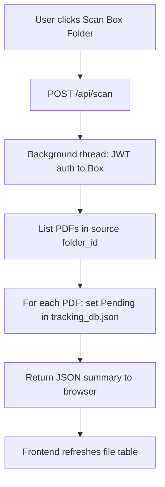

# WatsonX Challenge - Web App — Features

All parsing and export features use the shared extraction engine. See [Shared Engine](../shared/README.md) for parsing details.

---

## Feature 1 — Check Box Folder (Scan)

**What it does:** Scans the IBM Box source folder for PDFs via JWT Service Account auth and registers them as Pending.

**Web-specific detail:**
- Triggered via `POST /api/scan`; runs on a Flask background thread
- Uses JWT auth — **no token expiry**, no manual refresh needed
- Returns `{ message, total, completed, pending }` as JSON
- Frontend polls or re-renders the file table after scan completes



---

## Feature 2 — Extract Files (Async Pipeline)

**What it does:** Starts the extraction pipeline as an async background job, uploads all three exports to Box, and archives the source PDF.

**Web-specific detail:**
- `POST /api/extract` returns immediately with `{ message: "started" }`
- Frontend polls `GET /api/extract/status` until `running = false`
- Extraction lock (`_extract_running`) prevents overlapping runs
- JWT auth means uploads and archive steps never fail due to token expiry

```mermaid
sequenceDiagram
    participant Browser
    participant Flask as Flask app.py
    participant BgThread as Background Thread
    participant Box as IBM Box

    Browser->>Flask: POST /api/extract
    Flask->>BgThread: threading.Thread(target=skill_run_extraction).start()
    Flask-->>Browser: { message: "Extraction started" }
    Browser->>Flask: GET /api/extract/status (polling)
    Flask-->>Browser: { running: true, result: null }
    BgThread->>Box: Download, parse, export, upload, archive
    BgThread->>BgThread: Update tracking_db.json
    Browser->>Flask: GET /api/extract/status
    Flask-->>Browser: { running: false, result: "✅ 3 succeeded, ❌ 0 failed" }
```

---

## Feature 3 — Insights

**What it does:** Returns extraction statistics as JSON for rendering as a bar chart in the browser.

**Web-specific detail:**
- `GET /api/insights` returns bucketed `{ period_key: { Completed: N, Pending: N } }` data
- Frontend renders with Chart.js (or equivalent) — chart logic lives in the browser, not the server
- Filter options: Day / Week / Month / Year via query param

---

## Feature 4 — AI Assistant (Multi-Tier)

**What it does:** Chat interface backed by a priority-ordered chain of IBM AI services.

**This is the most capable AI implementation across all three apps.** The web app supports the full fallback chain:

| Priority | Service | How It's Used |
|---|---|---|
| 1 | **IBM watsonx.ai** | Primary model — `POST /ml/v1/text/generation` |
| 2 | **IBM watsonx Orchestrate** | Agent API — calls skills, returns action tags |
| 3 | **IBM ICA 1.0** | Session-cookie chat |
| 4 | **IBM Watson Assistant** | v2 sessions API |
| 5 | **Local help text** | Static fallback |

**Chat commands:**

| Command | Skill Function |
|---|---|
| `scan` | `skill_scan_box_folder()` |
| `extract` | `skill_run_extraction()` |
| `look up [name/ref]` | `skill_lookup_report(query)` |
| `file status` | `skill_get_file_status()` |
| `logs this week` | `skill_get_log_history("week")` |
| `generate report for [name]` | `skill_generate_reports(query)` |

**Report lookup reads from Box first:** `skill_lookup_report()` walks the Box `output_folder_id` for JSON files before falling back to local `JSON File Extracts/`. This ensures the most up-to-date data is always used.

```mermaid
flowchart TD
    MSG[POST /api/chat\n{message, history}]
    CMD{Action keyword\ndetected?}
    SKILL[Execute skill function\nReturn result text]
    WX{watsonx.ai\nconfigured?}
    ORCH{Orchestrate\nconfigured?}
    ICA{ICA 1.0\nconfigured?}
    WA{Watson Assistant\nconfigured?}
    FALLBACK[Return local help text]
    REPLY[Return JSON reply to browser]

    MSG --> CMD
    CMD -- Yes --> SKILL --> REPLY
    CMD -- No --> WX
    WX -- Yes --> REPLY
    WX -- No/Error --> ORCH
    ORCH -- Yes --> REPLY
    ORCH -- No/Error --> ICA
    ICA -- Yes --> REPLY
    ICA -- No/Error --> WA
    WA -- Yes --> REPLY
    WA -- No/Error --> FALLBACK --> REPLY
```

---

## Feature 5 — File Download

**What it does:** Serves extracted output files (Word, Excel, JSON) directly through the browser via `GET /api/download/<path>`.

**Why it exists:** Browser users cannot navigate the server's local filesystem. This endpoint provides safe, path-controlled file download without exposing arbitrary filesystem access.

---

## Feature 6 — Skills API (watsonx Orchestrate / ICA)

**What it does:** Exposes the five skill functions as REST endpoints callable by the IBM Orchestrate agent or any external system via the OpenAPI spec in [`ica_skills_openapi.yaml`](../../WatsonX%20Challenge%20-%20Web/ica_skills_openapi.yaml).

| Skill Endpoint | Method | Skill Function |
|---|---|---|
| `/api/scan` | POST | `skill_scan_box_folder()` |
| `/api/extract` | POST | `skill_run_extraction()` |
| `/api/extract/status` | GET | (poll extraction state) |
| `/api/status` | GET | `skill_get_file_status()` |
| `/api/logs?period=` | GET | `skill_get_log_history()` |
| `/api/chat` | POST | `skill_lookup_report()` via chat routing |
