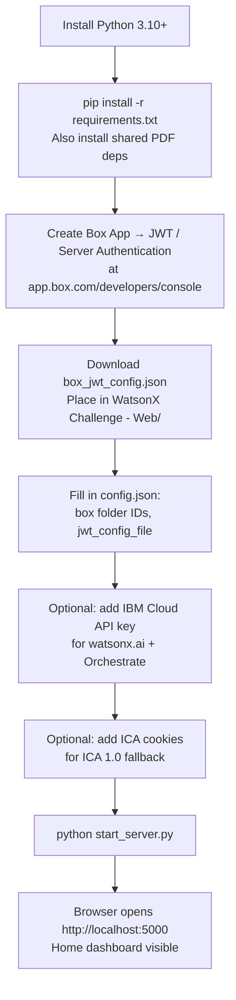
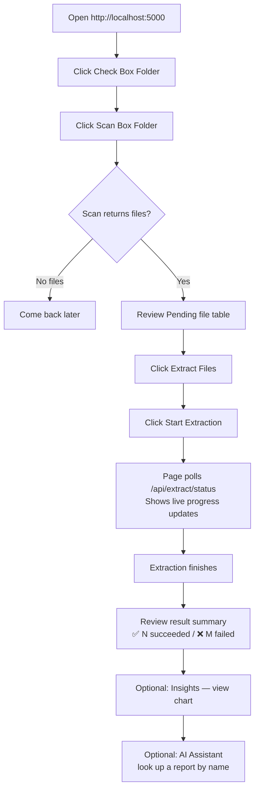
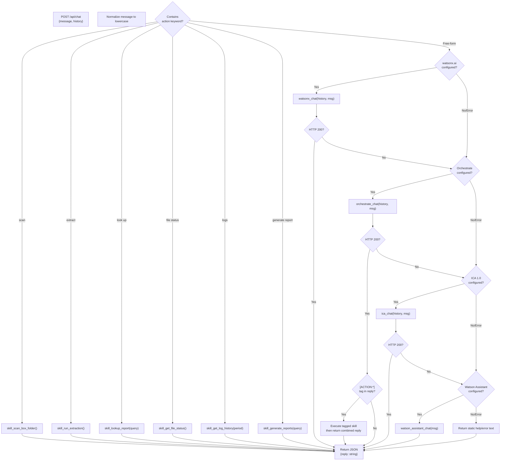
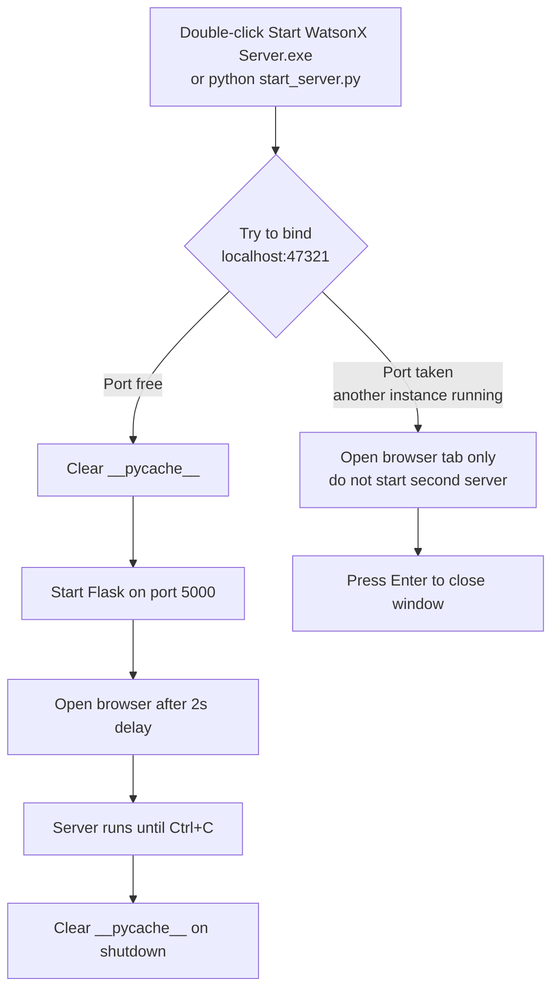

# WatsonX Challenge - Web App — Process Flows

## User Journey: First-Time Setup



---

## User Journey: Daily Extraction Workflow



---

## Backend Process: Extraction Pipeline (Web App)

```mermaid
flowchart TD
    START([POST /api/extract]) --> LOCK{_extract_running?}
    LOCK -- Yes --> BUSY([Return: already running])
    LOCK -- No --> FLAG[Set _extract_running = True\nStart background thread]
    FLAG --> RESP([Return: started immediately])

    FLAG --> LOADCFG[Load config.json]
    LOADCFG --> JWTAUTH[JWT auth to Box\nauto-rotated — no expiry]
    JWTAUTH --> LIST[List PDFs in source folder_id]
    LIST --> LOOP{For each PDF}

    LOOP --> DL[Download bytes from Box into memory]
    DL --> DECRYPT[Decrypt with pdf_password]
    DECRYPT --> PARSE[Parse via shared engine\nbuild_structured_json()]
    PARSE --> EXPORTLOCAL[Export to local dated folders:\nWord / CSV / JSON Extracts/]

    EXPORTLOCAL --> UPLOAD{output_folder_id\nconfigured?}
    UPLOAD -- Yes --> BOXUP[Upload 3 files to Box\ndated path per ref]
    UPLOAD -- No --> SKIP_UP[Skip Box upload]

    BOXUP & SKIP_UP --> ARCHIVE{archive_folder_id\nconfigured?}
    ARCHIVE -- Yes --> MOVE[Move source PDF\nto archive_folder_id on Box]
    ARCHIVE -- No --> SKIP_ARCH[Skip archive]

    MOVE & SKIP_ARCH --> MARK[Mark Completed in tracking_db]
    MARK --> LOG[Write .log to Log History/]
    LOG --> LOOP

    LOOP -- "All done" --> DONE[Set _extract_running = False\nStore summary in _extract_result]
```

---

## Backend Process: AI Chat Routing



---

## User Journey: AI Report Lookup

```mermaid
sequenceDiagram
    participant User
    participant Browser
    participant Flask as app.py
    participant Box as IBM Box output folder
    participant Local as JSON File Extracts/

    User->>Browser: "look up Manalo"
    Browser->>Flask: POST /api/chat {message: "look up Manalo"}
    Flask->>Flask: Detect "look up" → skill_lookup_report("Manalo")
    Flask->>Box: Walk output_folder_id recursively for .json files
    Box-->>Flask: All extracted JSON reports
    Flask->>Flask: Filter: "manalo" in subject_name OR case_reference
    Flask->>Flask: Deduplicate by case_reference (keep latest extracted_at)
    alt Box unreachable
        Flask->>Local: Walk JSON File Extracts/ for .json files
        Local-->>Flask: Local JSON reports
    end
    Flask->>Flask: Format with §SECTION§ markers
    Flask-->>Browser: JSON {reply: formatted text}
    Browser->>Browser: JS renders §markers as styled HTML cards
    Browser-->>User: Visual structured report
```

---

## Process: Single-Instance Guard (start_server.py)



---

## Process: Dated Output Folder + Box Mirror

The web app writes locally AND mirrors the same hierarchy on Box:

**Local:**
```
Word Extracts/2026/Jul_2026_Extracts/Week_28/2026-07-11/RN-123456/RN-123456.docx
```

**Box (`output_folder_id`):**
```
output_folder_id/2026/Jul_2026_Extracts/Week_28/2026-07-11/RN-123456/RN-123456.docx
```

Subfolders are created on Box on-demand using `_box_get_or_create_subfolder()`. If the subfolder already exists, it is reused.
