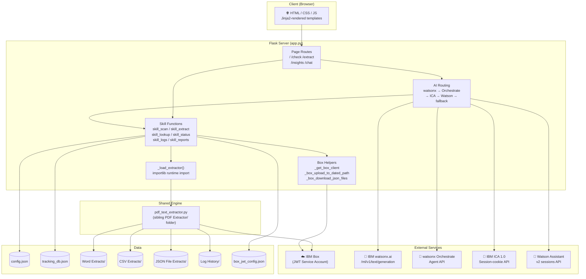
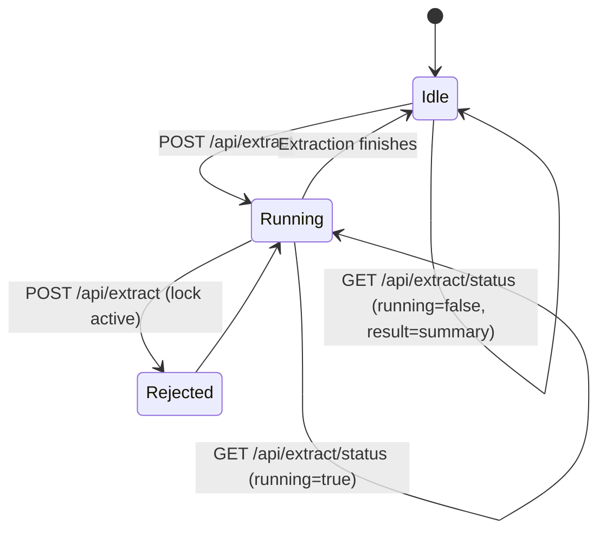

# WatsonX Challenge - Web App — System Design

## Architecture



---

## Key Modules

### `app.py`
The entire server is one file. Responsibilities:

| Section | What It Contains |
|---|---|
| Path constants | `BASE_DIR`, `CONFIG_PATH`, `TRACKING_PATH`, `LOG_HISTORY_DIR`, `JSON_DIR` |
| Config + tracking helpers | `load_config()`, `load_tracking()`, `save_tracking()` |
| Box output helpers | `_get_box_client()`, `_box_upload_file()`, `_box_upload_to_dated_path()`, `_box_download_json_files()` |
| Extractor loader | `_load_extractor()` — runtime import via `importlib` |
| Log helpers | `build_extract_folder()`, `write_extraction_log()` |
| Skill functions | `skill_scan_box_folder()`, `skill_run_extraction()`, `skill_lookup_report()`, `skill_get_log_history()`, `skill_get_file_status()`, `skill_generate_reports()` |
| AI integrations | `ica_chat()`, `orchestrate_chat()`, `watsonx_chat()`, `watson_assistant_chat()` |
| Page routes | `@app.route('/')`, `/check`, `/extract`, `/insights`, `/chat` |
| API routes | `@app.route('/api/scan')`, `/api/extract`, `/api/extract/status`, `/api/status`, `/api/insights`, `/api/chat`, `/api/logs`, `/api/download/<path>` |

### `start_server.py`
Launcher with two responsibilities beyond just running Flask:
- **Single-instance guard:** binds a socket to port 47321; a second launch opens a browser tab instead of a duplicate server
- **Cache cleaner:** wipes `__pycache__` on startup and shutdown so stale bytecode never causes confusing bugs

### `ica_skills_openapi.yaml`
OpenAPI 3.0.3 spec documenting the five skill endpoints for registration in IBM Consulting Advantage (ICA) or any OpenAPI-compatible system. Register these to enable the Orchestrate agent to call them as tools.

---

## Box Authentication (JWT)

Unlike the desktop apps, the web app uses **JWT Service Account** authentication:

```python
from boxsdk import JWTAuth, Client as BoxClient
auth   = JWTAuth.from_settings_file(str(jwt_path))
client = BoxClient(auth)
```

- No token expiry — JWT tokens are automatically rotated by the Box SDK
- `box_jwt_config.json` must not be committed to git (it contains private keys)
- The JWT file is looked up from `BASE_DIR` and falls back to the sibling `PDF Extractor/` folder

---

## Extraction Concurrency Model



The `_extract_running` module-level flag acts as a mutex. If a second extraction request arrives while one is running, it returns immediately with "already running."

---

## Shared Engine Import

The web app loads the extraction engine at runtime without maintaining a copy:

```python
def _load_extractor():
    extractor_path = BASE_DIR.parent / "PDF Extractor" / "pdf_text_extractor.py"
    spec      = importlib.util.spec_from_file_location("pdf_text_extractor", extractor_path)
    extractor = importlib.util.module_from_spec(spec)
    spec.loader.exec_module(extractor)
    # Redirect output directories to this app's own folders
    extractor.WORD_OUT_DIR = BASE_DIR / "Word Extracts"
    extractor.CSV_OUT_DIR  = BASE_DIR / "CSV Extracts"
    extractor.JSON_OUT_DIR = BASE_DIR / "JSON File Extracts"
    return extractor
```

**Critical:** Both folders must be siblings in the same parent directory. If `PDF Extractor/` is renamed or moved, the web app fails at extraction time with a `FileNotFoundError`.

---

## Design Decisions (Web App-specific)

### JWT Over OAuth2
The web app may run unattended on a server. JWT tokens are permanent and auto-rotate — no human needs to refresh credentials every 60 minutes. This is the most important reliability improvement over the desktop apps.

### Async Extraction + Polling
Flask's development server is single-threaded by default. Running the extraction pipeline synchronously would block all other requests for the duration of extraction. The background thread + polling pattern keeps the server responsive.

### Skills as First-Class Functions
Each AI action (`scan`, `extract`, `look up`) is implemented as a standalone Python function (`skill_*`). This means:
1. Action commands bypass the AI entirely — they run instantly and predictably
2. The same functions are callable via REST (for Orchestrate/ICA skill registration)
3. The AI layer only handles genuinely free-form questions

### Box-First Report Lookup
`skill_lookup_report()` reads JSON files from the Box `output_folder_id` first, then falls back to local `JSON File Extracts/`. This ensures lookups always return the most authoritative, up-to-date data — even if local files are stale or missing.

### Report Formatting with `§SECTION§` Markers
The lookup skill returns text with custom `§SECTION§...§END_SECTION§` markers rather than raw Markdown. The frontend's JavaScript parses these markers into styled HTML cards. This keeps rich formatting logic in the browser, not the server.
